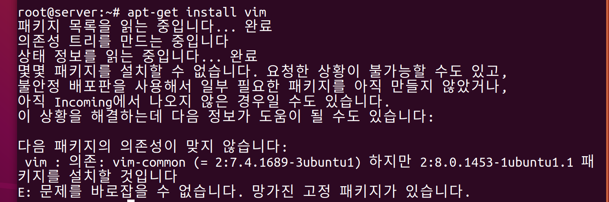
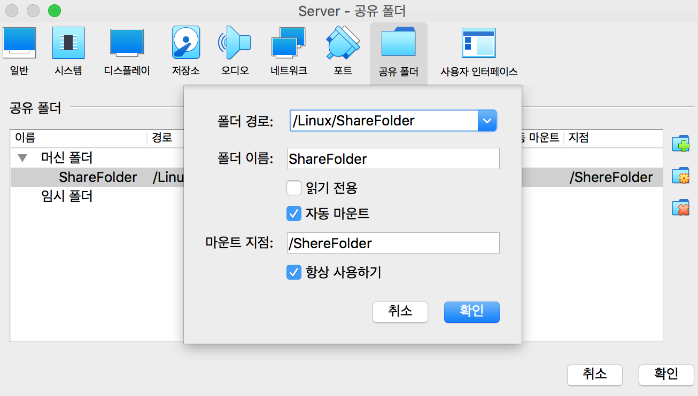
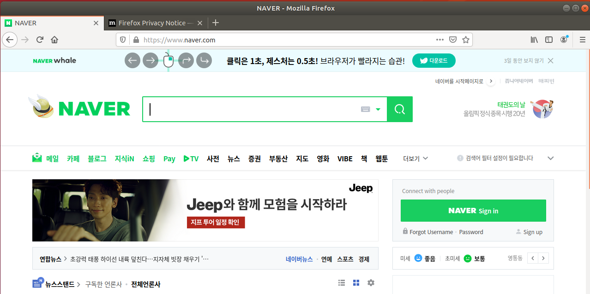
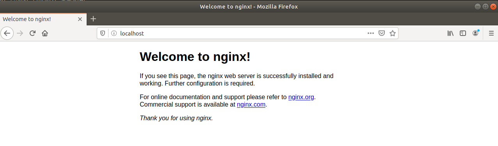

# ubuntu 초기 설정 - ubuntu GUI


# 😵 Server 초기셋팅

- 교재 : 60~79
- 문제점1

    

    - 해결

    ```python
    sudo apt-get remove vin-common
    sudo apt-get clean && sudo apt-get purge
    sudo apt-get update && sudo apt-get install vim
    ```

# 🦉 추가로 진행한 setting

## VirtualBox 확장 기능 이용

### #1 장치 > 게스트 확장 CD 이미지 삽입

- 여기에서 오류가 난다. mac의 문제인가?
- 해결
    1. 장치 > 게스트 확장 CD 이미지 삽입 해서 순서대로 설치
    2. 장치를 종료하고 오른쪽 상단 > 설정(s)에 들어감
    3. 설정 > 디스플레이 : 비디오 메모리를 최대로 올림
    4. 다시 Server 시작하기!

    

    - 그래픽 컨트롤러를 바꿀 경우, 밑에 경고 메세지가 뜨고 매우 느려진다....

### #2 호스트와 게스트 간 클립보드 공유

- 설정 후, 재부팅하면 적용된다.


### #3 호스트와 게스트 간 공유 폴더

1. 호스트의 Linux 폴더에 ShareFolder폴더 만들기
2. guest에서 `mkdir /ShereFolder` 를 통해 폴더를 생성
3. 공유폴더설정


4. 설정 > 공유 폴더에서 설정해주기



5. 공유를 확인


## nginx 서버 설치 및 host, guest간 접속

### #1 naver 접속 확인



### #2 우분투에 nginx 서버를 설치

```python
root@server:~# apt-get update
기존:1 http://mirror.kakao.com/ubuntu xenial InRelease
기존:2 http://archive.ubuntu.com/ubuntu xenial InRelease
패키지 목록을 읽는 중입니다... 완료   

  
root@server:~# apt-get install -y nginx
패키지 목록을 읽는 중입니다... 완료
의존성 트리를 만드는 중입니다       
상태 정보를 읽는 중입니다... 완료
다음의 추가 패키지가 설치될 것입니다 :
  nginx-common nginx-core
	...

root@server:~# service nginx restart

# Active : active인지 확인합니다.
root@server:~# service nginx status
● nginx.service - A high performance web server and a reverse proxy server
   Loaded: loaded (/lib/systemd/system/nginx.service; enabled; vendor preset: en
   Active: active (running) since Fri 2020-09-04 16:22:53 KST; 36s ago
  Process: 2456 ExecStop=/sbin/start-stop-daemon --quiet --stop --retry QUIT/5 -
  Process: 2458 ExecStart=/usr/sbin/nginx -g daemon on; master_process on; (code
  Process: 2457 ExecStartPre=/usr/sbin/nginx -t -q -g daemon on; master_process 
 Main PID: 2459 (nginx)
    Tasks: 2 (limit: 2328)
   CGroup: /system.slice/nginx.service
           ├─2459 nginx: master process /usr/sbin/nginx -g daemon on; master_pro
           └─2460 nginx: worker process
```

### #3 우분투 가상머신의 IP를 확인

- `inet 10.0.2.4` 이 부분을 확인하면 됩니다.

```python
root@server:~# ip a
1: lo: <LOOPBACK,UP,LOWER_UP> mtu 65536 qdisc noqueue state UNKNOWN group default qlen 1000
    link/loopback 00:00:00:00:00:00 brd 00:00:00:00:00:00
    inet 127.0.0.1/8 scope host lo
       valid_lft forever preferred_lft forever
    inet6 ::1/128 scope host 
       valid_lft forever preferred_lft forever
2: enp0s3: <BROADCAST,MULTICAST,UP,LOWER_UP> mtu 1500 qdisc fq_codel state UP group default qlen 1000
    link/ether 08:00:27:45:33:43 brd ff:ff:ff:ff:ff:ff
    inet 10.0.2.4/24 brd 10.0.2.255 scope global dynamic noprefixroute enp0s3
       valid_lft 316sec preferred_lft 316sec
    inet6 fe80::6d88:586d:43c1:93f8/64 scope link noprefixroute 
       valid_lft forever preferred_lft forever
```

### #4 우분투에서 nginx로 접속

http://localhost

http://127.0.0.1

http://`10.0.2.15`



### #5 host에서는 `10.0.2.15` 에 연결할 수 없음

- ubuntu(guest)에 접속할 수 있도록 포트포워딩이 필요하다

 

### #6 host 머신의 IP주소를 확인 (mac에서 확인)

- en0 > inet > `192.168.35.47` 을 확인

```python
➜ ~ ifconfig
lo0: flags=8049<UP,LOOPBACK,RUNNING,MULTICAST> mtu 16384
	options=1203<RXCSUM,TXCSUM,TXSTATUS,SW_TIMESTAMP>
	inet 127.0.0.1 netmask 0xff000000 
	inet6 ::1 prefixlen 128 
	inet6 fe80::1%lo0 prefixlen 64 scopeid 0x1 
	nd6 options=201<PERFORMNUD,DAD>
gif0: flags=8010<POINTOPOINT,MULTICAST> mtu 1280
stf0: flags=0<> mtu 1280
XHC20: flags=0<> mtu 0
en0: flags=8863<UP,BROADCAST,SMART,RUNNING,SIMPLEX,MULTICAST> mtu 1500
	ether 6c:96:cf:d9:78:ed 
	inet6 fe80::cb3:f49a:1669:9f46%en0 prefixlen 64 secured scopeid 0x5 
	inet 192.168.35.47 netmask 0xffffff00 broadcast 192.168.35.255
	nd6 options=201<PERFORMNUD,DAD>
	media: autoselect
	status: active
```

### #7 외부에서 게스트에 접속을 위한 포트포워딩


### #8 host에서 192.168.35.47:8888 에 접속하여 확인한다.

