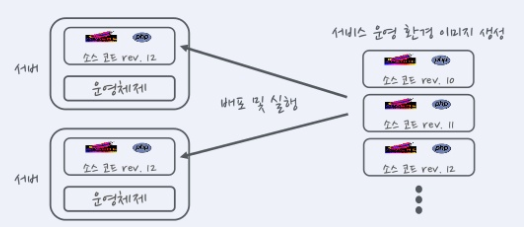

# 도커의 기초

# 1️⃣ 도커 이미지와 컨테이너

## 도커 이미지

- 서비스 운영에 필요한 서버 프로그램, 소스코드, 컴파일된 실행 파일을 묶은 형태

→ 저장소에 올리고 받는 것은 이미지 (push/pull)

## 도커 컨테이너

- 컨테이너는 이미지를 실행한 상태
- 이미지로 여러 개의 컨테이너를 만들 수 있다.
- 운영체제와 비교하면 이미지는 실행파일, 컨테이너는 프로세스!

## 도커가 이미지의 바뀐 부분을 관리하는 방법

### 유니온 파일 시스템 형식

- aufs, btrfs, devicemapper
1. 도커는 베이스 이미지에서 바뀐 부분만 이미지로 생성
2. 컨테이너로 실행할 때는 베이스 이미지와 바뀐 부분을 합쳐서 실행

- Docker Hub 및 개인 저장소에서 이미지를 공유할 때 바뀐 부분만 주고 받는다.

## 도커 요약

- 도커는 `서비스 운영 환경을 묶어`서 손쉽게 `배포하고 실행`하는 경향 `컨테이너` 기술

---

# 2️⃣ 서비스 운영 환경과 도커

## 클라우드 환경

- 지금 까지의 서버 환경은 서버 구입과 설치에 돈이 많이 들고 시간이 오래걸림
- 가상화가 발전하면서 클라우드 환경으로 변화
    - 가상 서버를 임대하여 사용한 만큼만 요금을 지불한다.

## Immutable Infrastructure

- 호스트 OS와 서비스 운영 환경(서버 프로그램, 소스 코드, 컴파일 된 바이너리)을 분리
- 한 번 설정한 운영 환경은 변경하지 않는다(Immutable)는 개념



- 서비스 운영 환경을 이미지로 생성한 뒤 서버에 배포하여 실행
- 서비스가 업데이트되면 운영 환경을 변경하는게 아니라, 이미지를 새로 생성하여 배포
    - 서비스 운영 환경 이미지를 한 번 쓰고 버린다.

→ 도커는 Immutable infrastructure를 구현한 프로젝트

## Immutable Infrastructure 의 장점

1. 관리가 편리
    - 이미지만 관리하면 된다.
    - 이미지에 버전 관리 시스템 활용
2. 확장
    - 이미지 하나로 서버를 계속 찍어 낼 수 있다.
    - 클라우드 플렛폼의 자동 확장 기능과 연동하여 쉽게 서비스 확장
3. 테스트
    - 개발자 PC, 테스트 서버에서 이미지를 서비스 운영 환경과 동일한 환경이 구성
    - 테스트 간편
4. 가벼움
    - 운영체제와 서비스 환경을 분리하여 가볍고 어디서든 실행 가능한 환경 제공

---

# 3️⃣ 도커 설치 및 기초

## a. 도커 설치

### 작업 디렉터리 만들기

```
➜ ~ mkdir Docker

➜ Docker vagrant init     
A `Vagrantfile` has been placed in this directory. You are now
ready to `vagrant up` your first virtual environment! Please read
the comments in the Vagrantfile as well as documentation on
`vagrantup.com` for more information on using Vagrant.
```

### Vagrant file 작성 & 가상머신 생성

```
# -*- mode: ruby -*-
# vi: set ft=ruby :

Vagrant.configure("2") do |config|
  config.vm.box = "ubuntu/xenial64"
  config.vm.hostname = "xenial64"
  config.vm.synced_folder ".", "/vagrant_data", disabled: true
end
```

- 가상머신 생성

```
➜ Docker vagrant up
```

### 가상 머신에 ssh 접속

```
➜ Docker vagrant ssh
Welcome to Ubuntu 16.04.7 LTS (GNU/Linux 4.4.0-189-generic x86_64)

 * Documentation:  https://help.ubuntu.com
 * Management:     https://landscape.canonical.com
 * Support:        https://ubuntu.com/advantage

0 packages can be updated.
0 updates are security updates.

New release '18.04.5 LTS' available.
Run 'do-release-upgrade' to upgrade to it.

# 접속 함!
vagrant@xenial64:~$
```

### 패키지 업데이트

```
vagrant@xenial64:~$ sudo apt update
vagrant@xenial64:~$ sudo apt upgrade
```

### 도커 설치 및 초기 설정

```
vagrant@xenial64:~$ sudo apt install -y docker.io
vagrant@xenial64:~$ sudo usermod -a -G docker $USER
vagrant@xenial64:~$ sudo service docker restart
vagrant@xenial64:~$ sudo chmod 666 /var/run/docker.sock

vagrant@xenial64:~$ docker --version
Docker version 18.09.7, build 2d0083d
```

## b. 도커 이미지 생성

### 작업 디렉터리 생성 및 이동

```
vagrant@xenial64:~$ mkdir chap01 && cd chap01
vagrant@xenial64:~/chap01$
```

### 쉘 스크립트 파일 생성 및 실행 권한 부여

```
vagrant@xenial64:~/chap01$ vi helloworld
```

```bash
#!/bin/sh

echo "Hello, World!"
```

- 확인

```
vagrant@xenial64:~/chap01$ chmod 755 helloworld

vagrant@xenial64:~/chap01$ ll			⇐ ls -l 과 동일
total 12
drwxrwxr-x 2 vagrant vagrant 4096 Sep 14 04:19 ./
drwxr-xr-x 5 vagrant vagrant 4096 Sep 14 04:18 ../
-rwxr-xr-x 1 vagrant vagrant   32 Sep 14 04:18 helloworld*
```

### 도커 파일 생성

```
vagrant@xenial64:~/chap01$ cat Dockerfile 
```

```docker
FROM ubuntu:16.04
COPY helloworld /usr/local/bin
RUN chmod +x /usr/local/bin/helloworld
CMD [ "helloworld" ]
```

- FROM : 베이스 이미지 정의
- COPY : 호스트 파일을 컨테이너 안으로 복사
- RUN : 도커 `빌드 과정`에서 컨테이너 안에서 실행할 명령어
- CMD  : 도커 빌드를 통해 만들어진 이미지를 `컨테이너로 실행하기 전`에 실행하는 명령어

### Docker 파일을 사용해서 이미지 빌드

```
vagrant@xenial64:~/chap01$ docker image build -t helloworld:latest .
Sending build context to Docker daemon  3.072kB
Step 1/4 : FROM ubuntu:16.04    <= 이미지 이름에 사용자명이 없으면 공식 이미지를 의미
16.04: Pulling from library/ubuntu
8e097b52bfb8: Pull complete 
a613a9b4553c: Pull complete 
acc000f01536: Pull complete 
73eef93b7466: Pull complete     <= 이미지가 여러개의 파일로 분리되어 있음을 의미
```

- `docker image build`  ⇒ Dockerfile 명세에 맞춰 이미지를 생성
- `-t helloworld:latest`  ⇒ 이미지 이름을 명시 (사용자명/이미지명:태그명)
- `.`    ⇒ 도커파일 위치 (현재 디렉터리)

### 생성된 이미지를 조회

```
vagrant@xenial64:~/chap01$ docker image ls
REPOSITORY          TAG                 IMAGE ID            CREATED             SIZE
helloworld          latest              5c770ca9c442        6 minutes ago       127MB
ubuntu              16.04               4b22027ede29        3 weeks ago         127MB
```

- `ubuntu`  : 베이스 이미지
- `helloworld` : 새로 생성한 이미지

### 컨테이너 실행

```
vagrant@xenial64:~/chap01$ docker container run helloworld:latest 
Hello, World!
```

- 확인하기

```
vagrant@xenial64:~/chap01$ docker container ps
CONTAINER ID        IMAGE               COMMAND             CREATED             STATUS              PORTS               NAMES

vagrant@xenial64:~/chap01$ docker container ps -a
CONTAINER ID        IMAGE               COMMAND             CREATED             STATUS                      PORTS               NAMES
0d001868a9df        helloworld:latest   "helloworld"        32 seconds ago      Exited (0) 31 seconds ago                       unruffled_ride
```

- `ps`는 실행중인 것만 나온다.
- `-a` 옵션을 통해 모든 컨테이너를 볼 수 있다.
    - `ps`에서 helloworld가 나오지 않는 이유는 ?  → `Hello, World!`  문자가 찍히고 바로 컨테이너가 종료되기 때문!

---