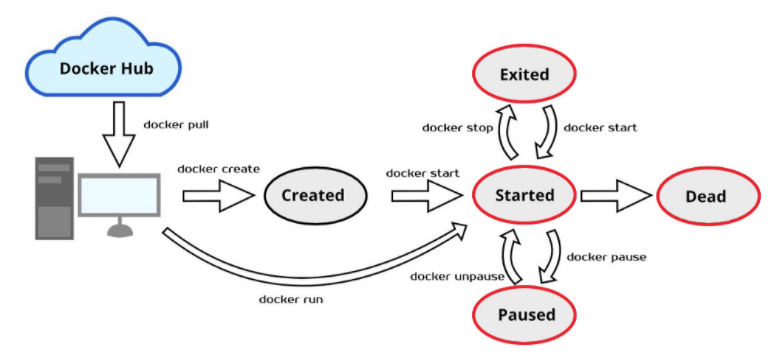
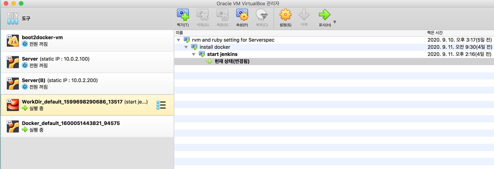
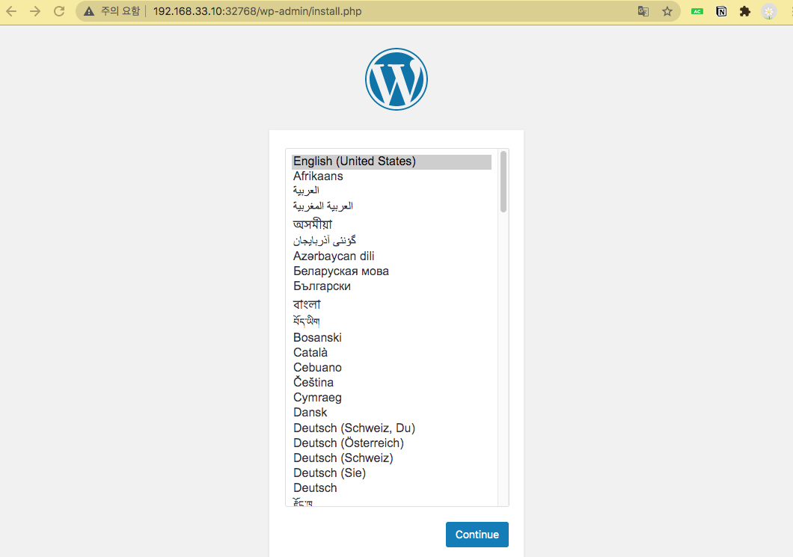
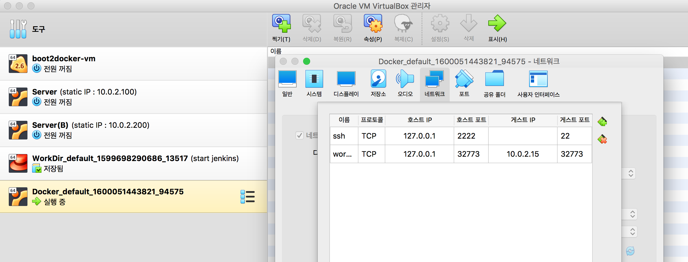
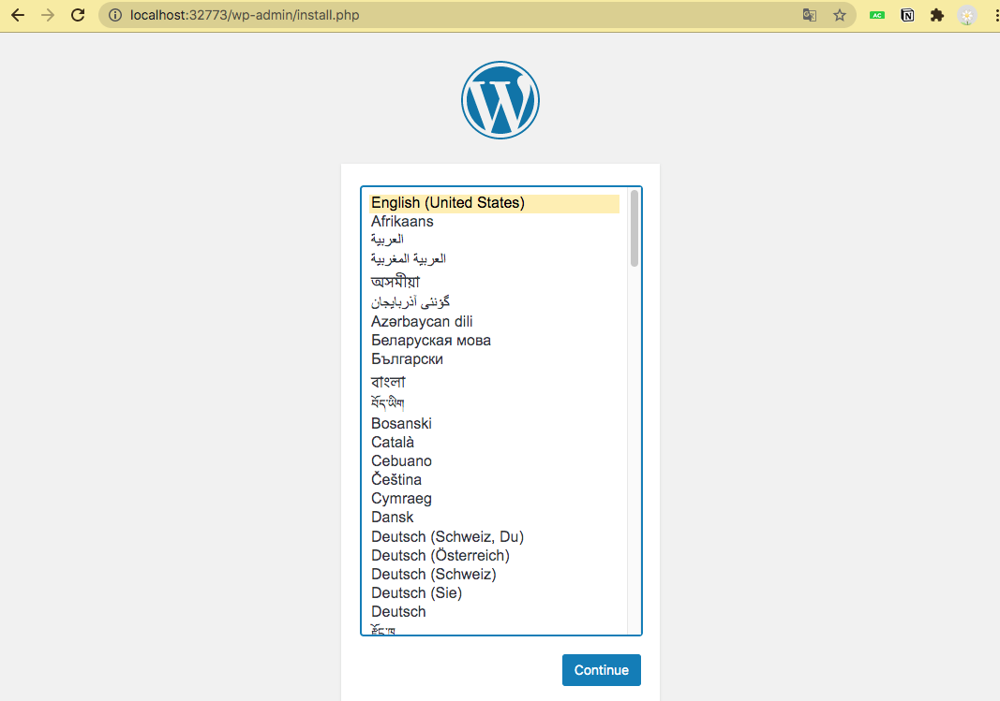

# 도커 컨테이너 배포

# 1️⃣  컨테이너로 애플리케이션 실행하기

## a. 도커 이미지로 도커 컨테이너 생성 (P36)

## gihyodocker/echo:latest 이미지를 이용해서 컨테이너를 생성, 실행

### docker image pull 명령으로 도커 이미지를 로컬 repo로 다운로드

```
vagrant@xenial64:~/chap01$ docker image pull gihyodocker/echo:latest
latest: Pulling from gihyodocker/echo
723254a2c089: Pull complete 
abe15a44e12f: Pull complete 
409a28e3cc3d: Pull complete 
503166935590: Pull complete 
abe52c89597f: Pull complete 
ce145c5cf4da: Pull complete 
96e333289084: Pull complete 
39cd5f38ffb8: Pull complete 
22860d04f4f1: Pull complete 
7528760e0a03: Pull complete 
Digest: sha256:4520b6a66d2659dea2f8be5245eafd5434c954485c6c1ac882c56927fe4cec84
Status: Downloaded newer image for gihyodocker/echo:latest
```

- 저장한 이미지를 조회

```
vagrant@xenial64:~$ docker image ls
REPOSITORY          TAG                 IMAGE ID            CREATED             SIZE
helloworld          latest              5c770ca9c442        About an hour ago   127MB
ubuntu              16.04               4b22027ede29        3 weeks ago         127MB
gihyodocker/echo    latest              3dbbae6eb30d        2 years ago         733MB
```

### 컨테이너 실행

```
vagrant@xenial64:~/chap01$ docker container run -t -p 9000:8080 gihyodocker/echo:latest
2020/09/14 05:40:42 start server
(제어권을 반환하지 않고 멈춘 상태)
```

### 새로운 프롬프트에서 컨테이너 실행을 확인

```
vagrant@xenial64:~$ docker container ls
CONTAINER ID        IMAGE                     COMMAND                  CREATED             STATUS              PORTS                    NAMES
cadbf11b5836        gihyodocker/echo:latest   "go run /echo/main.go"   3 minutes ago       Up 2 minutes        0.0.0.0:9000->8000/tcp   hardcore_leavitt
```

- `hardcore_leavitt` : 자동으로 만들어진 컨테이너 이름

### 두번째 터미널에서 curl 명령으로 컨테이너로 요청을 전송

- 컨테이너 실행하여 확인

```
vagrant@xenial64:~$ curl http://localhost:9000
Hello Docker!!
```

- 첫번째 터미널에서 요청 로그가 출력

```
vagrant@xenial64:~/chap01$ docker container run -t -p 9000:8080 gihyodocker/echo:latest 
2020/09/14 05:55:38 start server
2020/09/14 05:55:51 received request
```

### 두번째 터미널에서 docker container stop 명령으로 컨테이너를 중지/삭제

- 중지

```
vagrant@xenial64:~$ docker container stop 62
```

- 컨테이너 삭제

```
vagrant@xenial64:~$ docker container rm -f [컨테이너ID일부]
```

---

## b. 간단한 애플리케이션과 도커 이미지 만들기(p37)

### 1. main.go 작성

- 포트로 요청을 대기하고, 요청이 들어 왔을 때 Hello, Docker!! 라는 메시지를 반환

```
vagrant@xenial64:~$ mkdir ~/chap02 && cd ~/chap02
vagrant@xenial64:~/chap02$ vi main.go
```

- main.go 작성

```go
package main

import (
	"fmt"
	"log"
	"net/http"
)

func main() {
	http.HandleFunc("/", func(w http.ResponseWriter, r *http.Request) {
		log.Println("received request")
		fmt.Fprintf(w, "Hello Docker!!")
	})
	log.Println("start server")
	server := &http.Server{ Addr: ":8080" }
	if err := server.ListenAndServe(); err != nill {
		log.Println(err)
	}
}
```

### 2. Dockerfile 생성

```
vagrant@xenial64:~/chap02$ cat Dockerfile 
```

- 파일 내용

```docker
FROM golang:1.9

RUN mkdir /echo

COPY main.go /echo

CMD [ "go", "run", "/echo/main.go" ]
```

- CMD 인스트럭션 → `go run /echo/main.go`  명령어를 공백으로 구분하여 배열화한다

## c. 도커 이미지 빌드하기

- 도커 이미지 빌드하기

```
vagrant@xenial64:~/chap02$ docker image build -t example/echo:latest .
Sending build context to Docker daemon  3.072kB
Step 1/4 : FROM golang:1.9
1.9: Pulling from library/golang
55cbf04beb70: Pull complete 
1607093a898c: Pull complete 
9a8ea045c926: Pull complete 
d4eee24d4dac: Pull complete 
9c35c9787a2f: Pull complete 
8b376bbb244f: Downloading [==================>          ]  43.94MB/118.3MB
0d4eafcc732a: Download complete 
186b06a99029: Download complete
```

- 이미지 확인

```
vagrant@xenial64:~/chap02$ docker image ls
REPOSITORY          TAG                 IMAGE ID            CREATED             SIZE
example/echo        latest              ea5ead019e6b        14 seconds ago      750MB
helloworld          latest              5c770ca9c442        2 hours ago         127MB
ubuntu              16.04               4b22027ede29        3 weeks ago         127MB
golang              1.9                 ef89ef5c42a9        2 years ago         750MB
gihyodocker/echo    latest              3dbbae6eb30d        2 years ago         733MB
```

## d. 도커 컨테이너 실행

- 컨테이너 실행

```
vagrant@xenial64:~/chap02$ docker container run example/echo:latest 
2020/09/14 06:36:13 start server
```

- 만약, 오류가 나는 경우

```
vagrant@xenial64:~/chap02$ docker container run example/echo:latest 
# command-line-arguments
/echo/main.go:14:8: syntax error: missing statement after label
```

- `main.go` 파일을 알맞게 수정하고 다시 `build` 과정을 거친 후 `run` 한다.

### 백그라운드에서 컨테이너 실행 시키기

- 실행

```
vagrant@xenial64:~/chap02$ docker container run -d example/echo:latest
b29ccb86eaaf06e05c773808d6c2391e5177715b1c3e9c8ab9fcaeb8d6e1b2f6
```

- 중지 시키기
    - `id`의 일부만 입력해도 된다!

```
vagrant@xenial64:~/chap02$ docker container stop b
```

### 같은 이미지로 생성된 컨테이너를 일괄적으로 정지

- 두 개 연속으로 컨테이너 실행시키고 (같은 이미지로)

```
vagrant@xenial64:~/chap02$ docker container  run -d example/echo:latest
a569907c17d7417ade70df76a99d3ef2b38f42b6a69da851690a5247cb8d830e

vagrant@xenial64:~/chap02$ docker container  run -d example/echo:latest
45b5b26393f2e552844034d8542922c49095a5cd2d1efe48029e816e8c8556c6

vagrant@xenial64:~/chap02$ docker container ls
CONTAINER ID        IMAGE                 COMMAND                  CREATED             STATUS              PORTS               NAMES
45b5b26393f2        example/echo:latest   "go run /echo/main.go"   4 seconds ago       Up 3 seconds                            amazing_snyder
a569907c17d7        example/echo:latest   "go run /echo/main.go"   15 seconds ago      Up 14 seconds                           keen_allen
```

- 필터(filter) 옵션을 이용하여 조회

```
vagrant@xenial64:~/chap02$ docker container ls --filter  "ancestor=example/echo"
CONTAINER ID        IMAGE                 COMMAND                  CREATED             STATUS              PORTS               NAMES
45b5b26393f2        example/echo:latest   "go run /echo/main.go"   4 minutes ago       Up 4 minutes                            amazing_snyder
a569907c17d7        example/echo:latest   "go run /echo/main.go"   4 minutes ago       Up 4 minutes                            keen_allen
```

- 컨테이너 조회 결과에서 컨테이너ID만 추출

```
vagrant@xenial64:~/chap02$ docker container ls --filter  "ancestor=example/echo" -q
45b5b26393f2
a569907c17d7
```

- 동일한 이미지로 생성된 컨테이너를 일괄 삭제

    → 위에서 실행한 명령어를 $() 안에 넣어서 string으로 결과 값을 반환 하여 컨테이너 id 부분에 넣기

```
vagrant@xenial64:~/chap02$ docker container stop $(docker container ls --filter  "ancestor=example/echo" -q)
45b5b26393f2
a569907c17d7
```

### -p 옵션으로 포트포워딩

- `-p 호스트포트:컨테이너포트`

```
vagrant@xenial64:~/chap02$ docker container run -d -p 9090:8080 example/echo:latest
d59eac90e1e69b79c077fbc9607a409649dfb4551c1cc64e11d327620b2e8c76

vagrant@xenial64:~/chap02$ curl localhost:9090
Hello Docker!!
```

- 호스트 포트를 생략하는 경우 → 자동으로 할당

```
vagrant@xenial64:~/chap02$ docker container run -d -p 8080 example/echo:latest
e87d66c0ada2e60cb53e4ee8e126b290249994bdf9050a0fbc19061d7f11ad73
```

- `32768` 번으로 자동으로 매핑 된 것을 알 수 있다.

```
vagrant@xenial64:~/chap02$ docker container ls
CONTAINER ID        IMAGE                 COMMAND                  CREATED              STATUS              PORTS                     NAMES
e87d66c0ada2        example/echo:latest   "go run /echo/main.go"   13 seconds ago       Up 12 seconds       0.0.0.0:32768->8080/tcp   friendly_shtern
d59eac90e1e6        example/echo:latest   "go run /echo/main.go"   About a minute ago   Up About a minute   0.0.0.0:9090->8080/tcp    upbeat_rosalind
```

---

# 2️⃣ 도커 이미지 다루기

## a. 도커 이미지, 컨테이너 일괄 삭제

- 컨테이너 일괄 삭제
    - `docker container rm -f` : 실행 중인 컨테이너는 중지하고 삭제
    - `docker container ls -a -q`   :  모든 컨테이너의 ID반환

```
vagrant@xenial64:~/chap02$ docker container rm -f $(docker container ls -a -q)
e87d66c0ada2
d59eac90e1e6
45b5b26393f2
a569907c17d7
b29ccb86eaaf
8170dcb9062d
81c1647c8417
a0f2408c72da
15aac2796401
59bb415c9228
a2a408ce3f97
1598a8e92726
2ae987945975
ef2dd069a442
e0b3a4361a49
d57edd99a04f
0d001868a9df
```

- 모든 이미지 일관 삭제

```
vagrant@xenial64:~/chap02$ docker image rm -f $(docker image ls -q)
Untagged: example/echo:latest
...
Untagged: helloworld:latest
...
Untagged: ubuntu:16.04
Untagged: ubuntu@sha256:3dd44f7ca10f07f86add9d0dc611998a1641f501833692a2651c96defe8db940
...
Untagged: golang:1.9
...
Untagged: gihyodocker/echo:latest
...
```

## b. docker search 명령을 이용한 리포지토리 검색

- docker 사이트에서 인기순위 , 공식 이미지 등을 검색

```
vagrant@xenial64:~/chap02$ docker search mysql
NAME                              DESCRIPTION                                     STARS               OFFICIAL            AUTOMATED
mysql                             MySQL is a widely used, open-source relation…   9961                [OK]                
mariadb                           MariaDB is a community-developed fork of MyS…   3644                [OK]                
mysql/mysql-server                Optimized MySQL Server Docker images. Create…   725                                     [OK]
percona                           Percona Server is a fork of the MySQL relati…   509                 [OK]
```

- 이미지를 가져올 때, 좋은 방법
    1. 공식 배포이미지
    2. Dockerfile이 공개된 이미지 → 어떤 절차로 수행되는 지 알 수 있다.
    3. STARS를 많이 받은 이미지

### 리포지터리를 검색할 수 있도록 API를 제공

- 터미널에서 제공되는 API를 이용해서 이미지 정보를 조회

```
vagrant@xenial64:~/chap02$ curl https://hub.docker.com/v2/repositories/library/mysql/tags
```

⇒ JSON 형식의 데이터가 단순 문자열 형태로 출력

⇒ 가독성이 떨어져 데이터를 판독할 수 없음

### jq 유틸리티를 설치

⇒ JSON 데이터를 읽기 좋게 표현 및 가공을 도와주는 프로그램

```
vagrant@xenial64:~/chap02$ sudo apt install -y jq
```

- jq를 이용해서 출력 포맷을 변경

    ⇒ JSON 형식으로 포맷된 결과를 출력

    ⇒ 읽기 좋게 변경

```
vagrant@xenial64:~/chap02$ curl https://hub.docker.com/v2/repositories/library/mysql/tags | jq
```

```json
  % Total    % Received % Xferd  Average Speed   Time    Time     Time  Current
                                 Dload  Upload   Total   Spent    Left  Speed
100  4310    0  4310    0     0   4258      0 --:--:--  0:00:01 --:--:--  4263
{
  "count": 111,
  "next": "https://hub.docker.com/v2/repositories/library/mysql/tags?page=2",
  "previous": null,
  "results": [
    {
      "creator": 7,
      "id": 20021,
      "image_id": null,
      "images": [
        {
          "architecture": "amd64",
          "features": "",
          "variant": null,
          "digest": "sha256:b589f11ab39a852fd13090aeb56314978c73a16d615e28ec148306889b67889f",
          "os": "linux",
          "os_features": "",
          "os_version": null,
          "size": 158633433
        }
      ],
```

- jq를 이용해서 특정 데이터만  추출

```json
vagrant@xenial64:~/chap02$ curl https://hub.docker.com/v2/repositories/library/mysql/tags | jq '.results[].name'
  % Total    % Received % Xferd  Average Speed   Time    Time     Time  Current
                                 Dload  Upload   Total   Spent    Left  Speed
100  4310    0  4310    0     0   4334      0 --:--:-- --:--:-- --:--:--  4331
"latest"
"8.0.21"
"8.0"
"8"
"5.7.31"
"5.7"
"5.6.49"
"5.6"
"5"
"8.0.20"
```

## c. 테스트용 베이스 이미지를 생성

```
vagrant@xenial64:~/chap02$ mkdir ~/basetest & cd ~/basetest
```

- Dockerfile 작성

```docker
FROM busybox
RUN  echo "version = 1" > /tmp/version
```

- 이미지 생성

```
vagrant@xenial64:~/basetest$ docker image build -t likeyu96/basetest:latest .
Sending build context to Docker daemon  2.048kB
Step 1/2 : FROM busybox
latest: Pulling from library/busybox
df8698476c65: Pull complete 
Digest: sha256:d366a4665ab44f0648d7a00ae3fae139d55e32f9712c67accd604bb55df9d05a
Status: Downloaded newer image for busybox:latest
 ---> 6858809bf669
Step 2/2 : RUN echo "version = 1" > /tmp/version
 ---> Running in 75f2634bcee4
Removing intermediate container 75f2634bcee4
 ---> 4b372d007703
Successfully built 4b372d007703
Successfully tagged likeyu96/basetest:latest
```

- 생성한 이미지를 도커 허브에 업로드 (외부에 공개하기)
    - denied 되는 경우 로그인 작업이 필요 → `docker login` 명령을 통해

```
vagrant@xenial64:~/basetest$ docker image push likeyu96/basetest:latest
The push refers to repository [docker.io/likeyu96/basetest]
3ba820f4976a: Preparing 
be8b8b42328a: Preparing 
denied: requested access to the resource is denied
```

- 로그인 후 다시 push 한다.

```
vagrant@xenial64:~/basetest$ docker image push likeyu96/basetest:latest
The push refers to repository [docker.io/likeyu96/basetest]
3ba820f4976a: Pushed 
be8b8b42328a: Mounted from library/busybox 
latest: digest: sha256:ff5c8ef3f192898c952dbcbe449a0b962893612176fbeb82aab755702b13f086 size: 734
```

## d. 테스트용 이미지(basetest)를 이용해서 이미지를 생성

- pull test 디렉토리 만들기

```
vagrant@xenial64:~/basetest$ mkdir ~/pulltest && cd ~/pulltest
```

- Dockerfile 작성

```docker
vagrant@xenial64:~/pulltest$ cat Dockerfile 

FROM likeyu96/basetest

RUN cat /tmp/version
RUN cat /tmp/version
```

- 빌드
    - 이미지를 pull해서 만든다.
    - 같은 이미지를 또 만들면 중복으로 만들어 지지 않는다.

```docker
vagrant@xenial64:~/pulltest$ docker image build -t myanjini/pulltest:latest .	
```

## e. 테스트용 베이스 이미지를 업그레이드

```docker
vagrant@xenial64:~/pulltest$ cd ~/basetest
```

- Dockerfile 의 내용을 다음과 같이 변경

```docker
FROM busybox
RUN  echo "version = 2" > /tmp/version
```

- 변경 내용을 반영하기

```docker
vagrant@xenial64:~/basetest$ docker image build -t myanjini/basetest:latest .

vagrant@xenial64:~/basetest$ docker image push myanjini/basetest:latest
```

## f. 업데이트 된 테스트 이미지로 다시 이미지 만들기

```docker
vagrant@xenial64:~/pulltest$ cd ~/pulltest
vagrant@xenial64:~/pulltest$ docker image build -t myanjini/pulltest:latest .
```

- 확인
    - 기존의 이미지는 <none> 되고, 새로운 이미지가 다시 생긴다.

```docker
vagrant@xenial64:~/pushtest$ docker image ls
REPOSITORY          TAG                 IMAGE ID            CREATED              SIZE
likeyu96/basetest   latest              e49e89b85ba8        9 seconds ago        1.23MB
likeyu96/basetest   <none>              c6294af174d0        About a minute ago   1.23MB
<none>              <none>              209e4616f196        3 minutes ago        1.23MB
likeyu96/basetest   <none>              4b372d007703        11 minutes ago       1.23MB
exam/echo           latest              e0c2f06e9fdd        19 minutes ago       750MB
busybox             latest              6858809bf669        5 days ago           1.23MB
golang              1.9                 ef89ef5c42a9        2 years ago          750MB
```

---

# 3️⃣ 도커 컨테이너 다루기

## a. 도커 컨테이너 생명주기



## b. docker container run - 컨테이너 실행 시키기

### libray/alpine:latest 이미지의 Dockerfile 확인

- [https://hub.docker.com/_/alpine](https://hub.docker.com/_/alpine)
- [https://github.com/alpinelinux/docker-alpine/blob/90788e211ec6d5df183d79d6cb02e068b258d198/x86_64/Dockerfile](https://github.com/alpinelinux/docker-alpine/blob/90788e211ec6d5df183d79d6cb02e068b258d198/x86_64/Dockerfile)

### alpine 이미지를 이용해서 컨테이너 생성

```
vagrant@xenial64:~/dockerfile_test$ docker container run -it alpine
Unable to find image 'alpine:latest' locally
latest: Pulling from library/alpine
df20fa9351a1: Pull complete 
Digest: sha256:185518070891758909c9f839cf4ca393ee977ac378609f700f60a771a2dfe321
Status: Downloaded newer image for alpine:latest
/ # uname -a       <= 컨테이너가 생성괴면 컨테이너 내부에 쉘을 실행
Linux 216d9590feaa 4.4.0-189-generic #219-Ubuntu SMP Tue Aug 11 12:26:50 UTC 2020 x86_64 Linux
/ # ls
bin    dev    etc    home   lib    media  mnt    opt    proc   root   run    sbin   srv    sys    tmp    usr    var
/ # exit
```

### CMD 명령을 오버라이드

```
vagrant@xenial64:~/dockerfile_test$ docker container run -it alpine uname -a
Linux 9538af718777 4.4.0-189-generic #219-Ubuntu SMP Tue Aug 11 12:26:50 UTC 2020 x86_64 Linux

vagrant@xenial64:~/dockerfile_test$ docker container run -it alpine ls
bin    etc    lib    mnt    proc   run    srv    tmp    var
dev    home   media  opt    root   sbin   sys    usr

vagrant@xenial64:~/dockerfile_test$ docker container run -it alpine ip a
1: lo: <LOOPBACK,UP,LOWER_UP> mtu 65536 qdisc noqueue state UNKNOWN qlen 1
    link/loopback 00:00:00:00:00:00 brd 00:00:00:00:00:00
    inet 127.0.0.1/8 scope host lo
       valid_lft forever preferred_lft forever
80: eth0@if81: <BROADCAST,MULTICAST,UP,LOWER_UP,M-DOWN> mtu 1500 qdisc noqueue state UP 
    link/ether 02:42:ac:11:00:02 brd ff:ff:ff:ff:ff:ff
    inet 172.17.0.2/16 brd 172.17.255.255 scope global eth0
       valid_lft forever preferred_lft forever
```

## c. 컨테이너 목록 필터링

### 테스트를 위한 이미지를 생성하고 컨테이너를 실행

```
vagrant@xenial64:~/chap02$ docker image build -t example/echo:latest .

vagrant@xenial64:~/chap02$ docker container run -d -p 9000:8080 example/echo:latest 
5484ccd7835df8f6af91d682b584e76abc05c467f72f5876852c65b97ce4d37d

vagrant@xenial64:~/chap02$ docker container ls
CONTAINER ID        IMAGE                 COMMAND                  CREATED             STATUS              PORTS                    NAMES
5484ccd7835d        example/echo:latest   "go run /echo/main.go"   7 seconds ago       Up 6 seconds        0.0.0.0:9000->8080/tcp   nostalgic_newton
```

### 컨테이너 이름을 부여해서 실행

```
vagrant@xenial64:~/chap02$ docker container run -d -p 9001:8080 --name myecho example/echo:latest 
ac1a17570daff1c8a005f6aa2d6a563df8caa7da469946ac151fb544c9c4c041

vagrant@xenial64:~/chap02$ docker container ls
CONTAINER ID        IMAGE                 COMMAND                  CREATED             STATUS              PORTS                    NAMES
ac1a17570daf        example/echo:latest   "go run /echo/main.go"   5 seconds ago       Up 5 seconds        0.0.0.0:9001->8080/tcp   myecho
5484ccd7835d        example/echo:latest   "go run /echo/main.go"   2 minutes ago       Up 2 minutes        0.0.0.0:9000->8080/tcp   nostalgic_newton
```

### 컨테이너 이름으로 조회

```
vagrant@xenial64:~/chap02$ docker container ls -a --filter "name=myecho"
CONTAINER ID        IMAGE                 COMMAND                  CREATED             STATUS              PORTS                    NAMES
ac1a17570daf        example/echo:latest   "go run /echo/main.go"   3 minutes ago       Up 3 minutes        0.0.0.0:9001->8080/tcp   myecho
```

### 컨테이너 생성에 사용한 이미지로 조회(사용자명/이미지형 으로 조회)

```
vagrant@xenial64:~/chap02$ docker container ls -a --filter "ancestor=example/echo"
CONTAINER ID        IMAGE                 COMMAND                  CREATED             STATUS              PORTS                    NAMES
ac1a17570daf        example/echo:latest   "go run /echo/main.go"   2 minutes ago       Up 2 minutes        0.0.0.0:9001->8080/tcp   myecho
5484ccd7835d        example/echo:latest   "go run /echo/main.go"   4 minutes ago       Up 4 minutes        0.0.0.0:9000->8080/tcp   nostalgic_newton
```

## C-1. 태그가 다른 이미지를 이용한 컨테이너를 ancester 필터로 검색?

### example/echo:latest 이미지를 example/echo:old로 태그 변경

```
vagrant@xenial64:~/chap02$ docker image tag example/echo:latest example/echo:old
```

### myoldecho로 컨테이너 생성

```
vagrant@xenial64:~/chap02$ docker container run -d -p 9002:8080 --name myoldecho example/echo:old
4518d01a93b768479b36758250caf07ad7c266b411b723f16090e011e08c3f3d
```

### 검색!

- example/echo로 검색했을 때, old도 나오는 것을 알 수 있다.

```
vagrant@xenial64:~/chap02$ docker container ls --filter "ancestor=example/echo"
CONTAINER ID        IMAGE                 COMMAND                  CREATED             STATUS              PORTS                    NAMES
4518d01a93b7        example/echo:old      "go run /echo/main.go"   43 seconds ago      Up 42 seconds       0.0.0.0:9002->8080/tcp   myoldecho
ac1a17570daf        example/echo:latest   "go run /echo/main.go"   9 minutes ago       Up 9 minutes        0.0.0.0:9001->8080/tcp   myecho
5484ccd7835d        example/echo:latest   "go run /echo/main.go"   11 minutes ago      Up 11 minutes       0.0.0.0:9000->8080/tcp   nostalgic_newton
```

- example/echo:latest 로 검색했을때도 결과가 같다..!
    - 필터링에 사용하는 이미지는 "`사용자명/이미지명`"까지만 식별한다.

```
vagrant@xenial64:~/chap02$ docker container ls --filter "ancestor=example/echo:latest"
CONTAINER ID        IMAGE                 COMMAND                  CREATED             STATUS              PORTS                    NAMES
4518d01a93b7        example/echo:old      "go run /echo/main.go"   3 minutes ago       Up 3 minutes        0.0.0.0:9002->8080/tcp   myoldecho
ac1a17570daf        example/echo:latest   "go run /echo/main.go"   12 minutes ago      Up 12 minutes       0.0.0.0:9001->8080/tcp   myecho
5484ccd7835d        example/echo:latest   "go run /echo/main.go"   14 minutes ago      Up 14 minutes       0.0.0.0:9000->8080/tcp   nostalgic_newton
```

## d.  출력 형식 지정

```
vagrant@xenial64:~/chap02$ docker container ls -a --format "table {{.ID}} : {{.Names}}\t{{.Command}}"
CONTAINER ID : NAMES              COMMAND
4518d01a93b7 : myoldecho          "go run /echo/main.go"
ac1a17570daf : myecho             "go run /echo/main.go"
5484ccd7835d : nostalgic_newton   "go run /echo/main.go"
```

## e. 컨테이너 정지, 재시작

- 파라미터로 컨테이너 이름, ID를 지정할 수 있다.
- 정지

```
vagrant@xenial64:~/chap02$ docker container stop myoldecho 
```

- 재시작

```
vagrant@xenial64:~/chap02$ docker container restart 9b
```

## f. 컨테이너 삭제

### 중지 상태인 컨테이너를 삭제

- 중지 상태 컨테이너의 id를 조회

```
vagrant@xenial64:~/chap02$ docker container ls --filter "status=exited" -q
4518d01a93b7
ac1a17570daf
```

- 중지 중인 컨테이너를 일괄 삭제

```
vagrant@xenial64:~/chap02$ docker container rm $(docker container ls --filter "status=exited" -q)
4518d01a93b7
ac1a17570daf
```

### 모든 컨테이너를 삭제

```
vagrant@xenial64:~/chap02$ docker container rm -f $(docker container ls -a -q)
```

## g. 컨테이너 내부의 표준 출력을 호스트로 연결

- 도커에서 공식 배포하는 최신 버전(latest) → libary/jenkins:latest와 같은 의미

```
vagrant@xenial64:~/chap02$ docker container run -d -p 8080:8080 -p 5000:5000 jenkins
```

- 표준 출력 내용을 보기

```
vagrant@xenial64:~/chap02$ docker container logs -f 6
```

## h. 실행중인 컨테이너 내부로 명령을 전달

- `docker container exec 컨테이너이름 명령어`

```
vagrant@xenial64:~/chap02$ docker container run -t -d --name echo --rm example/echo:latest 
7052ed1914d6c05d0958c4f3d598d8104e30fc32461572513098bd1a7759c645

vagrant@xenial64:~/chap02$ docker container exec echo pwd
/go

vagrant@xenial64:~/chap02$ docker container exec echo ip a
1: lo: <LOOPBACK,UP,LOWER_UP> mtu 65536 qdisc noqueue state UNKNOWN group default qlen 1
    link/loopback 00:00:00:00:00:00 brd 00:00:00:00:00:00
    inet 127.0.0.1/8 scope host lo
       valid_lft forever preferred_lft forever
98: eth0@if99: <BROADCAST,MULTICAST,UP,LOWER_UP> mtu 1500 qdisc noqueue state UP group default 
    link/ether 02:42:ac:11:00:03 brd ff:ff:ff:ff:ff:ff link-netnsid 0
    inet 172.17.0.3/16 brd 172.17.255.255 scope global eth0
       valid_lft forever preferred_lft forever
```

- 컨테이너 내부 쉘을 이용
    - -i, -t를 합쳐서 사용하면 표준 입력 연결을 유지하고, 유사 터미널을 할당한다.

```
vagrant@xenial64:~/chap02$ docker container exec -it echo /bin/sh
# pwd
/go
# ip a
1: lo: <LOOPBACK,UP,LOWER_UP> mtu 65536 qdisc noqueue state UNKNOWN group default qlen 1
    link/loopback 00:00:00:00:00:00 brd 00:00:00:00:00:00
    inet 127.0.0.1/8 scope host lo
       valid_lft forever preferred_lft forever
98: eth0@if99: <BROADCAST,MULTICAST,UP,LOWER_UP> mtu 1500 qdisc noqueue state UP group default 
    link/ether 02:42:ac:11:00:03 brd ff:ff:ff:ff:ff:ff link-netnsid 0
    inet 172.17.0.3/16 brd 172.17.255.255 scope global eth0
       valid_lft forever preferred_lft forever
# exit
```

## i. 호스트의 파일 또는 디렉토리를 컨테이너 내부로 복사

- `docker container cp 호스트경로 컨테이너이름:컨테이너내부경로`

### 호스트의 현재 시간을 파일로 생성

```
vagrant@xenial64:~/chap02$ date > host_now

vagrant@xenial64:~/chap02$ cat host_now
Tue Sep 15 05:33:29 UTC 2020
```

### 호스트의 파일을 echo 컨테이너 내부로 복사 후 확인

```
vagrant@xenial64:~/chap02$ docker container cp ./host_now echo:/tmp/

vagrant@xenial64:~/chap02$ docker container exec echo cat /tmp/host_now
Tue Sep 15 05:33:29 UTC 2020
```

### 컨테이너 내부의 파일을 호스트로 복사

```
vagrant@xenial64:~/chap02$ docker container cp echo:/tmp/host_now ./host_now_from_container

vagrant@xenial64:~/chap02$ cat host_now_from_container 
Tue Sep 15 05:33:29 UTC 2020
```

---

# 4️⃣ 운영과 관리를 위한 명령

## a. 불필요한 컨테이너 및 이미지 삭제

- 컨테이너 삭제

```
vagrant@xenial64:~/chap02$ docker container ls -a
CONTAINER ID        IMAGE                 COMMAND                  CREATED             STATUS                       PORTS               NAMES
7052ed1914d6        example/echo:latest   "go run /echo/main.go"   15 minutes ago      Up 15 minutes                                    echo
6d37004aa0b0        jenkins               "/bin/tini -- /usr/l…"   23 minutes ago      Exited (143) 8 seconds ago                       sad_merkle

vagrant@xenial64:~/chap02$ docker container prune 
WARNING! This will remove all stopped containers.
Are you sure you want to continue? [y/N] y
Deleted Containers:
6d37004aa0b0a3896b6069e452fac734f012accffa5e9831eca9bf4acb45c120

Total reclaimed space: 0B
```

- 이미지 삭제

```
vagrant@xenial64:~/chap02$ docker image prune
```

## b. 컨테이너 단위 시스템 리소스 사용 현황 확인

```
vagrant@xenial64:~/chap02$ docker container stats
CONTAINER ID        NAME                CPU %               MEM USAGE / LIMIT     MEM %               NET I/O             BLOCK I/O           PIDS
7052ed1914d6        echo                0.00%               5.078MiB / 991.9MiB   0.51%               898B / 0B           43MB / 8.19kB       12
```

---

# LAB. 특정 웹 페이지를 포함하고 있는 웹 서버 이미지 생성

- [http://localhost:8080/hello.html](http://localhost:8080/hello.html) 요청하면 hello docker 메시지를 반환하는 웹 서비스를 제공하는 이미지를 생성

## 첫번째 방식

### 우분투 이미지를 이용해서 컨테이너 실행하고 컨테이너 내부를 변경한 후 이미지를 생성

1. 작업 디렉터리 생성

    ```
    vagrant@xenial64:~/chap02$ mkdir ~/webserver && cd ~/webserver
    vagrant@xenial64:~/webserver$

    ```

2. hello.html 파일 생성

    ```
    vagrant@xenial64:~/webserver$ echo "hello docker" > hello.html
    vagrant@xenial64:~/webserver$ cat hello.html 
    hello docker
    ```

3. 우분투 이미지를 이용해서 컨테이너를 실행

    ```
    vagrant@xenial64:~/webserver$ docker container run -dit -p 8080:80 --name myweb ubuntu:14.04
    Unable to find image 'ubuntu:14.04' locally
    14.04: Pulling from library/ubuntu
    2e6e20c8e2e6: Pull complete 
    30bb187ac3fc: Pull complete 
    b7a5bcc4a58a: Pull complete 
    Digest: sha256:ffc76f71dd8be8c9e222d420dc96901a07b61616689a44c7b3ef6a10b7213de4
    Status: Downloaded newer image for ubuntu:14.04
    72c554d139576816fdf9353131054cc34ccef817b81398258c89f2123726789b
    ```

4. 컨테이너 내부의 쉘로 접속

    ```
    vagrant@xenial64:~/webserver$ docker container exec -it myweb /bin/bash
    root@72c554d13957:/#
    ```

5. 컨테이너 내부에 아파치 웹 서버를 설치 및 실행

    ```
    root@72c554d13957:/# apt-get update

    root@72c554d13957:/# apt-get install apache2 -y

    root@72c554d13957:/# service apache2 status
     * apache2 is not running

    root@72c554d13957:/# service apache2 start
     * Starting web server apache2                                                                                                   AH00558: apache2: Could not reliably determine the server's fully qualified domain name, using 172.17.0.2. Set the 'ServerName' directive globally to suppress this message
     * 

    root@72c554d13957:/# service apache2 status
     * apache2 is running

    root@72c554d13957:/# ls /var/www/html
    index.html
    root@72c554d13957:/# exit 
    exit
    ```

6. 아파치 웹 서버의 웹 루트에 hello.html 파일을 복사

    ```
    vagrant@xenial64:~/webserver$ docker container cp ./hello.html myweb:/var/www/html

    vagrant@xenial64:~/webserver$ docker container exec myweb cat /var/www/html/hello.html
    hello docker
    ```

7. 컨테이너로 웹 서비스를 요청

    ```
    vagrant@xenial64:~/webserver$ curl http://localhost:8080/hello.html
    hello docker
    ```

8. 이미지를 생성

    ```
    vagrant@xenial64:~/webserver$ docker commit myweb likeyu96/myweb:latest
    sha256:b1c5a769cf15b4d6887116cb51f7d166b330f04eb04d047c4813e8267e88862d
    vagrant@xenial64:~/webserver$ docker image ls
    REPOSITORY          TAG                 IMAGE ID            CREATED             SIZE
    likeyu96/myweb      latest              b1c5a769cf15        7 seconds ago       221MB
    recommand           latest              100e6ccfc2ac        2 hours ago         73.9MB
    falloc_100m         latest              fc0a2c29d296        2 hours ago         179MB
    likeyu96/basetest   latest              e49e89b85ba8        21 hours ago        1.23MB

    ```

## 두번째 방식

### Dockerfile을 작성해서 이미지를 생성

1. Dockerfile 정의

    ```docker
    FROM ubuntu:14.04

    RUN apt-get update
    RUN apt-get install -y apache2

    ADD hello.html /var/www/html/

    EXPOSE 80

    CMD apachectl -DFOREGROUND
    ```

2. 빌드해서 이미지 생성 & 생성한 이미지로 컨테이너 실행

    ```docker
    vagrant@xenial64:~/webserver$ docker image build -t likeyu96/myweb:dockerfile

    vagrant@xenial64:~/webserver$ docker container run -d -p 9090:80 --name mywebdockerfile likeyu96/myweb:dockerfile
    aac0033d195f2f311d84beb35388377fa720faaac6e4a52f59ebcf2b8a46e060

    ```

    2-1.   호스트의 랜덤하게 할당된 포트와 컨테이너에서 EXPOSE된 포트를 자동으로 맵핑

    ```docker
    vagrant@xenial64:~/webserver$ docker container run -d -P --name mywebrandport likeyu96/myweb:dockerfile
    71356e09d86003d3df92d98197a90aa3fe8491ebf1a4e734eff6ec3ef26250bd
    ```

3. 실행

    ```docker
    vagrant@xenial64:~/webserver$ curl http://localhost:9090/hello.html
    hello docker
    ```

## 세번째 방식

### 이미 만들어진 이미지를 이용해서 웹 서버 구축

1. 도커 허브에서 적당한 이미지를 검색
    - [https://hub.docker.com/_/nginx](https://hub.docker.com/_/nginx)
2. nginx 이미지를 다운로드

    ```docker
    vagrant@xenial64:~/webserver$ docker pull nginx

    vagrant@xenial64:~/webserver$ docker image ls
    REPOSITORY          TAG                 IMAGE ID            CREATED             SIZE
    nginx               latest              7e4d58f0e5f3        4 days ago          133MB
    ```

3. nginx 서버를 구동 (컨테이너를 실행)

    ```docker
    vagrant@xenial64:~/webserver$ docker container run --name webserver -d -p 80:80 nginx
    879f999e410185ab89edfb57a6c810b62614a570f1498c2d28c94647302f4ecd

    vagrant@xenial64:~/webserver$ curl http://localhost
    ```

---

# LAB2. wordpress와 mysql을 연동한 워드프로세스 기반 블로그 서비스

- 이전에 생성한 WorkDir(centOS) 로 접속하거나
- 이번 수업에서 생성안 Docker_default 로 수행할 수 있다.



## 방법1 > 로컬에서 실행(WorkDir(centOS) 가상 머신으로 실행)

```docker
➜ ~ cd VirtualBox\ VMs/HashCorp/WorkDir
➜ WorkDir vagrant up
➜ WorkDir vagrant ssh
```

1. 작업 디렉터리 생성

    ```
    [vagrant@demo ~]$ mkdir ~/blog && cd ~/blog
    [vagrant@demo ~]$ sudo su
    [root@demo blog]# systemctl start docker.service
    ```

2. mysql 서비스를 제공하는 컨테이너 실행
    - 도커 허브 검색 → [https://hub.docker.com/_/mysql](https://hub.docker.com/_/mysql)
    - 뒤쪽의 변수들은 컨테이너 내부의 환경 변수를 설정

    ```
    vagrant@xenial64:~/blog$ docker run -d --name wordpressdb -e MYSQL_ROOT_PASSWORD=password -e MYSQL_DATABASE-wordpress mysql:5.7

    [root@demo blog]# docker run -d --name wordpressdb -e MYSQL_ROOT_PASSWORD=password -e MYSQL_DATABASE=wordpress mysql:5.7
    ```

3. 워드프레스 이미지를 이용한 웹 서버 컨테이너를 실행
    - 도커 허브 검색 → [https://hub.docker.com/_/wordpress](https://hub.docker.com/_/wordpress)

    ```
    [root@demo blog]# docker run -d -e WORDPRESS_DB_PASSWORD=password --name wordpress --link wordpressdb:mysql -p 80 wordpress
    ```

4. 컨테이너 실행 확인
    - wordpress와 mysql을 연동하여 컨테이너를 실행한 상태!

    ```
    [root@demo blog]# docker container ls
    CONTAINER ID        IMAGE               COMMAND                  CREATED              STATUS              PORTS                   NAMES
    2e1781ac5c36        wordpress           "docker-entrypoint..."   About a minute ago   Up About a minute   0.0.0.0:32768->80/tcp   wordpress
    9be806ed3545        mysql:5.7           "docker-entrypoint..."   4 minutes ago        Up 4 minutes        3306/tcp, 33060/tcp     wordpressdb
    ```

5. 워드프레스 컨테이너 내부에서 wordpressdb 이름의 컨테이너(mysql로 alias되어 있음)로 연결되는지 확인

    ```
    [root@demo blog]# docker container exec -it wordpress /bin/bash
    root@2e1781ac5c36:/var/www/html# ping mysql
    bash: ping: command not found

    root@2e1781ac5c36:/var/www/html# apt-get update

    root@2e1781ac5c36:/var/www/html# apt-get install -y iputils-ping

    root@2e1781ac5c36:/var/www/html# ping mysql
    PING mysql (172.17.0.2) 56(84) bytes of data.
    64 bytes from mysql (172.17.0.2): icmp_seq=1 ttl=64 time=0.077 ms
    64 bytes from mysql (172.17.0.2): icmp_seq=2 ttl=64 time=0.105 ms
    64 bytes from mysql (172.17.0.2): icmp_seq=3 ttl=64 time=0.136 ms
    ```

6. 로컬에서  192.168.33.10:32768 로 접속해보기!

    

## 방법 2 > Docker_default 로 수행

```
➜ ~ cd Docker
➜ Docker vagrant ssh
```

위의 1~3을 실행합니다.

4. 실행 확인

```
vagrant@xenial64:~/blog$ docker container ls
CONTAINER ID        IMAGE               COMMAND                  CREATED             STATUS              PORTS                   NAMES
78be21f34f7d        wordpress           "docker-entrypoint.s…"   3 seconds ago       Up 2 seconds        0.0.0.0:32773->80/tcp   wordpress
f8f895bf1528        mysql:5.7           "docker-entrypoint.s…"   17 seconds ago      Up 16 seconds       3306/tcp, 33060/tcp     wordpressdb
```

5. 포트포워딩을 한다.



6. 이제 접속해서 확인한다.

- localhost:32773

