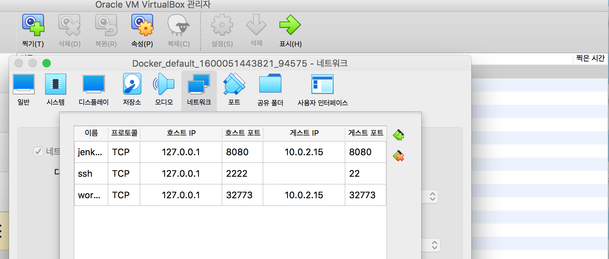
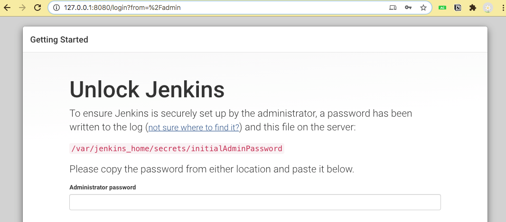
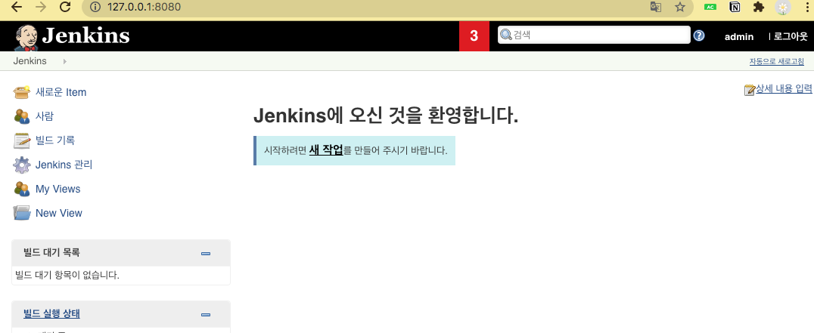
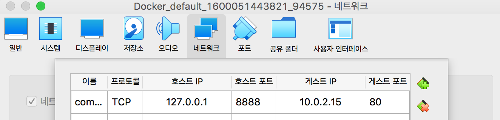
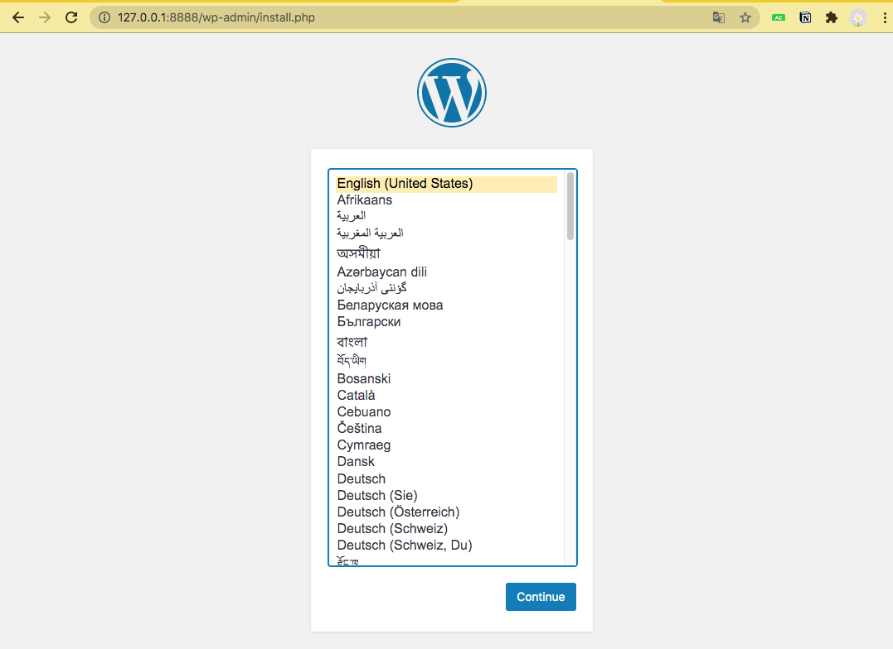

# 도커 컨테이너 배포2

# 컨테이너의 데이터를 영속적(persistent)인 데이터로 활용

## 방법 1. 호스트 볼륨 공유

### -v 옵션을 이용해서 호스트 볼륨을 공유

- 호스트의 디렉터리를 컨테이너의 디렉터리에 마운트
- 이미지에 원재 존재하는 디렉터리에 호스트의 볼륨을 공유하면 컨테이너의 디렉터리 자체가 덮어쓰게 됨

### 모든 컨테이너, 이미지, 볼륨을 삭제

```
vagrant@xenial64:~/blog$ docker container rm -f $(docker container ls -aq)
vagrant@xenial64:~/blog$ docker image rm -f $(docker image ls -aq)
vagrant@xenial64:~/blog$ docker volume rm -f $(docker volume ls -q)
```

### MySQL 이미지를 이용한 데이터베이스 컨테이너를 생성

```
vagrant@xenial64:~/blog$ docker run -d --name wordpressdb_hostvolume -e 
MYSQL_ROOT_PASSWORD=password -e MYSQL_DATABASE=wordpress -v 
/home/vagrant/wordpress_db:/var/lib/mysql mysql:5.7
6b7848cca9068f3af8b1cf56acbb9d5fb0160f0500e35cd4498ba13fbe14757a
```

- /home/wordpress_db	⇒ 도커가 자동으로 생성
- /var/lib/mysql	⇒ mysql 데이터베이스의 데이터를 저장하는 기본 디렉터리

### 호스트 볼륨 공유를 확인

```
vagrant@xenial64:~/blog$ ls /home/vagrant/wordpress_db
auto.cnf    ca.pem           client-key.pem  ibdata1      ib_logfile1  mysql               private_key.pem  server-cert.pem  sys
ca-key.pem  client-cert.pem  ib_buffer_pool  ib_logfile0  ibtmp1       performance_schema  public_key.pem   server-key.pem   wordpress
```

### 컨테이너 내부의 디렉터리를 확인 ⇒ 위에서 확인한 것과 동일

```
vagrant@xenial64:~/blog$ docker container exec wordpressdb_hostvolume ls /var/lib/mysql
auto.cnf
ca-key.pem
ca.pem
client-cert.pem
client-key.pem
ib_buffer_pool
ib_logfile0
ib_logfile1
ibdata1
ibtmp1
mysql
performance_schema
private_key.pem
public_key.pem
server-cert.pem
server-key.pem
sys
wordpress
```

### wordpressdb_hostvolume 컨테이너를 삭제한 후 호스트 볼륨을 확인

```
vagrant@xenial64:~/blog$ docker container rm -f wordpressdb_hostvolume
wordpressdb_hostvolume

vagrant@xenial64:~/blog$ docker container ls -a
CONTAINER ID        IMAGE               COMMAND                  CREATED             STATUS              PORTS                   NAMES
f83d662595e4        wordpress           "docker-entrypoint.s…"   51 seconds ago      Up 49 seconds       0.0.0.0:32774->80/tcp   wordpress_hostvolume

vagrant@xenial64:~/blog$ ls /home/vagrant/wordpress_db/
auto.cnf    ca.pem           client-key.pem  ibdata1      ib_logfile1  mysql               private_key.pem  server-cert.pem  sys
ca-key.pem  client-cert.pem  ib_buffer_pool  ib_logfile0  ibtmp1       performance_schema  public_key.pem   server-key.pem   wordpress
```

- 컨테이너는 삭제되었지만 공유되고 있던 파일(디렉터리)은 그대로 남아 있음을 확인
- 데이터의 영속성을 부여

### MySQL 이미지를 이용해서 컨테이너를 실행 (기존 호스트 볼륨을 맵핑)

```
vagrant@xenial64:~/blog$ docker run -d --name wordpressdb_hostvolume 
-e MYSQL_ROOT_PASSWORD=password -e MYSQL_DATABASE=wordpress -v 
/home/vagrant/wordpress_db:/var/lib/mysql mysql:5.7
38370efe4c601ab12c7d7ce6b25eaf27cc9441968a9d355651bf5a7ddc85a5b7
```

```
vagrant@xenial64:~/blog$ docker container exec wordpressdb_hostvolume ls /var/lib/mysql
auto.cnf
ca-key.pem
ca.pem
client-cert.pem
client-key.pem
ib_buffer_pool
ib_logfile0
ib_logfile1
ibdata1
ibtmp1
mysql
performance_schema
private_key.pem
public_key.pem
server-cert.pem
server-key.pem
sys
wordpress
```

## 방법2. 볼륨 컨테이너

### -v 옵션으로 볼륨을 사용하는 컨테이너를 다른 컨테이너와 공유하는 것

- 컨테이너를 생성할 때 --volumes-from 옵션을 설정하면 -v 또는 --volume 옵션을 적용한 컨테이너의 볼륨 디렉터리 공유가 가능

### -v 옵션으로 볼륨을 사용하는 컨테이너를 확인

```
vagrant@xenial64:~/blog$ docker container ls
CONTAINER ID        IMAGE               COMMAND                  CREATED             STATUS              PORTS                   NAMES
38370efe4c60        mysql:5.7           "docker-entrypoint.s…"   2 minutes ago       Up 2 minutes        3306/tcp, 33060/tcp     wordpressdb_hostvolume
f83d662595e4        wordpress           "docker-entrypoint.s…"   12 minutes ago      Up 12 minutes       0.0.0.0:32774->80/tcp   wordpress_hostvolume
```

- wordpressdb_hostvolume 없는 경우 아래 명령어로 컨테이너 생성
    - `docker run -d --name wordpressdb_hostvolume -e MYSQL_ROOT_PASSWORD=password -e MYSQL_DATABASE=wordpress -v /home/vagrant/wordpress_db:/var/lib/mysql mysql:5.7`

### 호스트 볼륨 공유를 확인

```
# 호스트의 디렉터리
vagrant@xenial64:~/blog$ ls ~/wordpress_db/
auto.cnf    ca.pem           client-key.pem  ibdata1      ib_logfile1  mysql               private_key.pem  server-cert.pem  sys
ca-key.pem  client-cert.pem  ib_buffer_pool  ib_logfile0  ibtmp1       performance_schema  public_key.pem   server-key.pem   wordpress

# 컨테이너 내부
vagrant@xenial64:~/blog$ docker container exec -it wordpressdb_hostvolume ls /var/lib/mysql
auto.cnf	 client-key.pem  ibdata1	     private_key.pem  sys
ca-key.pem	 ib_buffer_pool  ibtmp1		     public_key.pem   wordpress
ca.pem		 ib_logfile0	 mysql		     server-cert.pem
client-cert.pem  ib_logfile1	 performance_schema  server-key.pem
```

### 호스트와 볼륨을 공유하는 컨테이너를 공유하는 컨테이너를 생성

```
vagrant@xenial64:~$ docker run -it --name volume_from_container --volumes-from wordpressdb_hostvolume ubuntu:14.04
root@d6ec70aa8c04:/# ls /var/lib/mysql
auto.cnf    client-cert.pem  ib_logfile0  ibtmp1              private_key.pem  server-key.pem
ca-key.pem  client-key.pem   ib_logfile1  mysql               public_key.pem   sys
ca.pem      ib_buffer_pool   ibdata1      performance_schema  server-cert.pem  wordpress
```

## 방법3 . 도커 볼륨

### 도커 자체가 제공하는 볼륨 기능을 활용

- docker volume 명령어를 사용

### 볼륨 생성

```
vagrant@xenial64:~/blog$ docker volume create --name myvolume
myvolume

vagrant@xenial64:~/blog$ docker volume ls
DRIVER              VOLUME NAME
local               9e7badfd304fe0eb5faa08c7ff169600192f8bfa32f1b49b782092fa3ad030fc
local               myvolume
```

### 생성한 볼륨을 이용해서 컨테이너를 생성

- `-v 볼륨이름:컨테이너내부디렉터리`

```
vagrant@xenial64:~/blog$ docker run -it --name myvolume1 -v myvolume:/root/ ubuntu:14.04
root@9af238aaec4c:/# cd root
root@9af238aaec4c:~# echo hello, volume >> /root/volume
root@9af238aaec4c:~# exit
exit
```

### 동일 볼륨을 사용하는 컨테이너를 생성해서 공유 여부를 확인

```
vagrant@xenial64:~/blog$ docker run -it --name myvolume2 -v myvolume:/temp/ ubuntu:14.04
root@1553b657dfd7:/# cat /temp/volume 
hello, volume
```

### docker inspect 명령으로 볼륨의 저장 위치를 확인

```json
vagrant@xenial64:~/blog$ docker inspect --type volume myvolume
[
    {
        "CreatedAt": "2020-09-16T02:48:56Z",
        "Driver": "local",
        "Labels": {},
        "Mountpoint": "/var/lib/docker/volumes/myvolume/_data",
        "Name": "myvolume",
        "Options": {},
        "Scope": "local"
    }
]
```

---

# Quiz

1. run.sh 스크립트를 작성합니다.
2. run.sh 스크립트는 실행할 컨테이너의 이름을 파라미터로 입력받습니다.

예 ⇒ $ run.sh echo

1. 동일한 이름의 컨테이너가 존재하면 해당 컨테이너를 삭제하고 컨테이너를 실행(생성)합니다.
2. 컨테이너 생성 스크립트는 다음과 같은 형식입니다.

docker container run --name 컨테이너이름 -itd -p 8888:8080 myanjini/echo:latest /bin/bash

```bash
if [ $# == 0 ]
then
   echo 명령어 형식이 잘못되었습니다.
   echo [사용법] ./run.sh container_name
   exit 1
fi

cid=$(docker container ps -a --filter "name=$1" -q)

if [ -n cid ]
then
   docker container rm -f $cid
   echo $1 컨테이너\($cid\)를 삭제했습니다.
fi

docker container run --name $1 -itd -p 8888:8080 myanjini/echo:latest /bin/bash

exit 0
```

---

# 5️⃣ 도커 컴포즈로 여러 컨테이너 실행하기

## 1. 설치

- [https://docs.docker.com/compose/install/](https://docs.docker.com/compose/install/)

```
vagrant@xenial64:~$ sudo curl -L "https://github.com/docker/compose/releases/download/1.27.2/docker-compose-$(uname -s)-$(uname -m)" -o /usr/local/bin/docker-compose
  % Total    % Received % Xferd  Average Speed   Time    Time     Time  Current
                                 Dload  Upload   Total   Spent    Left  Speed
100   651  100   651    0     0   1379      0 --:--:-- --:--:-- --:--:--  1382
100 11.6M  100 11.6M    0     0   776k      0  0:00:15  0:00:15 --:--:--  653k

vagrant@xenial64:~$ sudo chmod +x /usr/local/bin/docker-compose 

vagrant@xenial64:~$ docker-compose version
docker-compose version 1.27.2, build 18f557f9
docker-py version: 4.3.1
CPython version: 3.7.7
OpenSSL version: OpenSSL 1.1.0l  10 Sep 2019
```

## 2. docker-compose 명령으로 컨테이너를 실행

### a) 작업 디렉터리 및 docker-compose.yml 파일을 생성

```
vagrant@xenial64:~$ mkdir ~/compose && cd ~/compose

vagrant@xenial64:~/compose$ vi docker-compose.yml
```

```yaml
version: "3"                          # 문법 버전
services:            
  echo:                               # 컨테이너 이름
    image: myanjini/echo:latest       # 컨테이너 생성에 사용할 도커 이미지 
    ports:
      - 9000:8080                     # 포트 포워딩 ⇒ 호스트:컨테이너
```

### b) 컨테이너 실행

```
vagrant@xenial64:~/compose$ docker-compose up
Creating compose_echo_1 ... done
Attaching to compose_echo_1
echo_1  | 2020/09/16 04:28:23 start server
```

### c) 다른 터미널에서 컨테이너 생성 여부 확인

```
vagrant@xenial64:~$ docker container ls
CONTAINER ID        IMAGE                  COMMAND                  CREATED             STATUS              PORTS                    NAMES
a4a9bb4ca337        likeyu96/echo:latest   "go run /echo/main.go"   2 minutes ago       Up 2 minutes        0.0.0.0:9000->8080/tcp   compose_echo_1
```

### d) 컨테이너 중지 (중지와 함께 삭제도 수행)

```
vagrant@xenial64:~/compose$ docker-compose down
Stopping compose_echo_1 ... done
Removing compose_echo_1 ... done
Removing network compose_default
```

## 3. 이미지를 만들고 컨테이너를 실행

### a) 기본에 만들어 놓은 Dockerfile, main.go 파일을 작업 디렉터리로 복사

```
vagrant@xenial64:~/compose$ cp ../chap02/Dockerfile ./

vagrant@xenial64:~/compose$ cp ../chap02/main.go ./

vagrant@xenial64:~/compose$ ls
docker-compose.yml  Dockerfile  main.go
```

### b) Dockerfile을 이용해서 이미지를 빌드 후 실행도록 docker-compose.yml 파일을 수정

```yaml
vagrant@xenial64:~/compose$ cat docker-compose.yml 
version: "3"
services:
 echo:
  #image: likeyu96/echo:latest
  build: .
  ports:
   - 9000:8080
```

- 컨테이너 실행

```
vagrant@xenial64:~/compose$ docker-compose up -d --build
Creating network "compose_default" with the default driver
Building echo                     ⇐ --build 옵션을 추가했기 때문에 이미지를 빌드(생성)
Step 1/4 : FROM golang:1.9 
 ---> ef89ef5c42a9
Step 2/4 : RUN mkdir /echo
 ---> Using cache
 ---> cf1bc6e9ba8b
Step 3/4 : COPY main.go /echo
 ---> cb8a8b284ad3
Step 4/4 : CMD [ "go", "run", "/echo/main.go" ]
 ---> Running in bdb2b33587b1
Removing intermediate container bdb2b33587b1
 ---> 5b6fd4563562

Successfully built 5b6fd4563562
Successfully tagged compose_echo:latest
Creating compose_echo_1 ... done ⇐ -d 옵션을 추가했기 때문에 명령어 입력이 가능 (백그라운드 실행)
```

- 확인해보기

```
vagrant@xenial64:~/compose$ docker image ls
REPOSITORY          TAG                 IMAGE ID            CREATED              SIZE
compose_echo        latest              5b6fd4563562        About a minute ago   750MB
example/echo        latest              a02ce6937c0b        2 hours ago          750MB
likeyu96/echo       latest              a02ce6937c0b        2 hours ago          750MB
wordpress           latest              420b971d0f8b        4 days ago           546MB
mysql               5.7                 ef08065b0a30        5 days ago           448MB
myanjini/echo       latest              11c732eb2923        8 months ago         750MB
ubuntu              14.04               6e4f1fe62ff1        9 months ago         197MB
golang              1.9                 ef89ef5c42a9        2 years ago          750MB
```

```
vagrant@xenial64:~/compose$ docker container ls
CONTAINER ID        IMAGE                  COMMAND                  CREATED              STATUS              PORTS                    NAMES
615174312d32        compose_echo           "go run /echo/main.go"   About a minute ago   Up About a minute   0.0.0.0:9000->8080/tcp   compose_echo_1
880dc4718124        myanjini/echo:latest   "/bin/bash"              2 hours ago          Up 2 hours          0.0.0.0:8888->8080/tcp   echo
38370efe4c60        mysql:5.7              "docker-entrypoint.s…"   2 hours ago          Up 2 hours          3306/tcp, 33060/tcp      wordpressdb_hostvolume
f83d662595e4        wordpress              "docker-entrypoint.s…"   2 hours ago          Up 2 hours          0.0.0.0:32774->80/tcp    wordpress_hostvolume
```

---

# 6️⃣ 컴포즈로 여러 컨테이너 실행하기

## 1. 젠킨스 컨테이너 실행

### a) docker-compose.yml 파일 작성

```yaml
vagrant@xenial64:~/compose$ cat docker-compose.yml 
version: "3"
services:
 master:
  container_name: master
  image: jenkinsci/jenkins
  ports:
   - 8080:8080
```

### b) 컨테이너 실행

```
vagrant@xenial64:~/compose$ docker-compose up
...
master    | INFO: 
master    | 
master    | *************************************************************
master    | *************************************************************
master    | *************************************************************
master    | 
master    | Jenkins initial setup is required. An admin user has been created and a password generated.
master    | Please use the following password to proceed to installation:
master    | 
master    | f949xxxxxxx34af7bd3dfxxxxx93d009    ⇐ 초기 관리자 패스워드
master    | 
master    | This may also be found at: /var/jenkins_home/secrets/initialAdminPassword
master    | 
master    | *************************************************************
master    | *************************************************************
master    | *************************************************************
...
master    | INFO: Obtained the updated data file for hudson.tasks.Maven.MavenInstaller
master    | Sep 16, 2020 4:50:46 AM hudson.model.AsyncPeriodicWork$1 run
master    | INFO: Finished Download metadata. 26,177 ms  ⇐ 컨테이너 실행 상태
```

### c) 초기 설정 (p82-83)

- 포트 포워딩



- [localhost:8080](http://localhost:8080) 접속



- 설치 후 실행 (관리자 계정 admin)



### d) 마스터 젠킨스 용 SSH 키 생성

```
vagrant@xenial64:~/compose$ docker container exec -it master ssh-keygen -t rsa
Generating public/private rsa key pair.
Enter file in which to save the key (/var/jenkins_home/.ssh/id_rsa): 
Created directory '/var/jenkins_home/.ssh'.
Enter passphrase (empty for no passphrase): 
Enter same passphrase again: 
Passphrases do not match.  Try again.
Enter passphrase (empty for no passphrase): 
Enter same passphrase again: 
Your identification has been saved in /var/jenkins_home/.ssh/id_rsa.
Your public key has been saved in /var/jenkins_home/.ssh/id_rsa.pub.
The key fingerprint is:
SHA256:n/g91/I2NTkImEJjC2C/gkE+2Ox5xkv39tcFk/PHnm8 jenkins@8b200a86e495
The key's randomart image is:
+---[RSA 2048]----+
| . o.            |
|+o. .. +         |
|.+o  .+ o o    . |
| .+o  .o o .  =  |
| .o.=.. S   . .*.|
|   +.o . o . . +*|
|    .   + o  . +*|
|       . o .o +oE|
|          o..o ==|
+----[SHA256]-----+
```

```
vagrant@xenial64:~/compose$ docker container exec master cat /var/jenkins_home/.ssh/id_rsa.pub
ssh-rsa AAAAB3NzaC1yc2EAAAADAQABAAABAQC7LAkfXtxKXWBai6hUaybw0vGygTc7uALJNbZc
33mFDaWtjHSED5UFZoBq2yQ+t/RACXpKlop5iaRXT12QXfa+hEmfAl55zO2vmOz8Q9RQY4ghD/Bd
ixWgxNLgdAtIGY3iBZZ0aMBB9F0rp1GTnkqXa03GHVRjEHevECZubXgnsLl6HyRH9A7CFzM4BvfbC
iwfLH37qIy+Lg2qgWrQ0TFwhGdc2aGbngtsvzaIro4Jfk8S+6rHQ0wKWc5DBikkoafWJByqkFCtrE
hwFE+bZOK2RHJjPaaoGqthTnWty1/cASAEBC8dWzsqp84ZaQQXp4JeUkCvcJup/CBX+1jiXXnh 
jenkins@8b200a86e495
```

### e) 슬레이브 젠킨스 컨테이너를 생성

- 버전 문제로 실습 실패!

---

# LAB. docker-compose를 이용해서 Mysql과 Wordpress를 연동

## 1. 기존 컨테이너, 이미지, 볼륨, ...등을 모두 삭제

```
vagrant@xenial64:~/compose$ docker container rm -f $(docker container ls -aq)
vagrant@xenial64:~/compose$ docker image rm -f $(docker image ls -aq)
vagrant@xenial64:~/compose$ docker volume rm -f $(docker volume ls -q)
```

## 2. docker-compose.yml 파일을 생성

```yaml
version: "3.3"

services:
  db:
    image: library/mysql:5.7
    volumes:
      - /home/vagrant/db_data:/var/lib/mysql
    restart: always
    environment:
      MYSQL_ROOT_PASSWORD: password
      MYSQL_DATABASE: wordpress
      MYSQL_USER: wordpress
      MYSQL_PASSWORD: wordpress

  wordpress:
    depends_on:
      - db
    image: library/wordpress:latest
    ports:
      - "80:80"
    restart: always
    envrionment:
      WORDPRESS_DB_HOST: db:3306
      WORDPRESS_DB_USER: wordpress
      WORDPRESS_DB_PASSWORD: wordpress
      WORDPRESS_DB_NAME: wordpress
volumes:
  db_data: {}
```

## 3. 컨테이너 생성 및 실행

```yaml
vagrant@xenial64:~/compose$ docker-compose up -d
```

### 작동 확인

```yaml
vagrant@xenial64:~/compose$ docker-compose ps
Name                      Command               State          Ports       
----------------------------------------------------------------------------------
compose_db_1          docker-entrypoint.sh mysqld      Up      3306/tcp, 33060/tcp
compose_wordpress_1   docker-entrypoint.sh apach ...   Up      0.0.0.0:80->80/tcp
```

### 내 pc에서 localhost:8888로 접속

- 포트포워딩



- 접속확인

