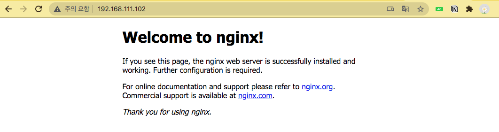
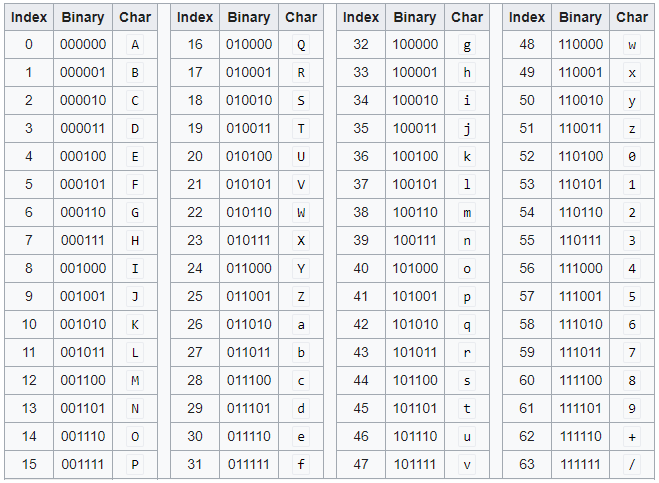
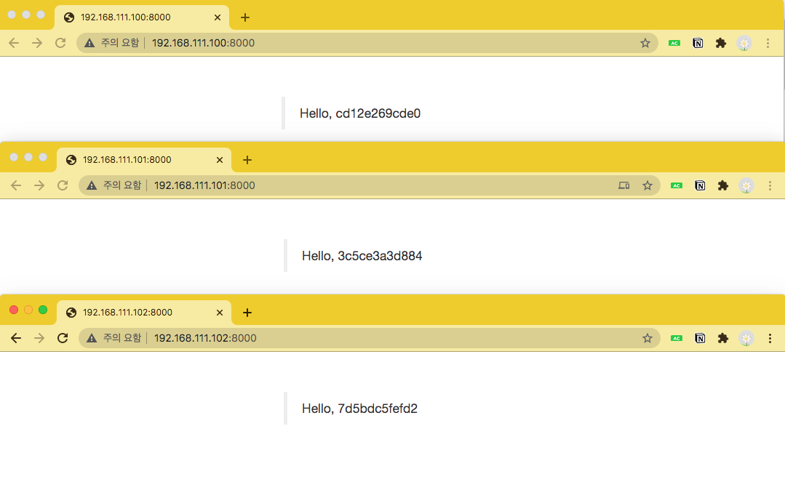

# 도커 스웜

# 1️⃣ 도커 스웜 클러스터를 구성

## 1. 기존 리소스 정리

- 모든 가상머진을 중지합니다.

## 2. 아래 3개 폴더 아래에 Vagrantfile을 생성

- /Users/gim-yujin/VirtualBox VMs/HashCorp/swarm-manager

```yaml
# -*- mode: ruby -*-
# vi: set ft=ruby :

Vagrant.configure("2") do |config|
# config.vm.box = "centos/7"
  config.vm.box = "generic/centos7"
  config.vm.hostname = "swarm-manager"
  config.vm.network "private_network", ip: "192.168.111.100"
  config.vm.synced_folder ".", "/home/vagrant/sync", disabled: true
end
```

- /Users/gim-yujin/VirtualBox VMs/HashCorp/swarm-worker1

```yaml
# -*- mode: ruby -*-
# vi: set ft=ruby :

Vagrant.configure("2") do |config|
# config.vm.box = "centos/7"
  config.vm.box = "generic/centos7"
  config.vm.hostname = "swarm-worker1"
  config.vm.network "private_network", ip: "192.168.111.101"
  config.vm.synced_folder ".", "/home/vagrant/sync", disabled: true
end
```

- /Users/gim-yujin/VirtualBox VMs/HashCorp/swarm-worker2

```yaml
# -*- mode: ruby -*-
# vi: set ft=ruby :

Vagrant.configure("2") do |config|
# config.vm.box = "centos/7"
  config.vm.box = "generic/centos7"
  config.vm.hostname = "swarm-worker2"
  config.vm.network "private_network", ip: "192.168.111.102"
  config.vm.synced_folder ".", "/home/vagrant/sync", disabled: true
end
```

- 이후 각 폴더에서 `Vagrant up` 명령어를 통해 가상머신을 생성한다.

```yaml
Host Name     IP
============= ===============
swarm-manager 192.168.111.100
swarm-worker1 192.168.111.101
swarm-worker2 192.168.111.102
```

- 터미널 3개를 사용하여 `vagrant ssh` 로 접속한다.
    - `sudo su` 명령으로 루트 계정으로 전환

## 3. 도커 스웜 모드의 구성

- 매니저(manager) 노드와 워커(worker) 노드로 구성
- 워커 노드 ⇒ 실제 컨테이너가 생성되고 관리되는 도커 서버
- 매니저 노드 ⇒ 워커 노드를 관리하기 위한 도커 서버
- 매니저 노드는 워커 노드의 역할을 포함
- 클러스터를 구성하기 위해서는 최소 1개 이상의 매니저 노드가 존재해야 함

## 4. 도커 설치 및 서비스 기동

- 세개의 터미널에서 모두 실행 시킨다

```
[root@swarm-manager vagrant]# cd
[root@swarm-manager ~]# yum install -y docker
[root@swarm-manager ~]# systemctl start docker.service
[root@swarm-manager ~]# docker version
[root@swarm-manager ~]# systemctl stop firewalld
```

- `Error response from daemon: can't initialize raft node: rpc error: code = 2 desc = could not connect to prospective new cluster member using its advertised address: rpc error: code = 14 desc = grpc: the connection is unavailable`
    - 이러한 에러가 난다면 방화벽을 정지시킨다.

## 5. 매니저 역할의 서버에서 스웜 클러스터를 시작

- manager 에서 실행

```
[root@swarm-manager ~]# docker swarm init --advertise-addr 192.168.111.100
Swarm initialized: current node (yyij9z3bl3e4si61ewk21clwv) is now a manager.

To add a worker to this swarm, run the following command:

    docker swarm join \
    --token SWMTKN-1-45gua72qm4uf04zumnzokr89bqcs5wheyg043x2bpb86v0f9l7-d0lqy0fer8kq2c5shd6g4u4pq \
    192.168.111.100:2377
     ⇒ 새로운 워커 노드를 클러스터에 추가할 때 사용하는 비밀키(토큰)

To add a manager to this swarm, run 'docker swarm join-token manager' and follow the instructions.
```

- 위의 비밀키를 다시 보는 방법 `docker swarm join-token worker`
- 비밀키를 바꾸는 방법 `docker swarm join-token --rotate manager`

## 6. 워커 노드를 추가

- worker1, worker2 에서 실행

```
[root@swarm-worker1 ~]# docker swarm join \
    --token SWMTKN-1-45gua72qm4uf04zumnzokr89bqcs5wheyg043x2bpb86v0f9l7-d0lqy0fer8kq2c5shd6g4u4pq \
    192.168.111.100:2377
This node joined a swarm as a worker.
```

## 7. 스웜 클러스터에 정상적으로 추가되었는지 확인

- manager 에서 확인 가능

```
[root@swarm-manager ~]# docker node ls
ID                           HOSTNAME       STATUS  AVAILABILITY  MANAGER STATUS
48gv1hte7fkn1go43br22pbt9    swarm-worker2  Ready   Active        
rh8kouisqodspazwgsujpbx3t    swarm-worker1  Ready   Active        
yyij9z3bl3e4si61ewk21clwv *  swarm-manager  Ready   Active        Leader
```

## 8. 워커 노드 삭제

```
vagrant@swarm-worker2:~$ docker swarm leave
Node left the swarm.

vagrant@swarm-manager:~$ docker node ls
ID                            HOSTNAME            STATUS              AVAILABILITY        MANAGER STATUS      ENGINE VERSION
wn5j8nymx704prelscdq8fw54 *   swarm-manager       Ready               Active              Leader              19.03.6
i2boml3wjv87wjv35mpi0okgt     swarm-worker1       Ready               Active                                  19.03.6
m110afvl76ppbomnlmh6zzwke     swarm-worker2       Down                Active                                  19.03.6

vagrant@swarm-manager:~$ docker node rm swarm-worker2
swarm-worker2

vagrant@swarm-manager:~$ docker node ls
ID                            HOSTNAME            STATUS              AVAILABILITY        MANAGER STATUS      ENGINE VERSION
wn5j8nymx704prelscdq8fw54 *   swarm-manager       Ready               Active              Leader              19.03.6
i2boml3wjv87wjv35mpi0okgt     swarm-worker1       Ready               Active                                  19.03.6
```

- 도커 서비스가 failed인 경우, `sudo shutdown -r now` 후에 다시 서비스 재시작

## 9. 워커 노드를 매니저 노드로 변경 , 다시 워커 노드로 변경

- 매니저 노드로 변경

```
vagrant@swarm-manager:~$ docker node promote swarm-worker1
Node swarm-worker1 promoted to a manager in the swarm.

vagrant@swarm-manager:~$ docker node ls
ID                           HOSTNAME       STATUS  AVAILABILITY  MANAGER STATUS
5qlmm7c7jzn4zw51uq5f2iz87    swarm-worker2  Ready   Active        
w5wjsbcxcqkca0kjf1von46vu    swarm-worker1  Ready   Active        Reachable
yyij9z3bl3e4si61ewk21clwv *  swarm-manager  Ready   Active        Leader
```

- 다시 워커 노드로 변경

```
[root@swarm-manager ~]# docker node demote swarm-worker1
Manager swarm-worker1 demoted in the swarm.

[root@swarm-manager ~]# docker node ls
ID                           HOSTNAME       STATUS  AVAILABILITY  MANAGER STATUS
5qlmm7c7jzn4zw51uq5f2iz87    swarm-worker2  Ready   Active        
w5wjsbcxcqkca0kjf1von46vu    swarm-worker1  Ready   Active        
yyij9z3bl3e4si61ewk21clwv *  swarm-manager  Ready   Active        Leader
```

---

# 2️⃣ 스윔 모드 서비스

## 도커 vs 스윔 모드

- 도커 명령어의 제어 단위 → 컨테이너
- 스윔 모드 명령어의 제어 단위 → 서비스

## 서비스

- 같은 이미지에서 생성된 컨테이너의 집합
- 서비스를 제어하면 해당 서비스 내의 컨테이너에 같은 명령이 실행됨
- 서비스 내에 컨테이너는 한 개 이상 존재할 수 있고, 컨테이너들은 각 워커 노드와 매니저 노드에 할당됨
- 각 노드에 할당된 컨테이너들은 task라고 한다.

## 1. 서비스 생성 & 조회 & 상세 확인

- 생성, 조회

```
[root@swarm-manager ~]# docker service create ubuntu:14.04 bin/sh -c "while true; do echo hello world; sleep 1; done"
sgryulc9dcs8hujwsudzz5w1a

[root@swarm-manager ~]# docker service ls
ID            NAME          MODE        REPLICAS  IMAGE
sgryulc9dcs8  zealous_bose  replicated  0/1       ubuntu:14.04
```

- 상세 정보 조회
    - NODE 부분을 보면 어떤 컨테이너에 서비스가 할당 되었는지 알 수 있다.

```
[root@swarm-manager ~]# docker service ps zealous_bose
ID            NAME            IMAGE         NODE           DESIRED STATE  CURRENT STATE           ERROR  PORTS
7c69dq349iv5  zealous_bose.1  ubuntu:14.04  swarm-worker2  Running        Running 22 seconds ago
```

## 2. 서비스 삭제

```
[root@swarm-manager ~]# docker service rm zealous_bose
zealous_bose

[root@swarm-manager ~]# docker service ls
ID  NAME  MODE  REPLICAS  IMAGE
```

## 3. nginx 웹 서버 서비스 생성

```
[root@swarm-manager ~]# docker service create --name myweb --replicas 2 -p 80:80 nginx
nyvdbwfllqm21gbg32lqekhsn

[root@swarm-manager ~]# docker service ps myweb
ID            NAME     IMAGE         NODE           DESIRED STATE  CURRENT STATE             ERROR  PORTS
obzj4a3pvx04  myweb.1  nginx:latest  swarm-manager  Running        Preparing 18 seconds ago         
unjvftxrjhsp  myweb.2  nginx:latest  swarm-worker2  Running        Preparing 18 seconds ago
```

## 4. 스윔 클러스터 내의 어떤 노드로 접근해도 서비스에 접근이 가능

- swarm-manager node → http://192.168.xxx.100
- swarm-worker1 node → http://192.168.xxx.101
- swarm-worker2 node → http://192.168.xxx.102



## 5. 레플리카 셋 추가

- 컨테이너 수를 늘린 뒤 서비스 내의 컨테이너 목록 확인

```
[root@swarm-manager ~]# docker service scale myweb=4
myweb scaled to 4

[root@swarm-manager ~]# docker service ps myweb
ID            NAME     IMAGE         NODE           DESIRED STATE  CURRENT STATE             ERROR  PORTS
obzj4a3pvx04  myweb.1  nginx:latest  swarm-manager  Running        Running 5 minutes ago            
unjvftxrjhsp  myweb.2  nginx:latest  swarm-worker2  Running        Running 5 minutes ago            
3wsbbuyvnbh7  myweb.3  nginx:latest  swarm-worker1  Running        Preparing 15 seconds ago         
6v29is2wk0jl  myweb.4  nginx:latest  swarm-worker1  Running        Preparing 15 seconds ago
```

## 서비스 모드

1. 복제(replicated) 모드
    - 레플리카 셋의 수를 정의해 그 만큼의 같은 컨테이너를 생성
    - 실제 서비스 제공에 일반적으로 사용하는 모드
2. 글로벌(global) 모드
    - 스웜 클러스터 내에서 사용할 수 있는 모든 노드에 컨테이너를 반드시 하나씩 생성
    - 레플리카 셋의 수를 별도로 지정하지 않음
    - 스윔 클러스터를 모니터링하기 위한 에이전트 컨테이너 등을 생성해야 할 때 유용
    - `docker service create —mode global` 명령으로 생성

## 글로벌 모드 서비스 생성 및 확인

```
[root@swarm-manager ~]# docker service create --name global_web --mode global nginx
n95hmiwg6bhabff5ko66111rr

[root@swarm-manager ~]# docker service ls
ID            NAME        MODE        REPLICAS  IMAGE
n95hmiwg6bha  global_web  global      3/3       nginx:latest
nyvdbwfllqm2  myweb       replicated  4/4       nginx:latest

[root@swarm-manager ~]# docker service ps global_web
ID            NAME                                  IMAGE         NODE           DESIRED STATE  CURRENT STATE           ERROR  PORTS
lpywxehpnxee  global_web.yyij9z3bl3e4si61ewk21clwv  nginx:latest  swarm-manager  Running        Running 28 seconds ago         
mkyko8hj3pwh  global_web.5qlmm7c7jzn4zw51uq5f2iz87  nginx:latest  swarm-worker2  Running        Running 28 seconds ago         
qqzbaa5m62f3  global_web.w5wjsbcxcqkca0kjf1von46vu  nginx:latest  swarm-worker1  Running        Running 28 seconds ago
```

---

# 3️⃣ 스윔 모드의 서비스 장애 복구

- 복제 모드로 설정된 서비스의 컨테이너가 정지하거나 특정 노드가 다운되면 스윔 매니저는 새로운 컨테이너를 생성해 자동으로 복구한다.

## 1. 특정 노드에서 myweb 서비스에 속한 컨테이너를 삭제하면 자동으로 다시 생성되는 것을 확인

- 컨테이너 목록 확인
    - 컨테이너 이름은 서비스 이름, 레플리카 번호, 자동으로 생성된 고유 ID로 구성

```
[root@swarm-manager ~]# docker ps
CONTAINER ID        IMAGE                                                                           COMMAND                  CREATED             STATUS              PORTS               NAMES
821c35fff84f        nginx@sha256:c628b67d21744fce822d22fdcc0389f6bd763daac23a6b77147d0712ea7102d0   "/docker-entrypoin..."   About an hour ago   Up About an hour    80/tcp              global_web.yyij9z3bl3e4si61ewk21clwv.lpywxehpnxee6dj3qupdebwm9
3a9349f72756        nginx@sha256:c628b67d21744fce822d22fdcc0389f6bd763daac23a6b77147d0712ea7102d0   "/docker-entrypoin..."   About an hour ago   Up About an hour    80/tcp              myweb.1.obzj4a3pvx046jkw2a1y5tfkm
```

- swarm-manager 노드에서 실행 중인 컨테이너 강제로 삭제

```
[root@swarm-manager ~]# docker rm -f myweb.1.obzj4a3pvx046jkw2a1y5tfkm
myweb.1.obzj4a3pvx046jkw2a1y5tfkm
```

- myweb 서비스의 task 확인 → 새로운 태스크가 생성된 것을 확인

```
[root@swarm-manager ~]# docker service ps myweb
ID            NAME         IMAGE         NODE           DESIRED STATE  CURRENT STATE               ERROR                        PORTS
gaf0bp3y8ga8  myweb.1      nginx:latest  swarm-manager  Running        Running about a minute ago                               
obzj4a3pvx04   \_ myweb.1  nginx:latest  swarm-manager  Shutdown       Failed about a minute ago   "task: non-zero exit (137)"  
unjvftxrjhsp  myweb.2      nginx:latest  swarm-worker2  Running        Running about an hour ago                                
3wsbbuyvnbh7  myweb.3      nginx:latest  swarm-worker1  Running        Running about an hour ago                                
6v29is2wk0jl  myweb.4      nginx:latest  swarm-worker1  Running        Running about an hour ago
```

## 2. 특정 노드가 다운되면 해당 노드의 컨테이너가 종료되고 다른 노드에 컨테이너가 생성되는 것을 확인

- swarm-worker1 노드의 도커 데몬 프로세스 종료

```
[root@swarm-worker1 vagrant]# service docker stop
Redirecting to /bin/systemctl stop docker.service
```

- manager 노드에서 노드상태확인 → worker1 노드가 다운 상태

```
[root@swarm-manager ~]# docker node ls
ID                           HOSTNAME       STATUS  AVAILABILITY  MANAGER STATUS
5qlmm7c7jzn4zw51uq5f2iz87    swarm-worker2  Ready   Active        
w5wjsbcxcqkca0kjf1von46vu    swarm-worker1  Down    Active        
yyij9z3bl3e4si61ewk21clwv *  swarm-manager  Ready   Active        Leader
```

- manager 노드에서 myweb 서비스의 태스크 상태 확인 → 실행 둥인 다른 노드에서 태스크가 생성되었음

```
[root@swarm-manager ~]# docker service ps myweb
ID            NAME         IMAGE         NODE           DESIRED STATE  CURRENT STATE           ERROR                        PORTS
gaf0bp3y8ga8  myweb.1      nginx:latest  swarm-manager  Running        Running 10 minutes ago                               
obzj4a3pvx04   \_ myweb.1  nginx:latest  swarm-manager  Shutdown       Failed 11 minutes ago   "task: non-zero exit (137)"  
unjvftxrjhsp  myweb.2      nginx:latest  swarm-worker2  Running        Running 2 hours ago                                  
o84guvgmgobs  myweb.3      nginx:latest  swarm-manager  Running        Running 28 seconds ago                               
3wsbbuyvnbh7   \_ myweb.3  nginx:latest  swarm-worker1  Shutdown       Running 44 seconds ago                               
nf7oslwpyinp  myweb.4      nginx:latest  swarm-manager  Running        Running 28 seconds ago                               
6v29is2wk0jl   \_ myweb.4  nginx:latest  swarm-worker1  Shutdown       Running 44 seconds ago
```

## 3. 다운되었던 노드를 재시작해도 재균형(rebalance) 작업은 자동으로 일어나지 않음

- worker1 노드를 재시작

```
[root@swarm-worker1 vagrant]# service docker start
Redirecting to /bin/systemctl start docker.service

[root@swarm-worker1 vagrant]# systemctl status docker.service
● docker.service - Docker Application Container Engine
   Loaded: loaded (/usr/lib/systemd/system/docker.service; enabled; vendor preset: disabled)
   Active: active (running) since Thu 2020-09-17 04:52:56 UTC; 14s ago
     Docs: http://docs.docker.com
```

- manager 노드에서 노드의 상태를 확인 → worker1 이 active 상태

```
[root@swarm-manager ~]# docker node ls
ID                           HOSTNAME       STATUS  AVAILABILITY  MANAGER STATUS
5qlmm7c7jzn4zw51uq5f2iz87    swarm-worker2  Ready   Active        
w5wjsbcxcqkca0kjf1von46vu    swarm-worker1  Ready   Active        
yyij9z3bl3e4si61ewk21clwv *  swarm-manager  Ready   Active        Leader
```

- manager 노드에서 myweb 서비스의 태스크 상태 확인 → 그대로임

```
[root@swarm-manager ~]# docker service ps myweb
ID            NAME         IMAGE         NODE           DESIRED STATE  CURRENT STATE              ERROR                             PORTS
gaf0bp3y8ga8  myweb.1      nginx:latest  swarm-manager  Running        Running 17 minutes ago                                       
obzj4a3pvx04   \_ myweb.1  nginx:latest  swarm-manager  Shutdown       Failed 17 minutes ago      "task: non-zero exit (137)"       
unjvftxrjhsp  myweb.2      nginx:latest  swarm-worker2  Running        Running 2 hours ago                                          
o84guvgmgobs  myweb.3      nginx:latest  swarm-manager  Running        Running 6 minutes ago                                        
3wsbbuyvnbh7   \_ myweb.3  nginx:latest  swarm-worker1  Shutdown       Failed about a minute ago  "No such container: myweb.3.3w…"  
nf7oslwpyinp  myweb.4      nginx:latest  swarm-manager  Running        Running 6 minutes ago                                        
6v29is2wk0jl   \_ myweb.4  nginx:latest  swarm-worker1  Shutdown       Failed about a minute ago  "No such container: myweb.4.6v…"
```

- docker service scale 명령으로 컨테이너 수를 줄이고 다시 늘리는 방식으로 서비스 컨테이너 할당의 균형을 맟추기

```
[root@swarm-manager ~]# docker service scale myweb=1
myweb scaled to 1

[root@swarm-manager ~]# docker service ps myweb
ID            NAME     IMAGE         NODE           DESIRED STATE  CURRENT STATE        ERROR  PORTS
unjvftxrjhsp  myweb.2  nginx:latest  swarm-worker2  Running        Running 2 hours ago

[root@swarm-manager ~]# docker service scale myweb=4
myweb scaled to 4

[root@swarm-manager ~]# docker service ps myweb
ID            NAME     IMAGE         NODE           DESIRED STATE  CURRENT STATE           ERROR  PORTS
djxeuznnjal7  myweb.1  nginx:latest  swarm-worker1  Running        Running 12 seconds ago         
unjvftxrjhsp  myweb.2  nginx:latest  swarm-worker2  Running        Running 2 hours ago            
w1gmnbr99j7o  myweb.3  nginx:latest  swarm-manager  Running        Running 12 seconds ago         
hdc4g6so4jvp  myweb.4  nginx:latest  swarm-manager  Running        Running 12 seconds ago
```

## 4. 서비스 롤링 업데이트

- 스윔 모드에서 자체적으로 지원

### 서비스 생성

```
[root@swarm-manager ~]# docker service create --name myweb2 --replicas 3 nginx:1.10
jxozp5jxqflctffj1vtq1dvjz

[root@swarm-manager ~]# docker service ps myweb2
ID            NAME      IMAGE       NODE           DESIRED STATE  CURRENT STATE            ERROR  PORTS
80ymz23d0xrx  myweb2.1  nginx:1.10  swarm-worker2  Running        Preparing 9 seconds ago         
b0f92o5ml83y  myweb2.2  nginx:1.10  swarm-worker1  Running        Preparing 9 seconds ago         
mygct98c6ica  myweb2.3  nginx:1.10  swarm-manager  Running        Preparing 9 seconds ago
```

### docker service update 명령으로 생성된 서비스의 설정 변경

```
[root@swarm-manager ~]# docker service update --image nginx:1.11 myweb2
myweb2
[root@swarm-manager ~]# docker service ps myweb2
ID            NAME          IMAGE       NODE           DESIRED STATE  CURRENT STATE            ERROR                        PORTS
wm6foe5xov8m  myweb2.1      nginx:1.11  swarm-worker1  Running        Preparing 6 seconds ago                               
qfz2p0vsjzifq  myweb2.2      nginx:1.11  swarm-worker1  Running        Preparing 9 seconds ago                               
b0f92o5ml83y   \_ myweb2.2  nginx:1.10  swarm-worker1  Shutdown       Shutdown 8 seconds ago                                
mygct98c6ica  myweb2.3      nginx:1.10  swarm-manager  Running        Running 21 seconds ago
```

### 서비스를 생성할 롤링 업데이트 설정 가능

- 롤링 업데이트 주기, 업데이트를 동시에 진행할 컨테이너의 개수, 업데이트 실패 시 조치를 설정
    - --update-delay 10s   : 10초 단위로 업데이트
    - --update-parallelism 2  : 업데이트 작업은 한 번에 2개의 컨테이너에 수행

```
[root@swarm-manager ~]# docker service create \
> --replicas 4 \
> --name myweb3 \
> --update-delay 10s \
> --update-parallelism 2 \
> nginx:1.10
nr6y7jguju4jz5kftjaq48vcn
```

### 서비스의 롤링 업데이트 설정 확인

- On failure:	pause     → 업데이트 도중 오류가 발생하면 업데이트를 중지

```
[root@swarm-manager ~]# docker service inspect --pretty myweb3

ID:		nr6y7jguju4jz5kftjaq48vcn
Name:		myweb3
Service Mode:	Replicated
 Replicas:	4
Placement:
UpdateConfig:
 Parallelism:	2
 Delay:		10s
 On failure:	pause
 Max failure ratio: 0
ContainerSpec:
 Image:		nginx:1.10@sha256:6202beb06ea61f44179e02ca965e8e13b961d12640101fca213efbfd145d7575
Resources:
Endpoint Mode:	vip
```

- 같은 내용을 다른 방식으로 확인

```
[root@swarm-manager ~]# docker inspect --type service myweb3
[
    {
        "ID": "nr6y7jguju4jz5kftjaq48vcn",
        "Version": {
            "Index": 291
        },
        "CreatedAt": "2020-09-17T05:06:17.444686118Z",
        "UpdatedAt": "2020-09-17T05:06:17.444686118Z",
        "Spec": {
            "Name": "myweb3",
            "TaskTemplate": {
                "ContainerSpec": {
                    "Image": "nginx:1.10@sha256:6202beb06ea61f44179e02ca965e8e13b961d12640101fca213efbfd145d7575",
                    "DNSConfig": {}
                },
                "Resources": {
                    "Limits": {},
                    "Reservations": {}
                },
                "RestartPolicy": {
                    "Condition": "any",
                    "MaxAttempts": 0
                },
                "Placement": {},
                "ForceUpdate": 0
            },
            "Mode": {
                "Replicated": {
                    "Replicas": 4
                }
            },
            "UpdateConfig": {
                "Parallelism": 2,
                "Delay": 10000000000,
                "FailureAction": "pause",
                "MaxFailureRatio": 0
            },
            "EndpointSpec": {
                "Mode": "vip"
            }
        },
        "Endpoint": {
            "Spec": {}
        },
        "UpdateStatus": {
            "StartedAt": "0001-01-01T00:00:00Z",
            "CompletedAt": "0001-01-01T00:00:00Z"
        }
    }
]
```

### 롤링 업데이트 중 오류가 발생해도 계속 롤링 업데이트를 진행하도록 설정

```
[root@swarm-manager ~]# docker service create --name myweb4 --replicas 4 --update-failure-action continue nginx:1.10
an5elegn2ehbphd4nm1jbldvq
[root@swarm-manager ~]# docker service inspect --pretty myweb4

ID:		an5elegn2ehbphd4nm1jbldvq
Name:		myweb4
Service Mode:	Replicated
 Replicas:	4
Placement:
UpdateConfig:
 Parallelism:	1
 On failure:	continue
 Max failure ratio: 0
ContainerSpec:
 Image:		nginx:1.10@sha256:6202beb06ea61f44179e02ca965e8e13b961d12640101fca213efbfd145d7575
Resources:
Endpoint Mode:	vip
```

### 서비스를 롤링 업데이트 이전으로 되돌리는 롤백

```
[root@swarm-manager vagrant]# docker service rollback myweb2
myweb2
rollback: manually requested rollback 
overall progress: rolling back update: 3 out of 3 tasks 
1/3: running   [>                                                  ] 
2/3: running   [>                                                  ] 
3/3: running   [>                                                  ] 
verify: Service converged
```

- 도커의 낮은 버전에서는 rollback 명령어가 듣지 않는다.
    - 업데이트 하기 ⇒ [http://lyasee.com/articles/2018-09/CentOS-도커-설치하기](http://lyasee.com/articles/2018-09/CentOS-%EB%8F%84%EC%BB%A4-%EC%84%A4%EC%B9%98%ED%95%98%EA%B8%B0)

---

# 3️⃣ 서비스 컨테이너에 설정 정보 전달

## 컨테이너에 설정 정보 전달

- -e 옵션을 통해 환경 변수로 전달

```
[root@swarm-manager vagrant]# docker run -d --name wordpressdb_hostvolume \
> -e MYSQL_ROOT_PASSWORD=password \
> -e MYSQL_DATABASE=wordpress \
> -v /home/wordpress_DB:/var/lib/mysql \
> mysql:5.7
```

## 스윔 모드는 secret과 config 기능을 제공

- 스윔 모드와 같은 서버 클러스터에서 파일 공유를 위해 설정 파일을 호스트마다 마련해두는 것을 매우 비효율적임
- 비밀번호와 같이 민감한 정보를 환경 변수로 설정하는 것은 보안상으로 바람직하지 않음
- 스윔 모드에서 사용할 수 있는 secret, config 기능을 제공
- secret ⇒ 비밀번호, SSH 키, 인증서 키와 같은 보안에 민감한 데이터를 전송하기 위한 용도
- config ⇒ nginx나 레지스트리 성정 파일과 같이 암호화할 필요가 없는 설정값들에 사용

## 1. secret 생성

- 생성된 secret은 조회해도 실제 값을 확인할 수 없음
- secret 값은 매니저 노드 간에 암호화된 상태로 저장

```
[root@swarm-manager vagrant]# echo 1q2w3e4r | docker secret create my_mysql_password -
q73fj9gg80ll6c1ducnw8v179

[root@swarm-manager vagrant]# docker secret ls
ID                          NAME                DRIVER              CREATED             UPDATED
q73fj9gg80ll6c1ducnw8v179   my_mysql_password                       7 seconds ago       7 seconds ago

[root@swarm-manager vagrant]# docker secret inspect my_mysql_password
[
    {
        "ID": "q73fj9gg80ll6c1ducnw8v179",
        "Version": {
            "Index": 510
        },
        "CreatedAt": "2020-09-17T06:49:05.533299545Z",
        "UpdatedAt": "2020-09-17T06:49:05.533299545Z",
        "Spec": {
            "Name": "my_mysql_password",
            "Labels": {}
        }
    }
]
```

- 생성한 secret을 통해 MySQL 컨테이너 생성
    - —secret 옵션을 통해 컨테이너로 공유된 값은 기본적으로 컨테이너 내부에 /run/secrets/ 디렉터리에 마운트 됨
    - —secret source=my_mysql_password,target=/home/mysql_root_password 처럼 마운트 될 디렉터리 지정도 가능

```
[root@swarm-manager vagrant]# docker service create --name mysql --replicas 1 \
--secret source=my_mysql_password,target=mysql_root_password \
--secret source=my_mysql_password,target=mysql_password \
-e MYSQL_ROOT_PASSWORD_FILE="/run/secrets/mysql_root_password" \
-e MYSQL_PASSWORD_FILE="/run/secrets/mysql_password" \
mysql:5.7
ox6lefxondoze3rpl67pcqzvy
overall progress: 1 out of 1 tasks 
1/1: running   [==================================================>] 
verify: Service converged
```

```
[root@swarm-manager vagrant]# docker service ls
ID                  NAME                MODE                REPLICAS            IMAGE               PORTS
n95hmiwg6bha        global_web          global              3/3                 nginx:latest        
ox6lefxondoz        mysql               replicated          1/1                 mysql:5.7           
nyvdbwfllqm2        myweb               replicated          4/4                 nginx:latest        *:80->80/tcp
jxozp5jxqflc        myweb2              replicated          3/3                 nginx:1.11          
nr6y7jguju4j        myweb3              replicated          4/4                 nginx:1.10          
an5elegn2ehb        myweb4              replicated          4/4                 nginx:1.10          

[root@swarm-manager vagrant]# docker service ps mysql
ID                  NAME                IMAGE               NODE                DESIRED STATE       CURRENT STATE           ERROR               PORTS
yhp0bkjn1ifx        mysql.1             mysql:5.7           swarm-worker2       Running             Running 3 minutes ago

[root@swarm-worker2 vagrant]# docker ps        
CONTAINER ID        IMAGE               COMMAND                  CREATED             STATUS              PORTS                 NAMES
2a4c3128acef        mysql:5.7           "docker-entrypoint.s…"   8 minutes ago       Up 8 minutes        3306/tcp, 33060/tcp   mysql.1.yhp0bkjn1ifxre73r7bkt8qcd
61c13d42e2f7        nginx:latest        "/docker-entrypoint.…"   56 minutes ago      Up 56 minutes       80/tcp                global_web.5qlmm7c7jzn4zw51uq5f2iz87.opi3obg7uixa8egp16ry0xc1g
```

- worker2 노드에서 만들어진 파일 확인

```
[root@swarm-worker2 vagrant]# docker exec mysql.1.yhp0bkjn1ifxre73r7bkt8qcd ls /run/secrets
mysql_password
mysql_root_password

[root@swarm-worker2 vagrant]# docker exec mysql.1.yhp0bkjn1ifxre73r7bkt8qcd cat /run/secrets/mysql_password
1q2w3e4r

[root@swarm-worker2 vagrant]# docker exec mysql.1.yhp0bkjn1ifxre73r7bkt8qcd cat /run/secrets/mysql_root_password
1q2w3e4r
```

## 2. config 사용하기

- 사설 레지스트리 설정 파일 생성

```yaml
[root@swarm-manager ~]# vi config.yml
[root@swarm-manager ~]# cat config.yml 
version: 0.1
log:
 level: info
storage:
 filesystem:
  eootdirectory: /registry_data
 delete:
  enabled: true
http:
 addr: 0.0.0.0:5000
```

- 설정 파일로 config 생성

```
[root@swarm-manager ~]# docker config create registry-config config.yml 
mebqdj41epu1mdo2arnpry56i
```

- 생성된 config 확인

```
[root@swarm-manager ~]# docker config ls
ID                          NAME                CREATED             UPDATED
mebqdj41epu1mdo2arnpry56i   registry-config     8 seconds ago       8 seconds ago
```

- config는 입력 값은 BASE64로 인코딩하여 저장

```
[root@swarm-manager ~]# docker config inspect registry-config 
[
    {
        "ID": "mebqdj41epu1mdo2arnpry56i",
        "Version": {
            "Index": 763
        },
        "CreatedAt": "2020-09-17T07:13:20.311884548Z",
        "UpdatedAt": "2020-09-17T07:13:20.311884548Z",
        "Spec": {
            "Name": "registry-config",
            "Labels": {},
            "Data": "dmVyc2lvbjogMC4xCmxvZzoKIGxldmVsOiBpbmZvCnN0b3JhZ2U6C
iBmaWxlc3lzdGVtOgogIGVvb3RkaXJlY3Rvcnk6IC9yZWdpc3RyeV9kYXRhCiBkZWxldGU6CiA
gZW5hYmxlZDogdHJ1ZQpodHRwOgogYWRkcjogMC4wLjAuMDo1MDAwCg=="
        }
    }
]
```

- BASE64로 디코딩 하여 입력값을 확인

```yaml
[root@swarm-manager ~]# echo dmVyc2lvbjogMC4xCmxvZzoKIGxldmVsOiBpbmZvCnN0b3JhZ2U6\
CiBmaWxlc3lzdGVtOgogIGVvb3RkaXJlY3Rvcnk6IC9yZWdpc3RyeV9kYXRhCiBkZWxldGU6CiAgZW5hYm\
xlZDogdHJ1ZQpodHRwOgogYWRkcjogMC4wLjAuMDo1MDAwCg== | base64 -d

version: 0.1
log:
 level: info
storage:
 filesystem:
  eootdirectory: /registry_data
 delete:
  enabled: true
http:
 addr: 0.0.0.0:5000
```

- config로 사설 레지스트리 생성

```yaml
[root@swarm-manager ~]# docker service create --name yml_registry -p 5000 \
--config source=registry-config,target=/etc/docker/registry/config.yml registry:2.6
enswgf55tgvk2v7m6pgivddt0
overall progress: 1 out of 1 tasks 
1/1: running   [==================================================>] 
verify: Service converged
```

- BASE64 인코딩
    - 일정한 규칙에 따라 데이터를 다른 형태로 변형
- 0~63 → 영문자(대문자, 소문자), 숫자, +, / 글자로 변경



- 스냅샷 찍어둠
    - `vagrant snapshot save "container setting info"`

---

# 4️⃣ 도커 스웜 네트워크

## 1. 매니저 노드에서 네트워크 목록 확인

```
[root@swarm-manager vagrant]# docker network ls
NETWORK ID          NAME                DRIVER              SCOPE
f40c9bf6572d        bridge              bridge              local
1420a2e0fb43        docker_gwbridge     bridge              local
509700ef5edb        host                host                local
xrpdp6g6m3y1        ingress             overlay             swarm
3ae1c4d2c524        none                null                local
```

## 2. ingress 네트워크

- 스웜 클러스터를 생성하면 자동으로 등록되는 네트워크
- 스윔 모드를 사용할 때만 유효
- 스웜 클러스터에 등록된 모든 노드에 ingress 네트워크가 생성

⇒ 클러스터 안에 있는 컨테이너 끼리 연결해주는 네트워크, 모든 노드에서 같은 네트워크를 공유한다.

```
[root@swarm-manager vagrant]# docker network ls | grep ingress
xrpdp6g6m3y1        ingress             overlay             swarm

[root@swarm-worker1 vagrant]# docker network ls | grep ingress
xrpdp6g6m3y1        ingress             overlay             swarm

[root@swarm-worker2 vagrant]# docker network ls | grep ingress
xrpdp6g6m3y1        ingress             overlay             swarm
```

- ingress 네트워크는 어떤 스웜 노드에 접근하더라도 서비스 내의 컨테이너에 접근 할 수 있게 설정하는 라우팅 메시를 구성하고, 서비스 내의 컨테이너에 대한 접근을 라운드 로빈 방식으로 로드 밸런싱을 담당

### 임의로 할당된 16진수를 출력하는 PHP 파일이 들어있는 웹 서버 이미지로 서비스 생성

```
[root@swarm-manager ~]# docker service create --name hostname -p 8000:80 \
--replicas=4 alicek106/book:hostname
jbkb36wzeai08gx4emfzt5nbb
overall progress: 4 out of 4 tasks 
1/4: running   [==================================================>] 
2/4: running   [==================================================>] 
3/4: running   [==================================================>] 
4/4: running   [==================================================>] 
verify: Service converged
```

### 생성된 컨테이너 목록 확인 → replicas=4 이므로 4개의 컨테이너 생성

```
[root@swarm-manager~]# docker ps --format "table {{.ID}}\t{{.Status}}\t{{.Image}}"
CONTAINER ID        STATUS              IMAGE
5816dcfa5aac        Up 41 seconds       alicek106/book:hostname
eb3ba86f643e        Up About an hour    mysql:5.7
824f0c2c7d3c        Up 2 hours          nginx:1.11
```

```
[root@swarm-worker1~]# docker ps --format "table {{.ID}}\t{{.Status}}\t{{.Image}}"
CONTAINER ID        STATUS              IMAGE
7d5bdc5fefd2        Up 2 minutes        alicek106/book:hostname
3c5ce3a3d884        Up 2 minutes        alicek106/book:hostname
a52a2ce4cab2        Up 18 minutes       registry:2.6
1bb94ca91cd8        Up 2 hours          nginx:latest
```

```
[root@swarm-worker2~]# docker ps --format "table {{.ID}}\t{{.Status}}\t{{.Image}}"
CONTAINER ID        STATUS              IMAGE
cd12e269cde0        Up 2 minutes        alicek106/book:hostname
2a4c3128acef        Up 41 minutes       mysql:5.7
61c13d42e2f7        Up About an hour    nginx:latest
```

### 각 노드 주소로 접근 → 접속하는 노드에 존재하지 않는 컨테이너 이름도 출력되는 것을 확인



### ingress 네트워크를 사용하지 않고 호스트의 8080포트를 직접 컨테이너의 80 포트로 연결하는 방법

- 어느 호스트에서 컨테이너가 생성될지 알 수 없어 포트 및 서비스 관리가 어렵다는 단점이 있다.
- 가급적이면 ingress 네트워크를 사용해 외부로 서비스를 노출하는 것이 좋다.

```
[root@swarm-manager ~]# docker service create \
--publish mode=host,target=80,published=8080,protocol=tcp --name web nginx
sz8ozezmdlp2ofo41j6ev65nm
overall progress: 1 out of 1 tasks 
1/1: running   [==================================================>] 
verify: Service converged
```

## 3. 오버레이 네트워크

- 오버레이 네트워크는 여러 개의 도커 데몬을 하나의 네트워크 풀로 만드는 네트워크 가상화 기술의 하나로, 도커에 오버레이 네트워크를 적용하면 여러 도커 데몬에 존재하는 컨테이너가 서로 통신할 수 있음

### 스윔 클러스터 내의 컨테이너가 할당 받은 IP주소 확인

- eth0 : ingress 네크워크와 연결된 NIC
- ingress 네트워크는 오버레이 네트워크 드라이버를 사용

- manager 노드의 ip주소 확인

```
[root@swarm-manager~]# docker ps --format "table {{.ID}}\t{{.Status}}\t{{.Image}}"
CONTAINER ID        STATUS              IMAGE
5816dcfa5aac        Up 16 minutes       alicek106/book:hostname
eb3ba86f643e        Up 2 hours          mysql:5.7
824f0c2c7d3c        Up 2 hours          nginx:1.11
...
```

⇒ eth0 : ingress 네크워크와 연결된 NIC

```
[root@swarm-manager ~]# docker exec 5816dcfa5aac ifconfig
eth0      Link encap:Ethernet  HWaddr 02:42:0a:ff:00:12  
          inet addr:10.255.0.18  Bcast:10.255.255.255  Mask:255.255.0.0
          UP BROADCAST RUNNING MULTICAST  MTU:1450  Metric:1
...

eth1      Link encap:Ethernet  HWaddr 02:42:ac:12:00:07  
          inet addr:172.18.0.7  Bcast:172.18.255.255  Mask:255.255.0.0
          UP BROADCAST RUNNING MULTICAST  MTU:1500  Metric:1
...

lo        Link encap:Local Loopback  
          inet addr:127.0.0.1  Mask:255.0.0.0
          UP LOOPBACK RUNNING  MTU:65536  Metric:1
...
```

- worker1 노드의 ip 주소 확인

```
[root@swarm-worker1~]# docker ps --format "table {{.ID}}\t{{.Status}}\t{{.Image}}"
CONTAINER ID        STATUS              IMAGE
7d5bdc5fefd2        Up 19 minutes       alicek106/book:hostname
3c5ce3a3d884        Up 19 minutes       alicek106/book:hostname
a52a2ce4cab2        Up 35 minutes       registry:2.6
1bb94ca91cd8        Up 2 hours          nginx:latest
```

```
[root@swarm-worker1 ~]# docker exec 7d5bdc5fefd2 ifconfig
eth0      Link encap:Ethernet  HWaddr 02:42:0a:ff:00:13  
          inet addr:10.255.0.19  Bcast:10.255.255.255  Mask:255.255.0.0
          UP BROADCAST RUNNING MULTICAST  MTU:1450  Metric:1
          RX packets:24 errors:0 dropped:0 overruns:0 frame:0
          TX packets:16 errors:0 dropped:0 overruns:0 carrier:0
```

### 별도의 포트포워딩을 설정하지 않아도 컨테이너 간 전송이 가능

- manager 노드의 컨테이너에서 swarm-worker1 노드의 컨테이너로 ping 전송

```
[root@swarm-manager ~]# docker exec 5816dcfa5aac ping -c 1 10.255.0.19
PING 10.255.0.19 (10.255.0.19) 56(84) bytes of data.
64 bytes from 10.255.0.19: icmp_seq=1 ttl=64 time=0.659 ms

--- 10.255.0.19 ping statistics ---
1 packets transmitted, 1 received, 0% packet loss, time 0ms
rtt min/avg/max/mdev = 0.659/0.659/0.659/0.000 ms
```

## 4. docker_gwbridge 네트워크

- gw = gateway
- 오버레이 네트워크를 사용하지 않는 컨테이너는 기본적으로 존재하는 브리지(bridge) 네트워크를 사용해 외부와 연결
- 그러나, ingress를 포함한 모든 오버레이 네트워크는 브리지 네트워크와 다른 docker_gwbridge 네트워크와 함께 사용된다.

- docker_gwbridge 네트워크는 외부로 나가는 통신 및 오버레이 네트워크의 트레픽 종단점 역할을 담당
- docker_gwbridge 네트워크는 컨테이너 내부의 네트워크 인터페이스 카드 중 ech1과 연결

## 5. 사용자 정의 오버레이 네트워크

### 사용자 정의 오버레이 네트워크 생성 및 확인

```
[root@swarm-manager ~]# docker network create --subnet 10.255.9.0/24 \
-d overlay myoverlay
qovomrdji51nrx5vtczzsuntd

[root@swarm-manager ~]# docker network ls
NETWORK ID          NAME                DRIVER              SCOPE
f40c9bf6572d        bridge              bridge              local
1420a2e0fb43        docker_gwbridge     bridge              local
509700ef5edb        host                host                local
xrpdp6g6m3y1        ingress             overlay             swarm
qovomrdji51n        myoverlay                               swarm
3ae1c4d2c524        none                null                local
```

### 오버레이 네트워크를 서비스에 적용(—network 옵션 이용)해 컨테이너 생성

```
[root@swarm-manager ~]# docker service create --name overlay_service \
--network myoverlay --replicas 2 alicek106/book:hostname
epryv3djbys86ogsi78nz1mv8
overall progress: 0 out of 2 tasks 
1/2: new       [=====>                                             ] 
2/2: new       [=====>                                             ]
```

- 여기서 멈춰보림..

---

# 5️⃣ 서비스 디스커버리

- 같은 컨테이너를 여러 개 만들어 사용할 대 새로 생성된 컨테이너 발견 혹은 없어진 컨테이너 감지가 중요
- 일반적으로 주키퍼, etcd 등의 분산 코디네이터를 외부에 두고 사용해서 해결하지만 스윔 모드는 서비스 발견 기능을 자체적으로 지원
- 스윔 모드에서는 서비스 이름으로 해당 서비스의 모든 컨테이너에 접근이 가능 ⇒ 서비스의 컨테이너 IP주소를 할 필요도 없고 새롭게 생성된 사실도 알 필요 없음

### 1. 예제 서비스에서 사용할 오버레이 네트워크 생성

```
[root@swarm-manager ~]# docker network create -d overlay discovery
gtmb9znro6wsbh8yvxbzez586

[root@swarm-manager ~]# docker network ls
NETWORK ID          NAME                DRIVER              SCOPE
f40c9bf6572d        bridge              bridge              local
gtmb9znro6ws        discovery           overlay             swarm
1420a2e0fb43        docker_gwbridge     bridge              local
509700ef5edb        host                host                local
xrpdp6g6m3y1        ingress             overlay             swarm
qovomrdji51n        myoverlay                               swarm
3ae1c4d2c524        none                null                local
```

### 2. server 서비스 생성 - 컨테이너의 호스트 이름을 출력하는 웹 서버 컨테이너 2개를 생성

```
[root@swarm-manager ~]# docker service create --name server \
--replicas 2 --network discovery alicek106/book:hostname
l3lcp6tzngubxv34h3p45pd6t
overall progress: 2 out of 2 tasks 
1/2: running   
2/2: running   
verify: Service converged
```

### 3. client 서비스 생성 - server 서비스에 http 요청을 보낼 컨테이너를 생성

```
[root@swarm-manager ~]# docker service create --name client \
--network discovery alicek106/book:curl ping docker.com
au3e382o331qcds1095s3ut9g
overall progress: 1 out of 1 tasks 
1/1: running   
verify: Service converged
```

### 4. clinet 서비스 컨테이너 실행 노드 확인

```
[root@swarm-manager ~]# docker service ls
ID                  NAME                MODE                REPLICAS            IMAGE                     PORTS
au3e382o331q        client              replicated          1/1                 alicek106/book:curl

[root@swarm-manager ~]# docker service ps client
ID                  NAME                IMAGE                 NODE                DESIRED STATE       CURRENT STATE                ERROR               PORTS
9t1zuahb1q5j        client.1            alicek106/book:curl   swarm-worker2       Running             Running about a minute ago
```

### 5. clinet 서비스 컨테이너가 생성된 노드에서 컨테이너 ID확인 후 컨테이너 내부로 진입

```
[root@swarm-worker2]# docker ps --format "table {{.ID}}\t{{.Image}}\t{{.Command}}"
CONTAINER ID        IMAGE                     COMMAND
2eab60a5f5d1        alicek106/book:curl       "ping docker.com"
6a936aecdda5        alicek106/book:hostname   "apachectl -DFOREGRO…"
52a008a48422        nginx:latest              "/docker-entrypoint.…"
...
```

```
[root@swarm-worker2 vagrant]# docker exec -it 2eab60a5f5d1 bash
root@2eab60a5f5d1:/#
```

### 6. 컨테이너 내부에서 curl 명령으로 server 서비스에 접근

```bash
root@2eab60a5f5d1:/# curl -s server | grep Hello
	<p>Hello,  696aecfb5f60</p>	</blockquote>
root@2eab60a5f5d1:/# curl -s server | grep Hello
	<p>Hello,  6a936aecdda5</p>	</blockquote>
root@2eab60a5f5d1:/# curl -s server | grep Hello
	<p>Hello,  696aecfb5f60</p>	</blockquote>
root@2eab60a5f5d1:/# curl -s server | grep Hello
	<p>Hello,  6a936aecdda5</p>	</blockquote>
```

- 오버레이 네트워크에 속하도록 서비스를 생성했다면 도커 스윔의 DNS가 이를 자동으로 변환(resolve)
- 요청을 보낼 때 마다 다른 컨테이너에 접근하는 것을 확인
- server라는 호스트 이름을 자동으로 server 서비스의 컨테이너 IP 중 하나로 라운드 로빈 방식으로 변환

### 7. swarm-manager 노드에서 server 서비스의 컨테이너 레플리카 수를 3개로 늘림

```
[root@swarm-manager ~]# docker service scale server=3
server scaled to 3
overall progress: 3 out of 3 tasks 
1/3: running   [==================================================>] 
2/3: running   [==================================================>] 
3/3: running   [==================================================>] 
verify: Service converged
```

### 8. 6번 처럼 접근하면 새롭게 생성된 컨테이너에 접근 가능

```bash
root@2eab60a5f5d1:/# curl -s server | grep Hello
	<p>Hello,  696aecfb5f60</p>	</blockquote>
root@2eab60a5f5d1:/# curl -s server | grep Hello
	<p>Hello,  6a936aecdda5</p>	</blockquote>
root@2eab60a5f5d1:/# curl -s server | grep Hello
	<p>Hello,  16d6c1e7c80b</p>	</blockquote>
```

### 9. server 서비스의 VIP 확인

```
[root@swarm-manager ~]# docker service inspect \
--format {{.Endpoint.VirtualIPs}} server
[{gtmb9znro6wsbh8yvxbzez586 10.0.0.2/24}]
```

- server라는 호스트 이름이 3개의 IP를 가지고 있는 것이 아니라 서비스의 VIP(Virtual IP)를 가지고 있음
- 스윔 모드가 활성화된 도커 엔진의 내장 DNS 서버는 server라는 호스트 이름을 `10.0.0.2`라는 IP로 변환
- 컨테이너의 네트워크 네임스페이스 내부에서 실제 server서비스의 컨테이너의 IP로 포워딩

### 10. VIP 방식이 아닌 도커의 내장 DNS 서버 기반으로 라운드 로빈 적용

```
[root@swarm-manager ~]# docker service inspect \
--format {{.Endpoint.VirtualIPs}} server
[{gtmb9znro6wsbh8yvxbzez586 10.0.0.2/24}]
```

- 애플리케이션에 따라 캐시 문제로 인해 서비스 발견이 정상적으로 작동하지 않을 때가 있으므로 가급적 VIP를 사용