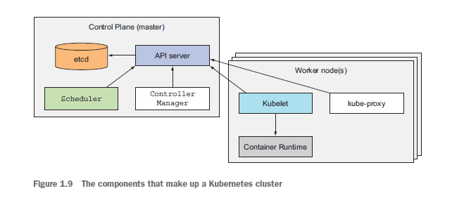

# kubernetes

# 1️⃣ 초기 설치 및 설정

## 기존의 가상 머신 전부 정지

- /VirtualMV/Hashicorp/kubermetes/Vagrantfile

```docker
# -*- mode: ruby -*-
# vi: set ft=ruby :

Vagrant.configure("2") do |config|
  config.vm.box = "ubuntu/bionic64"
  config.vm.hostname = "ubuntu"
  config.vm.network "private_network", ip: "192.168.111.110"
  config.vm.synced_folder ".", "/home/vagrant/sync", disabled: true
  config.vm.provider "virtualbox" do |vb|
    vb.cpus = 2
    vb.memory = 2048
  end
end
```

- `vagrant up` 을 통해 가상머신 생성
- `vagrant ssh` 로 접속

## 패키지 최신화

```
vagrant@ubuntu:~$ sudo su
root@ubuntu:/home/vagrant# cd
root@ubuntu:~# apt update
root@ubuntu:~# apt upgrade
```

## 도커 설치 및 설정

```
root@ubuntu:~# apt install docker.io -y

root@ubuntu:~# usermod -a -G docker vagrant
root@ubuntu:~# service docker restart
root@ubuntu:~# chmod 666 /var/run/docker.sock
```

- 버전 확인

```
root@ubuntu:~# docker version
Client:
 Version:           19.03.6
 API version:       1.40
 Go version:        go1.12.17
 Git commit:        369ce74a3c
 Built:             Fri Feb 28 23:45:43 2020
 OS/Arch:           linux/amd64
 Experimental:      false

Server:
 Engine:
  Version:          19.03.6
  API version:      1.40 (minimum version 1.12)
  Go version:       go1.12.17
  Git commit:       369ce74a3c
  Built:            Wed Feb 19 01:06:16 2020
  OS/Arch:          linux/amd64
  Experimental:     false
 containerd:
  Version:          1.3.3-0ubuntu1~18.04.2
  GitCommit:        
 runc:
  Version:          spec: 1.0.1-dev
  GitCommit:        
 docker-init:
  Version:          0.18.0
  GitCommit:
```

## kubectl 설치

- 쿠버네티스 커맨드 라인 도구인 kubectl을 사용
- [https://kubernetes.io/ko/docs/tasks/tools/install-kubectl/](https://kubernetes.io/ko/docs/tasks/tools/install-kubectl/)

- 설치

```
root@ubuntu:~# apt-get update && sudo apt-get install -y apt-transport-https gnupg2

root@ubuntu:~# curl -s https://packages.cloud.google.com/apt/doc/apt-key.gpg | apt-key add -
OK

root@ubuntu:~# echo "deb https://apt.kubernetes.io/ kubernetes-xenial main" | sudo tee -a /etc/apt/sources.list.d/kubernetes.list

root@ubuntu:~# apt-get update

root@ubuntu:~# apt-get install -y kubectl
```

- 설치 확인
    - 아직 클러스터가 없기 때문에 오류가 날 수 있다.

```
root@ubuntu:~# kubectl version
Client Version: version.Info{Major:"1", Minor:"19", GitVersion:"v1.19.2", GitCommit:"f5743093fd1c663cb0cbc89748f730662345d44d", GitTreeState:"clean", BuildDate:"2020-09-16T13:41:02Z", GoVersion:"go1.15", Compiler:"gc", Platform:"linux/amd64"}
The connection to the server localhost:8080 was refused - did you specify the right host or port?
```

## Minikube 설치

- 단일 노드 쿠버네티스 클러스터를 노트북의 가상 머신에서 구동하는 도구인 Minikube의 설치

```
root@ubuntu:~# curl -Lo minikube https://storage.googleapis.com/minikube/releases/latest/minikube-linux-amd64 \
>   && chmod +x minikube
  % Total    % Received % Xferd  Average Speed   Time    Time     Time  Current
                                 Dload  Upload   Total   Spent    Left  Speed
100 55.8M  100 55.8M    0     0  6761k      0  0:00:08  0:00:08 --:--:-- 7047k

root@ubuntu:~# mkdir -p /usr/local/bin/

root@ubuntu:~# install minikube /usr/local/bin/
```

- 다음 명령어를 실행해서 로컬 쿠버네티스 클러스터를 시작할 수 있다.

```
vagrant@ubuntu:~$ minikube start
😄  minikube v1.13.0 on Ubuntu 18.04 (vbox/amd64)
✨  Automatically selected the docker driver

⛔  Requested memory allocation (1992MB) is less than the recommended minimum 2000MB. Deployments may fail.

🧯  The requested memory allocation of 1992MiB does not leave room for system overhead (total system memory: 1992MiB). You may face stability issues.
💡  Suggestion: Start minikube with less memory allocated: 'minikube start --memory=1992mb'

👍  Starting control plane node minikube in cluster minikube
🚜  Pulling base image ...
💾  Downloading Kubernetes v1.19.0 preload ...
    > preloaded-images-k8s-v6-v1.19.0-docker-overlay2-amd64.tar.lz4: 486.28 MiB^[

🔥  Creating docker container (CPUs=2, Memory=1992MB) ...
🐳  Preparing Kubernetes v1.19.0 on Docker 19.03.8 ...
🔎  Verifying Kubernetes components...
🌟  Enabled addons: default-storageclass, storage-provisioner
🏄  Done! kubectl is now configured to use "minikube" by default
```

- minikube 상태, kubectl 버전 확인

```
vagrant@ubuntu:~$ minikube status
minikube
type: Control Plane
host: Running
kubelet: Running
apiserver: Running
kubeconfig: Configured

vagrant@ubuntu:~$ kubectl version
Client Version: version.Info{Major:"1", Minor:"19", GitVersion:"v1.19.2", GitCommit:"f5743093fd1c663cb0cbc89748f730662345d44d", GitTreeState:"clean", BuildDate:"2020-09-16T13:41:02Z", GoVersion:"go1.15", Compiler:"gc", Platform:"linux/amd64"}
Server Version: version.Info{Major:"1", Minor:"19", GitVersion:"v1.19.0", GitCommit:"e19964183377d0ec2052d1f1fa930c4d7575bd50", GitTreeState:"clean", BuildDate:"2020-08-26T14:23:04Z", GoVersion:"go1.15", Compiler:"gc", Platform:"linux/amd64"}

vagrant@ubuntu:~$ kubectl version --short
Client Version: v1.19.2
Server Version: v1.19.0
```

---

# 2️⃣ Kubernetes

## 1. 쿠버네티스

- 대부분의 리소스를 "오브젝트"라고 불리는 형태로 관리
- 쿠버네티스에서는 컨테이너의 집합(pods), 컨테이너의 집합을 관리하는 컨트롤러(replica set), 사용자(service account), 노드(node) 까지도 하나의 오브젝트로 사용할 수 있음
- kubectl 명령어 또는 YAML 파일을 정의해서 쿠버네티스를 사용

### 쿠버네티스에서 사용할 수 있는 오브젝트 확인

```docker
vagrant@ubuntu:~$ kubectl api-resources
NAME                              SHORTNAMES   APIGROUP                       NAMESPACED   KIND
bindings                                                                      true         Binding
componentstatuses                 cs                                          false        ComponentStatus
configmaps                        cm                                          true         ConfigMap
endpoints                         ep                                          true         Endpoints
events                            ev                                          true         Event
limitranges                       limits                                      true         LimitRange
namespaces                        ns                                          false        Namespace
nodes                             no                                          false        Node
...

```

### 특정 오브젝트의 상세 설명 확인

- pod에 대한 상세 설명

```docker
vagrant@ubuntu:~$ kubectl explain pod
```

## 2. 쿠버네티스 구성



### 마스터 노드

- 전체 쿠버네티스 시스템을 제어하고 관리하는 쿠버네티스 컨트롤 플레인을 실행

### 워커 노드

- 실제 배포되는 컨테이너 app을 실행

### 컨트롤 플레인(Control Plane)

- 클러스터를 제어하고 작동시킴
- 애플리케이션을 실행하지는 않음 ⇒ 노드에서 처리
- 구성요소
    - 쿠버네티스 API 서버 : 사용자 컨트롤 플레인 구성 요소와 통신
    - 스케줄러 : 애플리케이션 배포를 담당
    - 컨트롤러 매니저 : 구성 요소 복제본, 워커 노드 추적, 노드 장애 처리 등과 같은 클러스터 단의 기능을 수행
    - etcd : 클러스터 구성을 지속적으로 저장하는 신뢰할 수 있는 분산 데이터 저장소

### 워커노드(Worker Node)

- 컨테이너화 된 애플리케이션을 실행하는 시스템
- 애플리케이션을 실행하고 모니터링하며 애플리케이션에 서비스를 제공
- 구성요소
    - 컨테이너를 실행하는 도커, rkt 또는 다른 컨테이너 런타임(container runtime)
    - API 서버와 통신하고 노드의 컨테이너를 관리하는 Kubelet
    - 애플리케이션 구성 요소 간에 네트워크 트래픽을 로드밸런싱하는 쿠버네티스 서비스 프록시

---

# 3️⃣ nginx 컨테이너로 구성된 포드를 생성

### pod

- **컨테이너 애플리케이션**의 기본 단위
- 1개 이상의 컨테이너로 구성된 컨테이너의 집합
- 여러 개의 컨테이너를 추상화해서 하나의 애플리케이션으로 동작하도록 묶어 놓은 컨테이너의 묶음

### 포드 생성

- 디렉터리 생성 및 yml파일 작성

```yaml
vagrant@ubuntu:~$ mkdir ~/kube && cd ~/kube

vagrant@ubuntu:~/kube$ vi nginx-pod.yml
vagrant@ubuntu:~/kube$ cat nginx-pod.yml 
apiVersion: v1                          
kind: Pod                               
metadata:                                
  name: my-nginx-pod
spec:
  containers:
  - name: my-nginx-container
    image: nginx:latest
    ports:
    - containerPort: 80
      protocol: TCP
```

### 새로운 포드 생성 및 확인

- pods → po로 축약어 사용 가능

```yaml
vagrant@ubuntu:~/kube$ kubectl apply -f nginx-pod.yml 
pod/my-nginx-pod created

vagrant@ubuntu:~/kube$ kubectl get pods
NAME           READY   STATUS              RESTARTS   AGE
my-nginx-pod   0/1     ContainerCreating   0          9s

vagrant@ubuntu:~/kube$ kubectl get po
NAME           READY   STATUS    RESTARTS   AGE
my-nginx-pod   1/1     Running   0          25s
```

### 생성된 리소스의 자세한 정보를 확인

```yaml
vagrant@ubuntu:~/kube$ kubectl describe pods my-nginx-pod
Name:         my-nginx-pod
Namespace:    default
Priority:     0
Node:         minikube/172.17.0.3
Start Time:   Fri, 18 Sep 2020 06:36:24 +0000
Labels:       <none>
Annotations:  <none>
Status:       Running
IP:           172.18.0.3    -> 컨테이너의 ip
IPs:
  IP:  172.18.0.3
....
```

- 이제 이 pod에 접속 해보고 싶다.

### 클러스터 내부에 테스트를 위한 임시 포드를 생성해서 nginx 포드에 동작을 확인

- alicek106/ubuntu:curl 이미지를 이용해서 `debug` 이름의 포드를 생성
    - 바로 bash로 들어간다
- `—rm` 옵션은 작동을 중지함(exit)와 동시에 포드가 삭제된다

```yaml
vagrant@ubuntu:~/kube$ kubectl run -it --rm debug --image=alicek106/ubuntu:curl --restart=Never bash
If you don't see a command prompt, try pressing enter.
root@debug:/# 
root@debug:/#
```

- 다른 terminal에서 작동하고 있는 pod를 확인 가능하다

```yaml
vagrant@ubuntu:~$ kubectl get pods
NAME           READY   STATUS    RESTARTS   AGE
debug          1/1     Running   0          87s
my-nginx-pod   1/1     Running   0          7m37s
```

### debug 포드에서 my-nginx-pod(172.18.0.3)으로 요청을 전달

```yaml
vagrant@ubuntu:~/kube$ kubectl run -it --rm debug --image=alicek106/ubuntu:curl --restart=Never bash
If you don't see a command prompt, try pressing enter.
root@debug:/# curl 172.18.0.3
<!DOCTYPE html>
<html>
<head>
<title>Welcome to nginx!</title>
<style>
    body {
        width: 35em;
        margin: 0 auto;
        font-family: Tahoma, Verdana, Arial, sans-serif;
    }
</style>
</head>
<body>
<h1>Welcome to nginx!</h1>
<p>If you see this page, the nginx web server is successfully installed and
working. Further configuration is required.</p>

<p>For online documentation and support please refer to
<a href="http://nginx.org/">nginx.org</a>.<br/>
Commercial support is available at
<a href="http://nginx.com/">nginx.com</a>.</p>

<p><em>Thank you for using nginx.</em></p>
</body>
</html>
```

### exit 로 포드에서 나간 후, 포드가 삭제된 것을 확인 해보자

- 확인 해보세요!

### kubectl exec 명령으로 포드의 컨테이너에 명령어를 전달

```
vagrant@ubuntu:~$ kubectl  exec -it my-nginx-pod -- bash

root@my-nginx-pod:/# ls /etc/nginx/
conf.d	fastcgi_params	koi-utf  koi-win  mime.types  modules  nginx.conf  scgi_params	uwsgi_params  win-utf
root@my-nginx-pod:/# exit
exit
vagrant@ubuntu:~$
```

- 로그를 확인

```
vagrant@ubuntu:~/kube$ kubectl logs my-nginx-pod
/docker-entrypoint.sh: /docker-entrypoint.d/ is not empty, will attempt to perform configuration
/docker-entrypoint.sh: Looking for shell scripts in /docker-entrypoint.d/
/docker-entrypoint.sh: Launching /docker-entrypoint.d/10-listen-on-ipv6-by-default.sh
10-listen-on-ipv6-by-default.sh: Getting the checksum of /etc/nginx/conf.d/default.conf
10-listen-on-ipv6-by-default.sh: Enabled listen on IPv6 in /etc/nginx/conf.d/default.conf
/docker-entrypoint.sh: Launching /docker-entrypoint.d/20-envsubst-on-templates.sh
/docker-entrypoint.sh: Configuration complete; ready for start up
172.18.0.4 - - [18/Sep/2020:06:45:59 +0000] "GET / HTTP/1.1" 200 612 "-" "curl/7.35.0" "-"
```

### pod를 삭제 - 쿠버네티스 오브젝트를 삭제

```
vagrant@ubuntu:~/kube$ kubectl delete -f nginx-pod.yml 
pod "my-nginx-pod" deleted
  	
vagrant@ubuntu:~/kube$ kubectl get po
No resources found in default namespace.
```

## 4. 2개의 컨테이너를 가진 pod 정의

```
vagrant@ubuntu:~/kube$ cat nginx-pod-with-ubuntu.yml 
apiVersion: v1
kind: Pod
metadata:
        name: my-nginx-pod
spec:
        containers:
        - name: my-nginx-container
          image: nginx:latest
          ports:
          - containerPort: 80
            protocol: TCP

        - name: ubuntu-sidecar-container
          image: alicek106/rr-test:curl
          command: [ "tail" ]
          args: [ "-f", "/dev/null" ]
```

- 생성
    - 처음에는 준비중 이었다가 생성되는 것을 볼 수 있다.
    - my-nginx-pod에는 my-nginx-container 컨테이너와 ubuntu-sidecar-container 컨테이너가 실행 중

```
vagrant@ubuntu:~/kube$ kubectl apply -f nginx-pod-with-ubuntu.yml 
pod/my-nginx-pod created

vagrant@ubuntu:~/kube$ kubectl get po
NAME           READY   STATUS              RESTARTS   AGE
my-nginx-pod   0/2     ContainerCreating   0          13s

vagrant@ubuntu:~/kube$ kubectl get po
NAME           READY   STATUS    RESTARTS   AGE
my-nginx-pod   2/2     Running   0          28s
```

- 명령어를 전달할 때, 원하는 컨테이너로 명령을 전달하는 방법
    - 지정하지 않으면 디폴트 컨테이너로 전달된다.

```
vagrant@ubuntu:~/kube$ kubectl exec -it my-nginx-pod -c ubuntu-sidecar-container -- bash
root@my-nginx-pod:/# exit
exit

vagrant@ubuntu:~/kube$ kubectl exec -it my-nginx-pod -- bash
Defaulting container name to my-nginx-container.
Use 'kubectl describe pod/my-nginx-pod -n default' to see all of the containers in this pod.
root@my-nginx-pod:/#
```

### ubuntu-sidecar-container 에서 [localhost](http://localhost) 했을 때 , nginx가 나오면 이상하다는 것을 알아야한다?

```
vagrant@ubuntu:~/kube$ kubectl exec -it my-nginx-pod -c ubuntu-sidecar-container -- bash

root@my-nginx-pod:/# curl localhost
<!DOCTYPE html>
<html>
<head>
<title>Welcome to nginx!</title>
<style>
    body {
        width: 35em;
        margin: 0 auto;
        font-family: Tahoma, Verdana, Arial, sans-serif;
    }
</style>
</head>
<body>
<h1>Welcome to nginx!</h1>
<p>If you see this page, the nginx web server is successfully installed and
working. Further configuration is required.</p>

<p>For online documentation and support please refer to
<a href="http://nginx.org/">nginx.org</a>.<br/>
Commercial support is available at
<a href="http://nginx.com/">nginx.com</a>.</p>

<p><em>Thank you for using nginx.</em></p>
</body>
</html>
```

- ubunut-sidecar-container 컨테이너만으로 구성된 pod를 생성한 후 해당 pod에서 curl을 동작
    - 아무것도 나오지 않음

```
vagrant@ubuntu:~/kube$ cat nginx-pod-test.yml 
apiVersion: v1
kind: Pod
metadata:
        name: my-nginx-pod-test
spec:
        containers:
        - name: ubuntu-sidecar-container
          image: alicek106/rr-test:curl
          command: [ "tail" ]
          args: [ "-f", "/dev/null" ]

vagrant@ubuntu:~/kube$ kubectl apply -f nginx-pod-test.yml
pod/my-nginx-pod-test created

vagrant@ubuntu:~/kube$ kubectl exec -it my-nginx-pod-test -- bash
root@my-nginx-pod-test:/# curl localhost
curl: (7) Failed to connect to localhost port 80: Connection refused
```

---