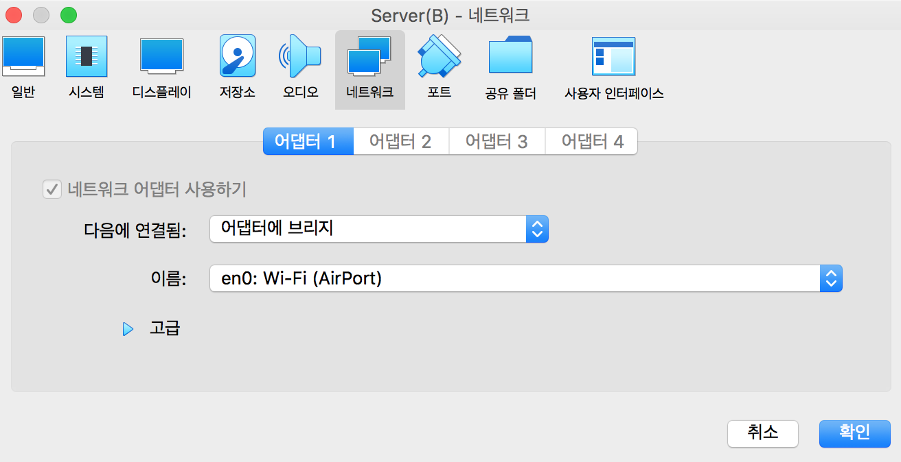
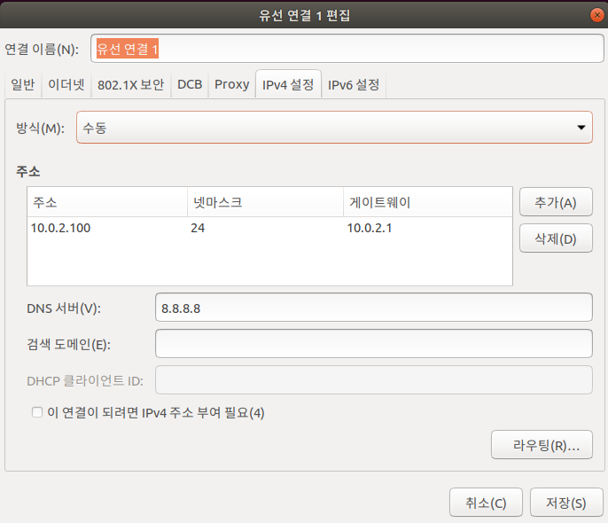
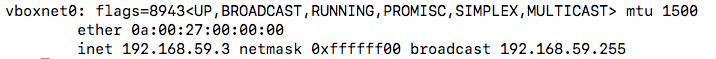

# SSH 접속과 staticIP 설정

# 👯 계정 전환

- root →ubuntu :  `su ubuntu`
- ubuntu → root : `sudu su`

# 🏌️ ubuntu에 ssh 설치

1. `sudo apt install openssh-server`
    - 의존성 문제

        root@server:/home/ubuntu# apt install openssh-server
        패키지 목록을 읽는 중입니다... 완료
        의존성 트리를 만드는 중입니다
        상태 정보를 읽는 중입니다... 완료
        몇몇 패키지를 설치할 수 없습니다. 요청한 상황이 불가능할 수도 있고,
        불안정 배포판을 사용해서 일부 필요한 패키지를 아직 만들지 않았거나,
        아직 Incoming에서 나오지 않은 경우일 수도 있습니다.
        이 상황을 해결하는데 다음 정보가 도움이 될 수도 있습니다:

        다음 패키지의 의존성이 맞지 않습니다:
        openssh-server : 의존: openssh-client (= 1:7.2p2-4)
        의존: openssh-sftp-server 하지만 %s 패키지를 설치하지 않을 것입니다
        추천: ssh-import-id 하지만 %s 패키지를 설치하지 않을 것입니다
        E: 문제를 바로잡을 수 없습니다. 망가진 고정 패키지가 있습니다.

    - 해결

        apt install openssh-client=1:7.2p2-4

2. no route to host  ..
    - 해결
        - 두 네트워크가 NAT network 인지 확인하기
        - ip를 확인하기

---

# 👰🏻 server, server(B), mac os 간 ssh 접속 (Bridge)



→ 어댑터에 브리지를 사용하여 연결 가능

1. ubuntu 에서 mac으로 접속

    ssh [gim-yujin@192.168.35.47](mailto:gim-yujin@192.168.35.47)

2. mac에서 ubuntu(server)로 접속

    ssh ubuntu@192.168.35.36

3. mac에서 ubuntu(server_b)로 접속

    ssh ubuntu@192.168.35.11

- 참고

    [https://m.blog.naver.com/PostView.nhn?blogId=fewus28&logNo=221071674293&proxyReferer=https:%2F%2Fwww.google.com%2F](https://m.blog.naver.com/PostView.nhn?blogId=fewus28&logNo=221071674293&proxyReferer=https:%2F%2Fwww.google.com%2F)

하지만,

→ Bridge Network는 Virtualbox가 호스트에 있는 네트워크 디바이스를 직접적으로 사용하는 네트워크이다.

→ 호스트가 사용하는 네트워크를 그대로 이용햘 수 있으며, VM이 호스트와 같은 물리적인 네트워크에 존재하게 할 수 있다.

→ 즉, VirtualBox의 네트워크를 사용하는 것이 아니므로 NAT Network로의 변환이 필요합니다

---

# ⭐ statuc IP (NAT network에서!)

- Server : 10.0.2.100
- Server(B) : 10.0.2.200

→ 고정IP로 변환 완료!

- Trouble shooting
    1. 10.0.2..xx 로 지정해주어야 한다.→ vb에서 지원해주는 주소 공간을 사용해야한다. 
    2. : 뒤에는 공백이 꼭 필요하다. (tab은 사용하면 안된다.)

## Server (ubuntu desktop) 고정 IP

교재(p153)참고

```python
nm-connection-editer
```



## Server_b 고정 IP

```python
ubuntu@server-b:~$ sudo su
[sudo] password for ubuntu: ubuntu

root@server-b:/home/ubuntu# cd
root@server-b:~# ls /etc/netplan/	⇐ 네트워크 설정 파일을 확인
50-cloud-init.yaml

root@server-b:~# cp /etc/netplan/50-cloud-init.yaml /etc/netplan/50-cloud-init.yaml.bak	  # 백업 파일 생성
root@server-b:~# vi /etc/netplan/50-cloud-init.yaml	 #네트워크 설정 파일을 편집
```

- `50-cloud-init.yaml` 수정하기

```python
network:
    ethernets:
        enp0s3:
            dhcp4: false
            addresses: [10.0.2.200/24]
            gateway4: 10.0.2.1
            nameservers:
                addresses: [8.8.8.8]
    version: 2
```

- 적용하기, 확인하기

```python
root@server-b:~# netplan apply

root@server-b:~# hostname -I
10.0.2.200
```

### ** MAC에서 접속

- mac은 윈도우 처럼 en0: 의 inet을 사용하는 것이 아니다.
- VBox용 네트워크를 사용해야 한다.

    

    → 처음에는 inet 192.168.59.3이 나오지 않았다...

    - 해결
        - host에서 VBoxManage 명령을 통해 서버를 실행시킨다.
        - Nat Network를 구성하는 방법

        ```python
        # 현재 생성되어있는 NAT Network 목록 조회
        $ VBoxManage list natnetworks
         
        # 192.168.0.0/24 대역의 DHCP 기능이 있는 NAT Network 생성
        $ VBoxManage natnetwork add --netname natnet1 --network "192.168.0.0/24" --enable --dhcp on
         
        # 위에서 생성한 'natnet1' NAT Network 시작하기
        $ VBoxManage natnetwork start --netname natnet1
         
        # 'natnet1' NAT Network 삭제하기
        $ VBoxManage natnetwork remove --netname natnet1
        ```

    - 참고링크
        1. NAT network 환경 구성

            [Virtualbox 네트워크 종류와 설정 방법](https://indienote.tistory.com/258)

        2. Mac에서 ssh 접속하기

            [Virtual Box SSH 접속(NAT network), 포트포워딩으로 원격접속](https://hongku.tistory.com/179)

        3. 방화벽 사용법 (ufw)

            [[Ubuntu] 우분투 방화벽(UFW) 설정](https://webdir.tistory.com/206)

        4. 윈도우와 맥의 차이점

            [[삽질]버철박스 네트워크 설정하기 - 맥북과 윈도우의 차이점](https://naleejang.tistory.com/167)