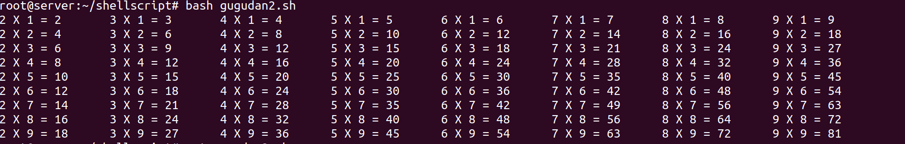

# 셸 스크립트 프로그래밍

- 교재 chapter 11

# 셸 프로그래밍

## #1 셸에서 변수 사용법

```c
ubuntu@server-b:~$ a=10

ubuntu@server-b:~$ echo $a
10

ubuntu@server-b:~$ b=20

ubuntu@server-b:~$ echo $b
20

ubuntu@server-b:~$ echo $a+$b
10+20
```

## #2 앞에서 했던 작업을 파일로 만들어서 일괄 실행

```c
ubuntu@server-b:~$ vi vartest.sh
```

```bash
#!/bin/bash
a=10
echo $a
b=20
echo $b
echo $a+$b
```

```c
ubuntu@server-b:~$ chmod +x vartest.sh   //실행가능한 파일로 바꾸어 주기
ubuntu@server-b:~$ ./vartest.sh
10
20
10+20 
```

# 변수

## #1 변수의 입력과 출력

```bash
#!/bin/bash

myvar="Hi Woo"        
echo $myvar           
echo "$myvar"          
echo '$myvar'      => (1)     
echo \$myvar       => (2)    
echo 값 입력:
read myvar
echo '$myvar' = $myvar
exit 0
```

→ 결과

```c
ubuntu@server-b:~$ sh var1.sh
Hi Woo		
Hi Woo       
$myvar		
$myvar		
값 입력:
abcd		⇐ 입력
$myvar = abcd
```

- (1), (2) 는 이스케이프 되었다고 한다.

## #2 숫자계산

```bash
#!/bin/sh

num1=100
num2=$num1+200
echo $num2

num3=`expr $num1 + 200`
echo $num3

num4=`expr \( $num1 + 200 \) / 10 \* 2`
echo $num4

exit 0
```

- `과 expr을 사용해야한다.
- (, * 앞에는 \를 사용해야한다!

```c
ubuntu@server-b:~$ sh numcalc.sh
100+200
300
60
```

## #3 파라미터 변수

```bash
#!/bin/sh
echo "실행파일 이름은 <$0>이다"
echo "첫번째 파라미터는 <$1>이고, 두번째 파라미터는 <$2>이다."
echo "전체 파라미티는 <$*>다."
exit 0
```

```html
ubuntu@server:~$ sh paraver.sh 안녕! 잘가!
실행파일 이름은 <paraver.sh>이다
첫번째 파라미터는 <안녕!>이고, 두번째 파라미터는 <잘가!>이다.
전체 파라미티는 <안녕! 잘가!>다.
```

## #4 for문

- `sh 파일명`  을 사용하면 sh을 사용한다

```bash
#!/bin/sh

hap=0
#for i in 1 2 3 4 5 6 7 8 9 10
for i in $(seq 1 100)
do
	hap=`expr $hap + $i`
done
echo "1부터 100까지의 합 : " $hap
exit 0
```

```python
root@server:~/shellscript# sh sigma.sh 
1부터 100까지의 합 : 5050
```

- `bash 파일명` 을 사용하면 bash shell을 사용한다.

```bash
#!/bin/sh

hap=0
for i in {1..100}
# 또는, for (( i = 1 ; i <= 100 ; i ++ ))
do
	hap=`expr $hap + $i`
done
echo "1부터 100까지의 합 : " $hap
exit 
```

```python
root@server:~/shellscript# sh sigma.sh 
expr: non-integer argument
1부터 100까지의 합 :

root@server:~/shellscript# bash sigma.sh 
1부터 100까지의 합 :  5050
```

- `sh` 와 `bash` 에서의 문법이 조금씩 차이가 있다.

- 구구단을 출력하는 프로그램을 짜보자!

```bash
#!/bin/bash

for i in {1..9}
do
	for j in {1..9}
	do
		echo $i " X " $j " = " `expr $i \* $j`
	done
	echo "----------------------"
done
exit 0
```

```bash
=> 결과
root@server:~/shellscript# bash gugudan.sh 
1  X  1  =  1
1  X  2  =  2
1  X  3  =  3
1  X  4  =  4
1  X  5  =  5
1  X  6  =  6
1  X  7  =  7
1  X  8  =  8
1  X  9  =  9
----------------------
2  X  1  =  2
2  X  2  =  4
		.
		.
		.
```

- 구구단을 가로로 출력하기 (format string 사용)
    - printf 사용

```bash
#!/bin/sh

for i in {1..9}
do
	for j in {2..9}
	do
		printf "%s X %s = %s\t" $j $i `expr $j \* $i`
	done
	echo ""
done
exit 0
```

→ 출력 결과



## #5 shift

```bash
root@server:~# vi shift.sh
#!/bin/bash
myfunc() {
	str=""
	while [ "$1" != "" ]; do
		str="$str $1"
		shift
	done
	echo $str
}

myfunc AAA BBB CCC DDD EEE FFF GGG
exit 0
```

- 계속 $1 번째 파라미터를 가져온다.
    - 파라미터의 수가 너무 많거나 , 수를 예측할 수 없을 때 사용한다.

## #6 cron 등록

`crontab -l`	⇐ 등록된 크론을 확인

`crontab -e`	⇐ 크론을 등록, 수정

- 크론 형식

```bash
0   5   *  *     1        tar -zcf /var/backups/home.tgz /home/
분   시  일  월   요일
                0~6 : 일~토
```

- 특정 시간에 특정 디렉터리를 백업
    - [backup.sh](http://backup.sh/)

```bash
#!/bin/bash
set $(date)
fname="backup$1$2$3tar.xz"			⇐ 2020.09.09.tar.xz
tar cfJ /backup/$fname /home
```

```bash
root@server:~# mkdir /backup

root@server:~# bash ./backup.sh
tar: Removing leading `/' from member names

root@server:~# ls /backup/
backup2020.09.09.tar.xz
```

- 크론에 등록 (예약 기능!)

```bash
root@server:~# vi /etc/crontab
# /etc/crontab: system-wide crontab
# Unlike any other crontab you don't have to run the `crontab'
# command to install the new version when you edit this file
# and files in /etc/cron.d. These files also have username fields,
# that none of the other crontabs do.

SHELL=/bin/sh
PATH=/usr/local/sbin:/usr/local/bin:/sbin:/bin:/usr/sbin:/usr/bin

# m h dom mon dow user  command
17 *    * * *   root    cd / && run-parts --report /etc/cron.hourly
25 6    * * *   root    test -x /usr/sbin/anacron || ( cd / && run-parts --report /etc/cron.daily )
47 6    * * 7   root    test -x /usr/sbin/anacron || ( cd / && run-parts --report /etc/cron.weekly )
52 6    1 * *   root    test -x /usr/sbin/anacron || ( cd / && run-parts --report /etc/cron.monthly )

# 매월 16일 새벽 3시 20분에 백업을 수행
20 3   16 * *  root    /root/shellscript/backup.sh
#
```