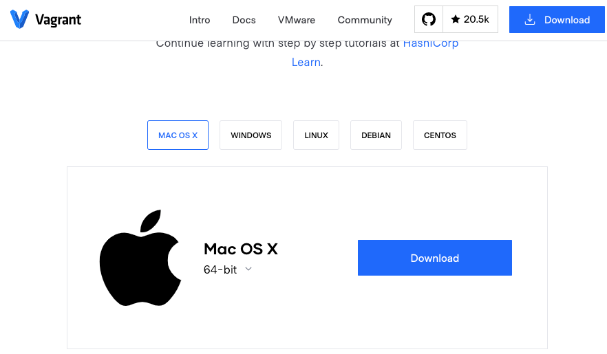
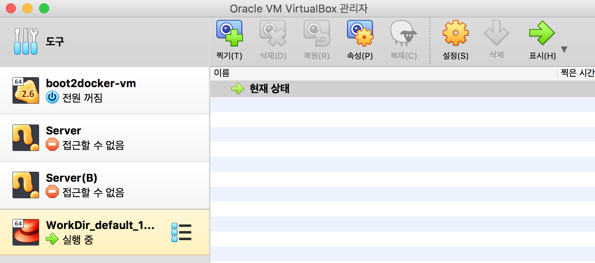
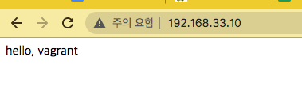

# 개인이 DevOps 시작하기1

## 😙 Vagrant로 **Local 개발 환경의 Infrastructure as Code 화(P58)**

- Vagrant ⇒ 해시코드에서 제공하는 **가상 환경 구축 도구**
- VirtualBox 6.1 버전을 사용하기 위해서는 Vagrant 2.2.1 보다 높은 버전을 사용해야 함

### #1 기존에 실행 중 가상머신을 모두 중지 (poweroff)

### #2 Vagrant 설치

- [https://www.vagrantup.com/](https://www.vagrantup.com/) 에서 환경에 맞는 설치 파일을 다운로드 받아서 설치



### #3 작업 디렉터리 생성

- `gim-yujin/VirtualBox VMs/Hashcorp/WorkDir` 위치에서 실행
- 그 위치에서 `vagrant init`

```c
➜ WorkDir ls
Vagrantfile
```

### #4 Vagrantfile 수정

```c
# -*- mode: ruby -*-
# vi: set ft=ruby :

Vagrant.configure("2") do |config|
# config.vm.box = "centos/7"
  config.vm.box = "generic/centos7"
  config.vm.hostname = "demo"
  config.vm.network "private_network", ip: "192.168.33.10"
  config.vm.synced_folder ".", "/home/vagrant/sync", disabled: true
end
```

### #5 가상머신을 생성하고 기동

- `vagrant up` 명령을 실행

```c
➜ WorkDir vagrant up                 
Bringing machine 'default' up with 'virtualbox' provider...
==> default: Box 'generic/centos7' could not be found. Attempting to find and install...
    default: Box Provider: virtualbox
    default: Box Version: >= 0
==> default: Loading metadata for box 'generic/centos7'
    default: URL: https://vagrantcloud.com/generic/centos7
==> default: Adding box 'generic/centos7' (v3.0.30) for provider: virtualbox
    default: Downloading: https://vagrantcloud.com/generic/boxes/centos7/versions/3.0.30/providers/virtualbox.box
Download redirected to host: vagrantcloud-files-production.s3.amazonaws.com
    default: Calculating and comparing box checksum...
==> default: Successfully added box 'generic/centos7' (v3.0.30) for 'virtualbox'!
==> default: Importing base box 'generic/centos7'...
==> default: Matching MAC address for NAT networking...
==> default: Checking if box 'generic/centos7' version '3.0.30' is up to date...
==> default: Setting the name of the VM: WorkDir_default_1599637138299_69582
==> default: Clearing any previously set network interfaces...
==> default: Preparing network interfaces based on configuration...
    default: Adapter 1: nat
    default: Adapter 2: hostonly
==> default: Forwarding ports...
    default: 22 (guest) => 2222 (host) (adapter 1)
==> default: Running 'pre-boot' VM customizations...

...
    default: Guest Additions Version: 5.2.44
    default: VirtualBox Version: 6.1
==> default: Setting hostname...
==> default: Configuring and enabling network interfaces...
```

### #6 가상 머신으로 접속

**#6-1 virtualBox 사용**



- id, pw : vagrant 로 로그인 가능

**#6-2 ssh 접속**

- terminal에서 ssh로 접속

```c
➜ WorkDir vagrant ssh
[vagrant@demo ~]$
```

- id, pw 설정 없이 바로 로그인

→ 가상 머신이 중지된 경우에는 `vagrant up` 을 한 후 `vagrant ssh` 를 하면 실행이 가능합니다.

### #7 snapshot 찍기

```c
➜ WorkDir vagrant snapshot save FirstSnapshot
==> default: Snapshotting the machine as 'FirstSnapshot'...
==> default: Snapshot saved! You can restore the snapshot at any time by
==> default: using `vagrant snapshot restore`. You can delete it using
==> default: `vagrant snapshot delete`.
```

- virtualbox를 CLI를 이용하여 조작이 가능하다.

---

## 🤧 Vagrant를 이용해서 웹 서버가 설치된 가상 머신을 배포 (P66)

- [https://www.vagrantup.com/docs/provisioning](https://www.vagrantup.com/docs/provisioning)

### #1 Vagrantfile 수정

```c
# -*- mode: ruby -*-
# vi: set ft=ruby :

Vagrant.configure("2") do |config|
# config.vm.box = "centos/7"
  config.vm.box = "generic/centos7"
  config.vm.hostname = "demo"
  config.vm.network "private_network", ip: "192.168.33.10"
  config.vm.synced_folder ".", "/home/vagrant/sync", disabled: true
	config.vm.provision "shell", inline: $script
end

$script = <<SCRIPT
  yum -y install epel-release
  yum -y install nginx
  echo "hello, vagrant" > /usr/shere/nginx/html/index.html
  systemctl start nginx
SCRIPT
```

### #2 provision 실행하기

- destroy 후에 다시 up하거나
- vagrant provision 명령으로 실행

### **#3 결과를 확인**

```python
C:\HashiCorp\WorkDir> vagrant ssh	⇐ 호스트 PC에서 가신머신으로 SSH로 접속

[vagrant@demo ~]$ cat /usr/share/nginx/html/index.html	⇐ nginx 설치 여부 및 index.html 파일 수정 여부를 확인
Hello, Vagrant

[vagrant@demo ~]$ sudo systemctl stop firewalld	⇐ 방화벽 해제

[vagrant@demo ~]$ exit	⇐ 가상머신에 빠져 나옴
logout
Connection to 127.0.0.1 closed.

C:\HashiCorp\WorkDir> curl http://192.168.33.10	⇐ 가상머신(nginx서버)에게 웹 페이지(index.html)를 요청
Hello, Vagrant	⇐ index.html 파일의 내용을 반환
```

- 웹에서  [`http://192.168.33.10`](http://192.168.33.10)  으로 접속 가능



---

## 😏 Vagrantfile에서 Infrastructure as Code를 구현하는 것의 의의

### vagrant를 이용하는 것의 장점

1. 환경 구축 작업의 간소화
    - Vagrantfile에 기술하기만 하면 누구라도 vgrant up 명령을 통해 동일한 환경을 간단하게 구축

2. 환경 공유가 용이
    - Vagrantfile을 공유하여 환경 정보를 쉽게 공유
3. 팀 차원의 유지 보수가 가능
    - 팀 멤버 누구라도 이 파일을 참조하여 vagrant up을 실행하는 것만으로 환경을 이용하는 것이 가능