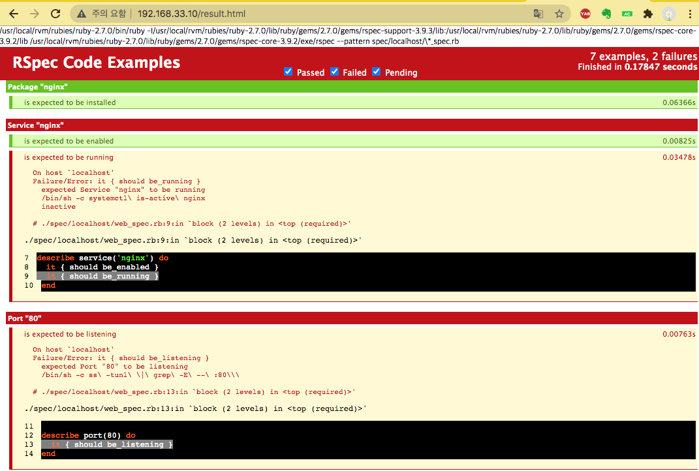

# 개인이 DevOps 시작하기2

# 🤧 Vagrant 의 한계

## **보다 효율적으로 인프라를 관리하기 위한 개선 사항 (= vagrant의 한계)**

- 구축 절차를 기술하는 사람에 따라 다양
- 구축된 환경에 대한 추가 설정이 불가
- 다양한 환경에 적용하기 어렵다

## 인프라 구성 관리 도구의 특징

- 선언적
- 추상화
- 수렴화
- 멱등성
- 간소화

# 🧐 Ansible로 범용적으로 구축하고 다른 환경으로 전개

## 앤서블(Ansible) 기본 사용법

- 파이썬으로 만들어진 인프라 구성 관리 도구

- 앤서블 본체
    - 인벤터리(inventory)
    - 모듈(module)

- 환경 설정 및 구축 절차를 통일된 형식으로 기술
- 매개 변수 등 환경의 차이를 관리
- 실행 전에 변경되는 부분을 파악

### #1 nginx 설치되어 있는지 확인

```python
C:\HashiCorp\WorkDir> vagrant ssh

[vagrant@demo ~]$ systemctl status nginx
● nginx.service - The nginx HTTP and reverse proxy server
Loaded: loaded (/usr/lib/systemd/system/nginx.service; disabled; vendor preset: disabled)
Active: active (running) since Thu 2020-09-10 00:38:06 UTC; 53min ago	⇐ 설치되어 실행 중
Process: 3217 ExecStart=/usr/sbin/nginx (code=exited, status=0/SUCCESS)
Process: 3214 ExecStartPre=/usr/sbin/nginx -t (code=exited, status=0/SUCCESS)
Process: 3212 ExecStartPre=/usr/bin/rm -f /run/nginx.pid (code=exited, status=0/SUCCESS)
Main PID: 3219 (nginx)
CGroup: /system.slice/nginx.service
├─3219 nginx: master process /usr/sbin/nginx
├─3220 nginx: worker proces
└─3221 nginx: worker process
```

### **#2 ansible 설치 및 버전 확인**

```python
[vagrant@demo ~]$ sudo systemctl stop nginx.service

[vagrant@demo ~]$ sudo yum install -y epel-release

[vagrant@demo ~]$ sudo yum install -y ansible

[vagrant@demo ~]$ ansible --version
ansible 2.9.10
config file = /etc/ansible/ansible.cfg
configured module search path = [u'/home/vagrant/.ansible/plugins/modules', u'/usr/share/ansible/plugins/modules']
ansible python module location = /usr/lib/python2.7/site-packages/ansible
executable location = /usr/bin/ansible
python version = 2.7.5 (default, Apr  2 2020, 13:16:51) [GCC 4.8.5 20150623 (Red Hat 4.8.5-39)]
```

### #3 ansible 명령으로 nginx를 기동

```python
[vagrant@demo ~]$ sudo sh -c "echo \"localhosts\" >> /etc/ansible/hosts"
[vagrant@demo ~]$ cat /etc/ansible/hosts
    .
    .
    .
    .
localhosts
```

- 의미 문자 = 메타 문자 ⇒ 어떤 기능에서 특별한 의미를 가지는 문자 = 특수 기호

    → SQL 문을 작성할 때 홑따움표(')는 문자열의 시작과 끝을 나타내는 의미를 가진 문자

    → URL에서 &는 요청 파라미터와 파라미터를 구분하는 의미를 가진 문자

- 의미 문자를 문자 그 자체로 사용해야 할 경우가 있다.
    - content 컬럼에 John's Name 이라는 글자가 들어간 것을 검색하는 쿼리를 만들 때

        ⇒ `content like '%John's Name%'`

    - 요청 파라미터 중 파라미터 이름이 CompanyName이고, 파라미터 값이 Bandi & Luce인 경우

        ⇒ `…?CompanyName=Bandi & Luce`

- 의미 문자를 그대로 사용하면 해석을 할 수 없거나 잘못 해석해서 오류가 발생
- 이런 문제점을 해결하기 위해서는 의미 문자를 문자 그 자체로 해석될 수 있도록 변형해야 한다.

- 이스케이프 ⇒ 의미 문자에서 의미를 제거하고 문자만 남기는 것
- 이스케이프를 구현하는 방법
    1. **이스케이프를 나타내는 의미 문자를 사용 ⇒ \ (역슬래쉬)** ⇒ `content like '%John\'s Name%'`
    2. 해당 기능에서 제공해 주는 규칙을 이용 ⇒ MySQL인 경우 홑따움표를 두 번 사용 ⇒ `content like '%John''s Name%'`
    3. 일정한 규칙에 따라서 변경해서 이용 = 인코딩 ⇒ URL의 경우 URL Encoding 기법을 이용해서 표현 ⇒ `CompanyName=Bandi %26 Luce`

- service start
    - [`localhost`](http://localhost) 는 인벤터리 파일에 기재된 서버 중 이번 명령어를 수행할 대상
    - **`"changed": true`** 중지 상태에서 실행 상태로 변경
    - `-b`   원격 실행되는 대상 서버의 사용자(=root)
    - `-c local`  대상 서버가 자기 자신이브로 SSH를 사용하지 않고 local로 연결
    - `-m service`   service 모듈을 이용

```python
[vagrant@demo ~]$ ansible **localhost** -b -c local -m service -a "name=nginx state=started"
localhost | CHANGED => {
    **"changed": true,** 
    "name": "nginx", 
    "state": "started", 
    "status": {
        "ActiveEnterTimestampMonotonic": "0", 
        "ActiveExitTimestampMonotonic": "0", 
        "ActiveState": "inactive",
```

### #4 nginx 상태 확인

```python
[vagrant@demo ~]$ systemctl status nginx.service
● nginx.service - The nginx HTTP and reverse proxy server
   Loaded: loaded (/usr/lib/systemd/system/nginx.service; disabled; vendor preset: disabled)
   Active: active (running) since Thu 2020-09-10 01:58:15 UTC; 7min ago
  Process: 25830 ExecStart=/usr/sbin/nginx (code=exited, status=0/SUCCESS)
  Process: 25828 ExecStartPre=/usr/sbin/nginx -t (code=exited, status=0/SUCCESS)
  Process: 25826 ExecStartPre=/usr/bin/rm -f /run/nginx.pid (code=exited, status=0/SUCCESS)
 Main PID: 25832 (nginx)
   CGroup: /system.slice/nginx.service
           ├─25832 nginx: master process /usr/sbin/nginx
           ├─25833 nginx: worker process
           └─25834 nginx: worker process
```

### #5 nginx가 실행 상태일 때 ansible 명령(nginx 서비스를 시작)를 실행

```python
[vagrant@demo ~]$ ansible localhost -b -c local -m service -a "name=nginx state=started"
localhost | SUCCESS => {
    "ansible_facts": {
        "discovered_interpreter_python": "/usr/bin/python"
    },
    **"changed": false,**		⇐ 실행 상태였기 때문에, 상태 변화가 발생하지 않았음 
    "name": "nginx",
    "state": "started",
    "status": {
        :
    }
}
```

---

## ansible 더 잘 사용하기 : ansible-playbook

### #1 git 설치

```python
[vagrant@demo ~]$ sudo yum install -y git
```

### #2 ansible-playbook-sample 클론 생성

```python
[vagrant@demo ~]$ git clone https://github.com/devops-book/ansible-playbook-sample.git
```

### #3 playbook 실행해서 구축

```python
[vagrant@demo ~]$ cd ansible-playbook-sample/
[vagrant@demo ansible-playbook-sample]$ ansible-playbook -i development site.yml                                                   
[WARNING]: Invalid characters were found in group names but not replaced, use -vvvv
to see details
PLAY [webservers] *******************************************************************

TASK [Gathering Facts] **************************************************************
ok: [localhost]

TASK [common : install epel] ********************************************************
ok: [localhost]			⇐ epel 패키지가 이미 설치되어 있어 아무것도 하지 않았다. 

TASK [install nginx] ****************************************************************
ok: [localhost]

TASK [nginx : replace index.html] ***************************************************
changed: [localhost]		⇐ TASK 실행 결과가 예상했던 데로 변경되었다. 

TASK [nginx start] ******************************************************************
changed: [localhost]

PLAY RECAP **************************************************************************
localhost                  : ok=5    changed=2    unreachable=0    failed=0    skipped=0    rescued=0    ignored=0

```

```python
[vagrant@demo ansible-playbook-sample]$ curl localhost
hello, development ansible		⇐ nginx 홈 디렉터리의 index.html 파일의 내용
```

- 디렉터리를 바꾸어 보기

```python
[vagrant@demo ansible-playbook-sample]$ ansible-playbook -i production site.yml
[WARNING]: Invalid characters were found in group names but not replaced, use -vvvv
to see details
PLAY [webservers] *******************************************************************

TASK [Gathering Facts] **************************************************************
ok: [localhost]

TASK [common : install epel] ********************************************************
ok: [localhost]

TASK [install nginx] ****************************************************************
ok: [localhost]

TASK [nginx : replace index.html] ***************************************************
changed: [localhost]

TASK [nginx start] ******************************************************************
ok: [localhost]

PLAY RECAP **************************************************************************
localhost                  : ok=5    changed=1    unreachable=0    failed=0    skipped=0    rescued=0    ignored=0
```

```python
[vagrant@demo ansible-playbook-sample]$ curl localhost
hello, production ansible
```

- site.yml 파일 열어보기
    - 어떤 서버에서 어떤 작업을 수행하는 방법을 정의하는 것이 playbook 파일입니다.
    - 일련의 처리가 모두 기록되어 있다.

```yaml
---
- hosts: webservers
  become: yes
  connection: local
  roles:
    - common
    - nginx
#    - serverspec
#    - serverspec_sample
#    - jenkins
```

### #4 실행 대상 정의를 확인

- 인벤터리 파일은 /etc/ansible/hosts를 사용하지만 -i 옵션을 이용해서 지정할 수 도 있다

```python
[vagrant@demo ansible-playbook-sample]$ ls
development  group_vars  production  roles  site.yml	⇐ 인벤터리 파일
~~~~~~~~~~~              ~~~~~~~~~~
  
[vagrant@demo ansible-playbook-sample]$ cat development
[development-webservers]
localhost

[webservers:children]
development-webservers

[vagrant@demo ansible-playbook-sample]$ cat production
[production-webservers]
localhost

[webservers:children]
production-webservers
```

### #5 실행 내용 정의를 확인

- ansible-playbook-sample/roles 디렉터리 아래에 tasks 디렉터리에 기록

```python
[vagrant@demo ansible-playbook-sample]$ ls ./roles
common  jenkins  nginx  serverspec  serverspec_sample	⇐ 롤 별로 실행될 내용을 담고 있는 디렉터리

[vagrant@demo ansible-playbook-sample]$ ls ./roles/common/tasks/
main.yml							⇐ common 롤에서 수행해야 할 내용을 정의

[vagrant@demo ansible-playbook-sample]$ ls ./roles/nginx/tasks/
main.yml							⇐ nginx 롤에서 수행해야 할 내용을 정의

[vagrant@demo ansible-playbook-sample]$ cat ./roles/common/tasks/main.yml
---
# tasks file for common
- name: install epel
  yum: name=epel-release state=installed

[vagrant@demo ansible-playbook-sample]$ cat ./roles/nginx/tasks/main.yml
---
# tasks file for nginx
- name: install nginx
  yum: name=nginx state=installed

- name: replace index.html
  template: src=index.html.j2 dest=/usr/share/nginx/html/index.html

- name: nginx start
  service: name=nginx state=started enabled=yes
```

### #6 template 확인

```python
[vagrant@demo ansible-playbook-sample]$ ls ./roles/nginx/templates/
index.html.j2
[vagrant@demo ansible-playbook-sample]$ cat ./roles/nginx/templates/index.html.j2 
hello, {{ env }} ansible
```

### #7 템플릿에서 사용하는 변수 값을 확인

- 템플릿에서 사용하는 변수 값은 group_vars 디렉터리에 그룹별로 정의

```python
[vagrant@demo ansible-playbook-sample]$ ls ./group_vars/
development-webservers.yml  production-webservers.yml

[vagrant@demo ansible-playbook-sample]$ cat ./group_vars/development-webservers.yml
env: "development"

[vagrant@demo ansible-playbook-sample]$ cat ./group_vars/production-webservers.yml
env: "production"
```

### #8 템플릿 내용을 변경

```python
[vagrant@demo ansible-playbook-sample]$ vi ./roles/nginx/templates/index.html.j2
HELLO, {{ env }} ansible !!!				⇐ 템플릿 내용 변경
```

### #9 dry-run 모드로 실행

- `—check`옵션 : dry-run 모드로 실행
- `—diff` 옵션 : 변경 차이를 표시한다.

```python
[vagrant@demo ansible-playbook-sample]$ ansible-playbook -i development site.yml --check --diff
```

```python
-> 결과의 일부

TASK [nginx : replace index.html] **********************************************
--- before: /usr/share/nginx/html/index.html
+++ after: /home/vagrant/.ansible/tmp/ansible-local-267130NhB93/tmph_KXYZ/index.html.j2
@@ -1 +1 @@
-hello, production ansible
+HELLO, development ansible !!!

changed: [localhost]
```

- 반영이 되지 않은 상태에서 실행하는 경우
    - 이전 상태로 실행이 된다.

```python
[vagrant@demo ansible-playbook-sample]$ curl localhost
hello, production ansible
```

### #10 변경 사항을 호스트에 반영하기

```python
[vagrant@demo ansible-playbook-sample]$ ansible-playbook -i development site.yml --diff

[vagrant@demo ansible-playbook-sample]$ curl localhost
HELLO, development ansible !!!
```

---

# 🤓  인프라 구성 관리 도구가 가져다 주는 것

- vagrant를 사용함으로써 생겼던 문제에 대해 Ansible을 활용 함으로써 대응할 수 있었습니다.

1. 구축 절차를 이해하기 어렵다.
    - Ansible의 선언적인 기술 방법에 의해 상태가 '수렴화'되도록 기재할 수 있었습니다. 즉, 절차가 아닌 결과만을 보는 것이 가능해졌습니다.
2. 설정을 추가할 수 없다.
    - 전제가 되는 환경 조건을 걱정할 필요가 없으며, 설정의 추가도 도구에게 맡기며 기재만 하면 해결됩니다.
3. 구축 절차를 다른 환경에서 유용하기 어렵다.
    - OS 등의 환경 조건을 걱정하기 않고 구축으로 인해 나타나는 상태만을 간단하게 이해할 수 있게 되었습니다.

---

# 🤭 Serverspec 으로 인프라 구축 테스트 코드화(자동화)

## #1 rvm 및 ruby 설치

- rvm 설치 전 설정

```python
[vagrant@demo ansible-playbook-sample]$ command curl -sSL https://rvm.io/mpapis.asc | sudo gpg2 --import -
gpg: directory `/root/.gnupg' created
gpg: new configuration file `/root/.gnupg/gpg.conf' created
gpg: WARNING: options in `/root/.gnupg/gpg.conf' are not yet active during this run
gpg: keyring `/root/.gnupg/secring.gpg' created
gpg: keyring `/root/.gnupg/pubring.gpg' created
gpg: /root/.gnupg/trustdb.gpg: trustdb created
gpg: key D39DC0E3: public key "Michal Papis (RVM signing) <mpapis@gmail.com>" imported
gpg: Total number processed: 1
gpg:               imported: 1  (RSA: 1)
gpg: no ultimately trusted keys found
```

```python
[vagrant@demo ansible-playbook-sample]$ command curl -sSL https://rvm.io/pkuczynski.asc | sudo gpg2
 --import -
gpg: key 39499BDB: public key "Piotr Kuczynski <piotr.kuczynski@gmail.com>" imported
gpg: Total number processed: 1
gpg:               imported: 1  (RSA: 1)
```

```python
[vagrant@demo ansible-playbook-sample]$ curl -L get.rvm.io | sudo bash -s stable
  % Total    % Received % Xferd  Average Speed   Time    Time     Time  Current
                                 Dload  Upload   Total   Spent    Left  Speed
100   194  100   194    0     0    340      0 --:--:-- --:--:-- --:--:--   340
100 24535  100 24535    0     0  10527      0  0:00:02  0:00:02 --:--:-- 16488
Downloading https://github.com/rvm/rvm/archive/1.29.10.tar.gz
Downloading https://github.com/rvm/rvm/releases/download/1.29.10/1.29.10.tar.gz.asc
gpg: Signature made Wed 25 Mar 2020 09:58:42 PM UTC using RSA key ID 39499BDB
gpg: Good signature from "Piotr Kuczynski <piotr.kuczynski@gmail.com>"
...
```

```python
[vagrant@demo ansible-playbook-sample]$ sudo usermod -aG rvm $USER

[vagrant@demo ansible-playbook-sample]$ id $USER
uid=1000(vagrant) gid=1000(vagrant) groups=1000(vagrant),1001(rvm)

[vagrant@demo ansible-playbook-sample]$ source /etc/profile.d/rvm.sh

[vagrant@demo ansible-playbook-sample]$ rvm reload
RVM reloaded!

[vagrant@demo ansible-playbook-sample]$ sudo su

[root@demo ansible-playbook-sample]# rvm requirements run
Checking requirements for centos.
Installing requirements for centos.
Installing required packages: bison, libffi-devel, readline-devel, sqlite-devel, zlib-devel, openssl-devel............
Requirements installation successful.
```

- rvm으로 루비 설치

    → rvm? : ruby version manager : 루비를 관리하는 매니저

```python
[root@demo ansible-playbook-sample]# rvm install 2.7
Searching for binary rubies, this might take some time.
Found remote file https://rvm_io.global.ssl.fastly.net/binaries/centos/7/x86_64/ruby-2.7.0.tar.bz2
Checking requirements for centos.
Requirements installation successful.
ruby-2.7.0 - #configure
ruby-2.7.0 - #download
  % Total    % Received % Xferd  Average Speed   Time    Time     Time  Current
                                 Dload  Upload   Total   Spent    Left  Speed
100 18.3M  100 18.3M    0     0  3388k      0  0:00:05  0:00:05 --:--:-- 3859k
No checksum for downloaded archive, recording checksum in user configuration.
ruby-2.7.0 - #validate archive
ruby-2.7.0 - #extract
ruby-2.7.0 - #validate binary
ruby-2.7.0 - #setup
ruby-2.7.0 - #gemset created /usr/local/rvm/gems/ruby-2.7.0@global
ruby-2.7.0 - #importing gemset /usr/local/rvm/gemsets/global.gems...............
ruby-2.7.0 - #generating global wrappers.......
ruby-2.7.0 - #gemset created /usr/local/rvm/gems/ruby-2.7.0
ruby-2.7.0 - #importing gemsetfile /usr/local/rvm/gemsets/default.gems evaluated to empty gem list
ruby-2.7.0 - #generating default wrappers.......
```

- rvm 설치 확인

    → root에서 2.7로 설치(고정)

    → root에서 나간다 (vagrant로)

```coffeescript
[root@demo ansible-playbook-sample]# rvm use 2.7 --default
Using /usr/local/rvm/gems/ruby-2.7.0
[root@demo ansible-playbook-sample]# rvm list
=* ruby-2.7.0 [ x86_64 ]

# => - current
# =* - current && default
#  * - default

[root@demo ansible-playbook-sample]# exit
exit
```

- ruby 설치

```coffeescript
[vagrant@demo ansible-playbook-sample]$ ruby -v
ruby 2.0.0p648 (2015-12-16) [x86_64-linux]

-> 버전을 2.7로 고정
[vagrant@demo ansible-playbook-sample]$ rvm use 2.7 --default
Using /usr/local/rvm/gems/ruby-2.7.0

[vagrant@demo ansible-playbook-sample]$ ruby -v
ruby 2.7.0p0 (2019-12-25 revision 647ee6f091) [x86_64-linux]
```

- ruby 설정

```coffeescript
[vagrant@demo ansible-playbook-sample]$ which ruby
/usr/local/rvm/rubies/ruby-2.7.0/bin/ruby

[vagrant@demo ansible-playbook-sample]$ sudo which ruby
/bin/ruby

[vagrant@demo ansible-playbook-sample]$ sudo mv /bin/ruby /bin/ruby_2.0.0

[vagrant@demo ansible-playbook-sample]$ sudo ln -s /usr/local/rvm/rubies/ruby-2.7.0/bin/ruby /bin/ruby

[vagrant@demo ansible-playbook-sample]$ ruby -v
ruby 2.7.0p0 (2019-12-25 revision 647ee6f091) [x86_64-linux]

[vagrant@demo ansible-playbook-sample]$ sudo ruby -v
ruby 2.7.0p0 (2019-12-25 revision 647ee6f091) [x86_64-linux]
```

## #2 Playbook 파일 (site.yaml)에서 serverspec 롤을 추가

```python
[vagrant@demo ansible-playbook-sample]$ vi site.yml
```

```yaml
---
- hosts: webservers
  become: yes
  connection: local
  roles:
    - common
    - nginx
    - serverspec
#    - serverspec_sample
#    - jenkins
```

## #3 sercerspec 롤을 확인

```python
[vagrant@demo ansible-playbook-sample]$ cat ./roles/serverspec/tasks/main.yml
---
# tasks file for serverspec
- name: install ruby
  yum: name=ruby state=installed

- name: install serverspec
  gem: name={{ item }} state=present user_install=no
  with_items:
   - rake
   - serverspec
```

## #4 ansible-playbook으로 Serverspec 설치

```coffeescript
[vagrant@demo ansible-playbook-sample]$ ansible-playbook -i development site.yml --diff
[WARNING]: Invalid characters were found in group names but not replaced, use -vvvv to see details

PLAY [webservers] ***********************************************************************************************

TASK [Gathering Facts] ******************************************************************************************
ok: [localhost]

TASK [common : install epel] ************************************************************************************
ok: [localhost]

TASK [install nginx] ********************************************************************************************
ok: [localhost]

TASK [nginx : replace index.html] *******************************************************************************
ok: [localhost]

TASK [nginx start] **********************************************************************************************
ok: [localhost]

TASK [serverspec : install ruby] ********************************************************************************
ok: [localhost]

TASK [install serverspec] ***************************************************************************************
ok: [localhost] => (item=rake)
changed: [localhost] => (item=serverspec)

PLAY RECAP ******************************************************************************************************
localhost                  : ok=7    changed=1    unreachable=0    failed=0    skipped=0    rescued=0    ignored=0
```

## #5 Serverspec 초기 설정

```coffeescript
[vagrant@demo ~]$ mkdir ~/serverspec && cd ~/serverspec
```

```coffeescript
[vagrant@demo serverspec]$ serverspec-init
Select OS type:

  1) UN*X
  2) Windows

Select number: 1

Select a backend type:

  1) SSH
  2) Exec (local)

Select number: 2

 + spec/
 + spec/localhost/
 + spec/localhost/sample_spec.rb
 + spec/spec_helper.rb
 + Rakefile
 + .rspec
```

## #6 sample_spec.rb 파일을 확인

```coffeescript
[vagrant@demo ansible-playbook-sample]$ cat ./spec/localhost/sample_spec.rb
require 'spec_helper'

describe package('httpd'), :if => os[:family] == 'redhat' do
  it { should be_installed }		⇐ httpd가 설치되어 있어야 한다.
end
		:
describe service('httpd'), :if => os[:family] == 'redhat' do
  it { should be_enabled }		⇐ httpd 서비스가 활성화되어 있어야 한다.
  it { should be_running }		⇐ httpd 서비스가 실행되고 있어야 한다. 
end
		:
describe port(80) do
  it { should be_listening }  ⇐ 80 포트가 동작(listen)하고 있어야 한다.
end
```

## #7 Serverspec을 이용한 테스트 실행

```arduino
[vagrant@demo serverspec]$ rake spec
/usr/local/rvm/rubies/ruby-2.7.0/bin/ruby -I/usr/local/rvm/rubies/ruby-2.7.0/lib/ruby/gems/2.7.0/gems/rspec-support-3.9.3/lib:/usr/local/rvm/rubies/ruby-2.7.0/lib/ruby/gems/2.7.0/gems/rspec-core-3.9.2/lib /usr/local/rvm/rubies/ruby-2.7.0/lib/ruby/gems/2.7.0/gems/rspec-core-3.9.2/exe/rspec --pattern spec/localhost/\*_spec.rb

Package "httpd"
  is expected to be installed (FAILED - 1)

Service "httpd"
  is expected to be enabled (FAILED - 2)
  is expected to be running (FAILED - 3)

Port "80"
  is expected to be listening

Failures:

  1) Package "httpd" is expected to be installed
     On host `localhost'
     Failure/Error: it { should be_installed }
       expected Package "httpd" to be installed
       /bin/sh -c rpm\ -q\ httpd
       package httpd is not installed

     # ./spec/localhost/sample_spec.rb:4:in `block (2 levels) in <top (required)>'

  2) Service "httpd" is expected to be enabled
     On host `localhost'
     Failure/Error: it { should be_enabled }
       expected Service "httpd" to be enabled
       /bin/sh -c systemctl\ --quiet\ is-enabled\ httpd
       
     # ./spec/localhost/sample_spec.rb:12:in `block (2 levels) in <top (required)>'

  3) Service "httpd" is expected to be running
     On host `localhost'
     Failure/Error: it { should be_running }
       expected Service "httpd" to be running
       /bin/sh -c systemctl\ is-active\ httpd
       unknown

     # ./spec/localhost/sample_spec.rb:13:in `block (2 levels) in <top (required)>'

Finished in 0.12785 seconds (files took 0.64409 seconds to load)
4 examples, 3 failures   ⇐ 테스트 결과 요약

Failed examples:         ⇐ 실패한 테스트 케이스 목록

rspec ./spec/localhost/sample_spec.rb:4 # Package "httpd" is expected to be installed
rspec ./spec/localhost/sample_spec.rb:12 # Service "httpd" is expected to be enabled
rspec ./spec/localhost/sample_spec.rb:13 # Service "httpd" is expected to be running

/usr/local/rvm/rubies/ruby-2.7.0/bin/ruby -I/usr/local/rvm/rubies/ruby-2.7.0/lib/ruby/gems/2.7.0/gems/rspec-support-3.9.3/lib:/usr/local/rvm/rubies/ruby-2.7.0/lib/ruby/gems/2.7.0/gems/rspec-core-3.9.2/lib /usr/local/rvm/rubies/ruby-2.7.0/lib/ruby/gems/2.7.0/gems/rspec-core-3.9.2/exe/rspec --pattern spec/localhost/\*_spec.rb failed
```

- 실패가 나는 부분은 site.yml 파일에 serverspec_sample이 없기때문!

---

# Ansible 이용해서 Serverpec의 테스트 케이스(_sepc.rb) 자동 생성

## #1 Playbook파일(site.yml)에 serverspec_sample 롤(role) 추가

- `serverspec_sample` 부분의 주석을 제거한다.

```arduino
[vagrant@demo ~]$ cat ansible-playbook-sample/site.yml 
---
- hosts: webservers
  become: yes
  connection: local
  roles:
    - common
    - nginx
    - serverspec
    - serverspec_sample
#    - jenkins
```

## **#3 serverspec_sample 롤 정의 파일을 확인**

```arduino
[vagrant@demo ansible-playbook-sample]$ cat ./roles/serverspec_sample/tasks/main.yml
- --
# tasks file for serverspec_sample
- name: distribute serverspec suite
copy: src=serverspec_sample dest={{ serverspec_base_path }} ⇐ /tmp 아래로 serverspec_sample 디렉터리를 복사
- name: distribute spec file
template: src=web_spec.rb.j2 dest={{ serverspec_path }}/spec/localhost/web_spec.rb
																													⇐ 템플릿에 정의된 내용으로 web_spec.rb 파일을 생성
```

```arduino
[vagrant@demo ansible-playbook-sample]$ cat ./roles/serverspec_sample/vars/main.yml	
⇐ task에서 사용하는 변수를 정의
serverspec_base_path: "/tmp"									   
serverspec_path: "{{ serverspec_base_path }}/serverspec_sample"
```

- 실험할 test case를 만들어 놓음

```arduino
																																				⇐ serverspec에서 사용할 테스트 케이스 템플릿
[vagrant@demo ansible-playbook-sample]$ cat ./roles/serverspec_sample/templates/web_spec.rb.j2
require 'spec_helper'

describe package('nginx') do      ⇐ nginx 설치 여부
  it { should be_installed }
end

describe service('nginx') do      ⇐ nginx 실행/활성화 여부
  it { should be_enabled }
  it { should be_running }
end

describe port(80) do              ⇐ 80 포트 확인
  it { should be_listening }
end

describe file('/usr/share/nginx/html/index.html') do
  it { should be_file }           ⇐ index.html 파일 존재 여부
  it { should exist }
  its(:content) { should match /^Hello, {{ env }} ansible!!$/ } ⇐ index.html 파일의 내용 검증
end
```

## #3 Ansible 명령으로 spec 파일의 배포

```arduino
[vagrant@demo ~]$ cd ~/ansible-playbook-sample/
[vagrant@demo ansible-playbook-sample]$ ansible-playbook -i development site.yml 
[WARNING]: Invalid characters were found in group names but not replaced, use -vvvv to see details

PLAY [webservers] ***********************************************************************************************

TASK [Gathering Facts] ******************************************************************************************
ok: [localhost]

TASK [common : install epel] ************************************************************************************
ok: [localhost]

TASK [install nginx] ********************************************************************************************
ok: [localhost]

TASK [nginx : replace index.html] *******************************************************************************
ok: [localhost]

TASK [nginx start] **********************************************************************************************
ok: [localhost]

TASK [serverspec : install ruby] ********************************************************************************
ok: [localhost]

TASK [install serverspec] ***************************************************************************************
ok: [localhost] => (item=rake)
ok: [localhost] => (item=serverspec)

TASK [serverspec_sample : distribute serverspec suite] **********************************************************
changed: [localhost]        ⇐ /tmp 디렉터리 아래로 serverspec_sample 디렉터리를 복사
															/tmp/serverspec_sample 디렉터리는 인프라가 원하는 형태로 구성되었는지 테스트하는 공간

TASK [serverspec_sample : distribute spec file] *****************************************************************
changed: [localhost]         ⇐ 템플릿을 이용해서 web_spec.rb 파일을 정상적으로 생성

PLAY RECAP ******************************************************************************************************
localhost                  : ok=9    changed=2    unreachable=0    failed=0    skipped=0    rescued=0    ignored=0
```

## #4 spec 파일(test case를 정의) 생성을 확인

```arduino
[vagrant@demo ansible-playbook-sample]$ cat /tmp/serverspec_sample/spec/localhost/web_spec.rb 
require 'spec_helper'

describe package('nginx') do
  it { should be_installed }
end

describe service('nginx') do
  it { should be_enabled }
  it { should be_running }
end

describe port(80) do
  it { should be_listening }
end

describe file('/usr/share/nginx/html/index.html') do
  it { should be_file }
  it { should exist }
  its(:content) { should match /^Hello, development ansible!!$/ }
end
```

## #5 (ansible으로 자동 생성한) spec 파일을 이용해서 테스트를 실행

- 우리가 만든 content와 test case의 충돌이 생긴다!

```arduino
[vagrant@demo ansible-playbook-sample]$ cd /tmp/serverspec_sample/   ⇐ 작업 디렉터리(테스트 디렉터리)로 이동
[vagrant@demo serverspec_sample]$ rake spec        ⇐ 테스트 실행
/usr/local/rvm/rubies/ruby-2.7.0/bin/ruby -I/usr/local/rvm/rubies/ruby-2.7.0/lib/ruby/gems/2.7.0/gems/rspec-support-3.9.3
/lib:/usr/local/rvm/rubies/ruby-2.7.0/lib/ruby/gems/2.7.0/gems/rspec-core-3.9.2/lib /usr/local/rvm/rubies/ruby-2.7.0/lib
/ruby/gems/2.7.0/gems/rspec-core-3.9.2/exe/rspec --pattern spec/localhost/\*_spec.rb

Package "nginx"
  is expected to be installed

Service "nginx"
  is expected to be enabled
  is expected to be running

Port "80"
  is expected to be listening

File "/usr/share/nginx/html/index.html"
  is expected to be file
  is expected to exist
  content
    is expected to match /^Hello, development ansible!!$/ (FAILED - 1)  
          ⇐ nginx의 index.html 파일 내용이 테스트 케이스에 명싱된 내용과 다르기 때문에 테스트 실패가 발생

Failures:

  1) File "/usr/share/nginx/html/index.html" content is expected to match /^Hello, development ansible!!$/
     On host `localhost'
     Failure/Error: its(:content) { should match /^Hello, development ansible!!$/ }
       expected "HELLO, development ansible !!!\n" to match /^Hello, development ansible!!$/
       Diff:
       @@ -1 +1 @@
       -/^Hello, development ansible!!$/
       +HELLO, development ansible !!!
       
       /bin/sh -c cat\ /usr/share/nginx/html/index.html\ 2\>\ /dev/null\ \|\|\ echo\ -n
       HELLO, development ansible !!!

     # ./spec/localhost/web_spec.rb:19:in `block (2 levels) in <top (required)>'

Finished in 0.15082 seconds (files took 0.61144 seconds to load)
7 examples, 1 failure

Failed examples:

rspec ./spec/localhost/web_spec.rb:19 # File "/usr/share/nginx/html/index.html" content is expected to match /^Hello, development ansible!!$/

/usr/local/rvm/rubies/ruby-2.7.0/bin/ruby -I/usr/local/rvm/rubies/ruby-2.7.0/lib/ruby/gems/2.7.0/gems/rspec-support-3.9.3/lib:/usr/local/rvm/rubies/ruby-2.7.0/lib/ruby/gems/2.7.0/gems/rspec-core-3.9.2/lib /usr/local/rvm/rubies/ruby-2.7.0/lib/ruby/gems/2.7.0/gems/rspec-core-3.9.2/exe/rspec --pattern spec/localhost/\*_spec.rb failed
```

## #6 테스트 케이스를 통과하도록 컨텐츠를 수정

→ 컨텐츠 형식을 정의하고 있는 템플릿 파일을 수정

```arduino
[vagrant@demo ansible-playbook-sample]$ cat ~/ansible-playbook-sample/roles/nginx/templates/index.html.j2
HELLO, {{ env }} ansible !!!     ⇐ 테스트 케이스와 상이 → 테스트 케이스에 맞춰서 수정

[vagrant@demo ansible-playbook-sample]$ vi ~/ansible-playbook-sample/roles/nginx/templates/index.html.j2
Hello, {{ env }} ansible!!
```

## #7 ansible-playbook으로 배포 후 테스트를 실행

- 바뀐 부분을 배포 → 수정한 템플릿에 맞춰서 새롭게 index.html을 생성

```arduino
[vagrant@demo ansible-playbook-sample]$ ansible-playbook -i development site.yml 
[WARNING]: Invalid characters were found in group names but not replaced, use -vvvv to see details

PLAY [webservers] ***********************************************************************************************

TASK [Gathering Facts] ******************************************************************************************
ok: [localhost]

TASK [common : install epel] ************************************************************************************
ok: [localhost]

TASK [install nginx] ********************************************************************************************
ok: [localhost]

TASK [nginx : replace index.html] *******************************************************************************
changed: [localhost]

TASK [nginx start] **********************************************************************************************
ok: [localhost]

TASK [serverspec : install ruby] ********************************************************************************
ok: [localhost]

TASK [install serverspec] ***************************************************************************************
ok: [localhost] => (item=rake)
ok: [localhost] => (item=serverspec)

TASK [serverspec_sample : distribute serverspec suite] **********************************************************
ok: [localhost]

TASK [serverspec_sample : distribute spec file] *****************************************************************
ok: [localhost]

PLAY RECAP ******************************************************************************************************
localhost                  : ok=9    changed=1    unreachable=0    failed=0    skipped=0    rescued=0    ignored=0
```

## #8  테스트를 실행

```arduino
[vagrant@demo ansible-playbook-sample]$ cd /tmp/serverspec_sample/
[vagrant@demo serverspec_sample]$ rake spec
/usr/local/rvm/rubies/ruby-2.7.0/bin/ruby -I/usr/local/rvm/rubies/ruby-2.7.0/lib/ruby/gems/2.7.0/gems/rspec-support-3.9.3/lib:/usr/local/rvm/rubies/ruby-2.7.0/lib/ruby/gems/2.7.0/gems/rspec-core-3.9.2/lib /usr/local/rvm/rubies/ruby-2.7.0/lib/ruby/gems/2.7.0/gems/rspec-core-3.9.2/exe/rspec --pattern spec/localhost/\*_spec.rb

Package "nginx"
  is expected to be installed

Service "nginx"
  is expected to be enabled
  is expected to be running

Port "80"
  is expected to be listening

File "/usr/share/nginx/html/index.html"
  is expected to be file
  is expected to exist
  content
    is expected to match /^Hello, development ansible!!$/

Finished in 0.13465 seconds (files took 0.59507 seconds to load)
7 examples, 0 failures           ⇐ 7개 테스트 케이스를 모두 통과
```

## #9 nginx를 중지 후 테스트 실행

```arduino
[vagrant@demo serverspec_sample]$ sudo systemctl stop nginx.service
[vagrant@demo serverspec_sample]$ systemctl status nginx.service
● nginx.service - The nginx HTTP and reverse proxy server
   Loaded: loaded (/usr/lib/systemd/system/nginx.service; enabled; vendor preset: disabled)
   Active: inactive (dead) since Thu 2020-09-10 08:12:51 UTC; 46s ago
 Main PID: 25911 (code=exited, status=0/SUCCESS)
```

- 테스트 실행

```arduino
[vagrant@demo serverspec_sample]$ rake spec
/usr/local/rvm/rubies/ruby-2.7.0/bin/ruby -I/usr/local/rvm/rubies/ruby-2.7.0/lib/ruby/gems/2.7.0/gems/rspec-support-3.9.3/lib:/usr/local/rvm/rubies/ruby-2.7.0/lib/ruby/gems/2.7.0/gems/rspec-core-3.9.2/lib /usr/local/rvm/rubies/ruby-2.7.0/lib/ruby/gems/2.7.0/gems/rspec-core-3.9.2/exe/rspec --pattern spec/localhost/\*_spec.rb

Package "nginx"
  is expected to be installed

Service "nginx"
  is expected to be enabled
  is expected to be running (FAILED - 1)

Port "80"
  is expected to be listening (FAILED - 2)

File "/usr/share/nginx/html/index.html"
  is expected to be file
  is expected to exist
  content
    is expected to match /^Hello, development ansible!!$/

Failures:

  1) Service "nginx" is expected to be running
     On host `localhost'
     Failure/Error: it { should be_running }
       expected Service "nginx" to be running
       /bin/sh -c systemctl\ is-active\ nginx
       inactive

     # ./spec/localhost/web_spec.rb:9:in `block (2 levels) in <top (required)>'

  2) Port "80" is expected to be listening
     On host `localhost'
     Failure/Error: it { should be_listening }
       expected Port "80" to be listening
       /bin/sh -c ss\ -tunl\ \|\ grep\ -E\ --\ :80\\\ 
       
     # ./spec/localhost/web_spec.rb:13:in `block (2 levels) in <top (required)>'

Finished in 0.15061 seconds (files took 0.59617 seconds to load)
7 examples, 2 failures

Failed examples:

rspec ./spec/localhost/web_spec.rb:9 # Service "nginx" is expected to be running
rspec ./spec/localhost/web_spec.rb:13 # Port "80" is expected to be listening

/usr/local/rvm/rubies/ruby-2.7.0/bin/ruby -I/usr/local/rvm/rubies/ruby-2.7.0/lib/ruby/gems/2.7.0/gems/rspec-support-3.9.3/lib:/usr/local/rvm/rubies/ruby-2.7.0/lib/ruby/gems/2.7.0/gems/rspec-core-3.9.2/lib /usr/local/rvm/rubies/ruby-2.7.0/lib/ruby/gems/2.7.0/gems/rspec-core-3.9.2/exe/rspec --pattern spec/localhost/\*_spec.rb failed
```

## #10 테스트 결과를 HTML 형식으로 출력

```arduino
[vagrant@demo serverspec_sample]$ sudo gem install coderay
```

```arduino
[vagrant@demo serverspec_sample]$ rake spec SPEC_OPTS="--format html" > ~/result.html
/usr/local/rvm/rubies/ruby-2.7.0/bin/ruby -I/usr/local/rvm/rubies/ruby-2.7.0/lib
/ruby/gems/2.7.0/gems/rspec-support-3.9.3/lib:/usr/local/rvm/rubies/ruby-2.7.0/lib
ruby/gems/2.7.0/gems/rspec-core-3.9.2/lib /usr/local/rvm/rubies/ruby-2.7.0/lib/ruby
/gems/2.7.0/gems/rspec-core-3.9.2/exe/rspec --pattern spec/localhost/\*_spec.rb failed
```

```arduino
[vagrant@demo serverspec_sample]$ sudo mv ~/result.html /usr/share/nginx/html/
[vagrant@demo serverspec_sample]$ sudo setenforce 0
[vagrant@demo serverspec_sample]$ sudo systemctl start nginx.service
```

- 호스트 PC에서 [http://192.168.33.10/result.html](http://192.168.33.10/result.html) 으로 접속 해봅니다.
    - 접속이 안되는 경우

```arduino
[vagrant@demo serverspec_sample]$ sudo systemctl stop firewalld
```

- 접속화면

