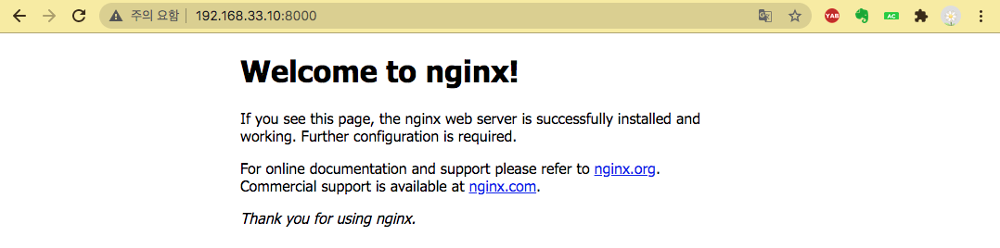
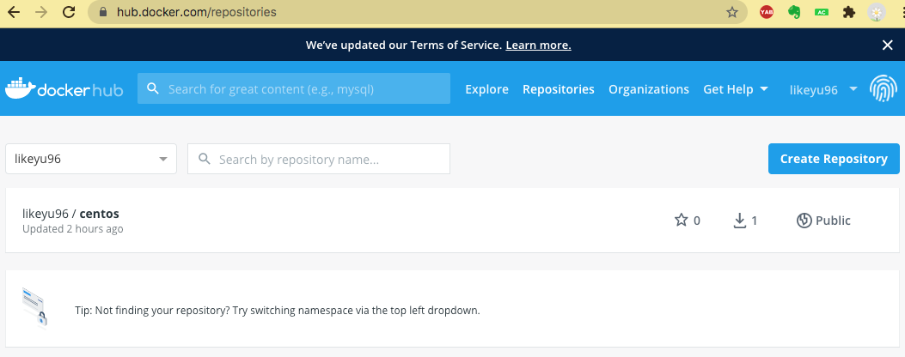

# 팀으로 DevOps 확대하기 - Docker

## vagrant 스냅샵을 한 후 시작하자!

- `vagrant snapshot save V2`

---

# Docker 설치

- 간단하게 설치가 가능하다

```arduino
[vagrant@demo html]$ sudo su
[root@demo html]# cd
[root@demo ~]# yum install -y docker
```

---

# Docker 서비스 기동

```arduino
[root@demo ~]# systemctl start docker.service

[root@demo ~]# docker version
Client:
 Version:         1.13.1
 API version:     1.26
 Package version: docker-1.13.1-162.git64e9980.el7.centos.x86_64
 Go version:      go1.10.3
 Git commit:      64e9980/1.13.1
 Built:           Wed Jul  1 14:56:42 2020
 OS/Arch:         linux/amd64

Server:
 Version:         1.13.1
 API version:     1.26 (minimum version 1.12)
 Package version: docker-1.13.1-162.git64e9980.el7.centos.x86_64
 Go version:      go1.10.3
 Git commit:      64e9980/1.13.1
 Built:           Wed Jul  1 14:56:42 2020
 OS/Arch:         linux/amd64
 Experimental:    false
```

# Docker Hub 로그인

```arduino
[root@demo ~]# docker login
Login with your Docker ID to push and pull images from Docker Hub. If you don't have a Docker ID, head over to https://hub.docker.com to create one.
Username: DOCKER_HUB_ID
Password: DOCKER_HUB_PASSWORD
Login Succeeded
```

# Docker 이미지 검색

```arduino
[root@demo ~]# docker search centos
INDEX       NAME                                         DESCRIPTION                                     STARS     OFFICIAL   AUTOMATED
docker.io   docker.io/centos                             The official build of CentOS.                   6187      [OK]
docker.io   docker.io/ansible/centos7-ansible            Ansible on Centos7                              132                  [OK]
docker.io   docker.io/consol/centos-xfce-vnc             Centos container with "headless" VNC sessi...   119                  [OK]
docker.io   docker.io/jdeathe/centos-ssh                 OpenSSH / Supervisor / EPEL/IUS/SCL Repos ...   115                  [OK]
docker.io   docker.io/centos/systemd                     systemd enabled base container.                 86                   [OK]
...
```

# 이미지 획득 및 확인

```arduino
[root@demo ~]# docker pull docker.io/centos
Using default tag: latest
Trying to pull repository docker.io/library/centos ...
latest: Pulling from docker.io/library/centos
3c72a8ed6814: Pull complete                                                                        Digest: sha256:76d24f3ba3317fa945743bb3746fbaf3a0b752f10b10376960de01da70685fbd
Status: Downloaded newer image for docker.io/centos:latest

[root@demo ~]# docker image ls
REPOSITORY          TAG                 IMAGE ID            CREATED             SIZE
docker.io/centos    latest              0d120b6ccaa8        4 weeks ago         215 MB
```

# 태그를 지정해서 이미지 획득

```arduino
[root@demo vagrant]# docker pull docker.io/centos:centos7
Trying to pull repository docker.io/library/centos ... 
centos7: Pulling from docker.io/library/centos
75f829a71a1c: Pull complete 
Digest: sha256:19a79828ca2e505eaee0ff38c2f3fd9901f4826737295157cc5212b7a372cd2b
Status: Downloaded newer image for docker.io/centos:centos7

[root@demo vagrant]# docker image ls
REPOSITORY          TAG                 IMAGE ID            CREATED             SIZE
docker.io/centos    centos7             7e6257c9f8d8        4 weeks ago         203 MB
docker.io/centos    latest              0d120b6ccaa8        4 weeks ago         215 MB
```

# 컨테이너 실행 및 확인

- -t  : 입력을 받을 수 있게
- -d : 백그라운드 동작
- —name centos7  : 이름을 centos7로 명시 (지정하지 않으면 랜덤하게 이름 생성)
- [docker.io/centos:centos7](http://docker.io/centos:centos7)   : 컨테이너를 만들때 사용할 이미지

    → local repo에 없는 것을 하면 스스로 docker pull을 통해 만든다.

```arduino
[root@demo vagrant]# docker run -t -d --name centos7 docker.io/centos:centos7
7a232ed69483ec15e1e7496d9581846ebcdca43a4d94944ba4b76c786e693451

[root@demo vagrant]# docker container ls
CONTAINER ID        IMAGE                      COMMAND             CREATED             STATUS              PORTS               NAMES
7a232ed69483        docker.io/centos:centos7   "/bin/bash"         22 seconds ago      Up 21 seconds                           centos7

[root@demo vagrant]# docker container ps
CONTAINER ID        IMAGE                      COMMAND             CREATED             STATUS              PORTS               NAMES
7a232ed69483        docker.io/centos:centos7   "/bin/bash"         25 seconds ago      Up 24 seconds                           centos7
```

# 컨테이너 내부에 명령어 실행

```arduino
[root@demo ~]# docker exec centos7 cat /etc/redhat-release
CentOS Linux release 7.8.2003 (Core)

[root@demo ~]# docker exec -it centos7 /bin/bash

[root@61260c982277 /]# cat /etc/redhat-release
CentOS Linux release 7.8.2003 (Core)

[root@61260c982277 /]# exit
exit
[root@demo ~]#
```

# 우분투 이미지를 이용해 컨테이너를 실행

- 가져오는 과정을 추가

```arduino
[root@demo vagrant]# docker run --name ubuntu -td docker.io/ubuntu
Unable to find image 'docker.io/ubuntu:latest' locally
Trying to pull repository docker.io/library/ubuntu ... 
latest: Pulling from docker.io/library/ubuntu
54ee1f796a1e: Pull complete 
f7bfea53ad12: Pull complete 
46d371e02073: Pull complete 
b66c17bbf772: Pull complete 
Digest: sha256:31dfb10d52ce76c5ca0aa19d10b3e6424b830729e32a89a7c6eee2cda2be67a5
Status: Downloaded newer image for docker.io/ubuntu:latest
```

```arduino
[root@demo ~]# docker exec -it ubuntu /bin/bash

root@dcfde3761f4f:/# ls
bin   dev  home  lib32  libx32  mnt  proc  run   srv  tmp  var
boot  etc  lib   lib64  media   opt  root  sbin  sys  usr
root@dcfde3761f4f:/# cat /etc/issue
Ubuntu 20.04.1 LTS \n \l

root@dcfde3761f4f:/# exit
exit
```

- 컨테이너를 지우고 싶을 때

```arduino
[root@demo vagrant]# docker container rm -f ubuntu
ubuntu
```

# 컨테이너 정지/재기동

- 중지시키기

```arduino
[root@demo vagrant]# docker container stop centos7
centos7

[root@demo vagrant]# docker container ls
CONTAINER ID        IMAGE               COMMAND             CREATED             STATUS              PORTS               NAMES
7753e7f430bf        docker.io/ubuntu    "/bin/bash"         17 minutes ago      Up 17 minutes                           ubuntu

[root@demo vagrant]# docker container ls -a
CONTAINER ID        IMAGE                      COMMAND             CREATED             STATUS                        PORTS               NAMES
7753e7f430bf        docker.io/ubuntu           "/bin/bash"         17 minutes ago      Up 17 minutes                                     ubuntu
7a232ed69483        docker.io/centos:centos7   "/bin/bash"         36 minutes ago      Exited (137) 40 seconds ago                       centos7
```

- 재기동 및 확인

```arduino
[root@demo vagrant]# docker container start centos7 
centos7

[root@demo vagrant]# docker container ls
CONTAINER ID        IMAGE                      COMMAND             CREATED             STATUS              PORTS               NAMES
7753e7f430bf        docker.io/ubuntu           "/bin/bash"         19 minutes ago      Up 19 minutes                           ubuntu
7a232ed69483        docker.io/centos:centos7   "/bin/bash"         38 minutes ago      Up 11 seconds                           centos7
```

# nginx 컨테이너 기동

- 공식 배포 이미지는 docker.io를 생략 가능

```arduino
[root@demo vagrant]# docker pull nginx
Using default tag: latest
Trying to pull repository docker.io/library/nginx ... 
latest: Pulling from docker.io/library/nginx
d121f8d1c412: Pull complete 
ebd81fc8c071: Pull complete 
655316c160af: Pull complete 
d15953c0e0f8: Pull complete 
2ee525c5c3cc: Pull complete 
Digest: sha256:9a1f8ed9e2273e8b3bbcd2e200024adac624c2e5c9b1d420988809f5c0c41a5e
Status: Downloaded newer image for docker.io/nginx:latest
```

- 컨테이너 기동

    → 호스트의 8000번 포트를 컨테이너 내부의 80번 포트를 연결

```arduino
[root@demo vagrant]# docker container run -d -p 8000:80 --name nginx-latest nginx
31ead5b8d1d10c2808330ad97d4821127321f623410fc10213e3959d7a750b2a
```

- 확인 하기

```arduino
[root@demo vagrant]# docker container ls
CONTAINER ID        IMAGE               COMMAND                  CREATED              STATUS              PORTS                  NAMES
31ead5b8d1d1        nginx               "/docker-entrypoin..."   About a minute ago   Up About a minute   0.0.0.0:8000->80/tcp   nginx-latest
7753e7f430bf        docker.io/ubuntu    "/bin/bash"              32 minutes ago       Up 32 minutes                              ubuntu
```

- 접속 해보기
    - [`http://localhost:8000`](http://localhost:8000/)
        - [localhost](http://localhost) :  Vagrant로 생성한 CentOS
        - :8000      :  nginx 컨테이너의 80번 포트로 맵핑
    - nginx 컨테이너 내부의 nginx 웹 루트 디렉터리에 있는 `index.html` 파일의 내용이 보이고 있음

```html
[root@demo vagrant]# curl http://localhost:8000
<!DOCTYPE html>
<html>
<head>
<title>Welcome to nginx!</title>
<style>
    body {
        width: 35em;
        margin: 0 auto;
        font-family: Tahoma, Verdana, Arial, sans-serif;
    }
</style>
</head>
<body>
<h1>Welcome to nginx!</h1>
<p>If you see this page, the nginx web server is successfully installed and
working. Further configuration is required.</p>

<p>For online documentation and support please refer to
<a href="http://nginx.org/">nginx.org</a>.<br/>
Commercial support is available at
<a href="http://nginx.com/">nginx.com</a>.</p>

<p><em>Thank you for using nginx.</em></p>
</body>
</html>
```

- host pc 에서 192.168.33.10:8000 으로 접속했을 때



# 컨테이너 표준 출력 로그 확인

```html
[root@demo vagrant]# docker container logs -f nginx-latest
/docker-entrypoint.sh: /docker-entrypoint.d/ is not empty, will attempt to perform configuration
/docker-entrypoint.sh: Looking for shell scripts in /docker-entrypoint.d/
/docker-entrypoint.sh: Launching /docker-entrypoint.d/10-listen-on-ipv6-by-default.sh
10-listen-on-ipv6-by-default.sh: Getting the checksum of /etc/nginx/conf.d/default.conf
10-listen-on-ipv6-by-default.sh: Enabled listen on IPv6 in /etc/nginx/conf.d/default.conf
/docker-entrypoint.sh: Launching /docker-entrypoint.d/20-envsubst-on-templates.sh
/docker-entrypoint.sh: Configuration complete; ready for start up
...
```

# **CentOS Dockerfile**

- https://github.com/CentOS/sig-cloud-instance-images/blob/f2788ce41161326a18420913b0195d1c6cfa1581/docker/Dockerfile

```docker
FROM scratch	⇐ 컨테이너 이미지를 처음부터 생성
ADD centos-7-x86_64-docker.tar.xz /	⇐ 이미지에 파일을 추가 (ADD: 압축 파일을 풀어서 배치, COPY: 단순 복사)

LABEL \
	org.label-schema.schema-version="1.0" \
	org.label-schema.name="CentOS Base Image" \
	org.label-schema.vendor="CentOS" \
	org.label-schema.license="GPLv2" \
	org.label-schema.build-date="20200809" \
	org.opencontainers.image.title="CentOS Base Image" \
	org.opencontainers.image.vendor="CentOS" \
	org.opencontainers.image.licenses="GPL-2.0-only" \
	org.opencontainers.image.created="2020-08-09 00:00:00+01:00"

CMD ["/bin/bash"]	⇐ 컨테이너가 기동될 때 실행할 default 프로세스를 지정
```

# **Nginx Dockerfile**

- https://github.com/nginxinc/docker-nginx/blob/9774b522d4661effea57a1fbf64c883e699ac3ec/mainline/buster/Dockerfile

```docker
FROM debian:buster-slim

LABEL maintainer="NGINX Docker Maintainers <docker-maint@nginx.com>"

ENV NGINX_VERSION   1.19.2
ENV NJS_VERSION     0.4.3
ENV PKG_RELEASE     1~buster

RUN set -x \

...

COPY docker-entrypoint.sh /
COPY 10-listen-on-ipv6-by-default.sh /docker-entrypoint.d
COPY 20-envsubst-on-templates.sh /docker-entrypoint.d
ENTRYPOINT ["/docker-entrypoint.sh"]

EXPOSE 80

STOPSIGNAL SIGTERM

CMD ["nginx", "-g", "daemon off;"]
```

---

# Dockerfile을 이용해서 이미지를 생성 (p166)

## #1 컨테이너 이미지 내부로 전달할 파일을 생성

```docker
[root@demo ~]# echo "Hello, Docker." > hello-docker.txt
```

## #2 Dockerfile을 생성 ⇒ 이미지 생성에 사용

```docker
[root@demo ~]# vi Dockerfile
```

```docker
FROM docker.io/centos:latest        ⇐ 베이스 이미지를 지정
ADD  hello-docker.txt /tmp          ⇐ 호스트에 있는 hello-docker.txt 파일을 컨테이너 이미지의 /tmp 아래로 복사
RUN  yum install -y epel-release    ⇐ 컨테이너 이미지를 만들 때 실행
CMD  [ "/bin/bash" ]                ⇐ 컨테이너가 실행될 때 실행할 명령어
```

## #3 Dockerfile을 이용해서 이미지를 생성

- docker image build   → Dockerfile을 이용해서 이미지를 생성
- t myanjini/centos:1.0 → 이미지 이름 ⇒ DOCKER_HUB_ID/IMAGE_NAME:TAG_NAME
- .     →   Dockerfile 위치 ( . ⇒ 현재 위치)

```docker
[root@demo ~]# docker image build -t myanjini/centos:1.0 .
```

```docker
[root@demo ~]# docker image ls
REPOSITORY          TAG                 IMAGE ID            CREATED             SIZE
likeyu96/centos     1.0                 f6c1ef71dee0        5 minutes ago       246 MB
docker.io/nginx     latest              7e4d58f0e5f3        14 hours ago        133 MB
docker.io/ubuntu    latest              4e2eef94cd6b        3 weeks ago         73.9 MB
docker.io/centos    centos7             7e6257c9f8d8        4 weeks ago         203 MB
docker.io/centos    latest              0d120b6ccaa8        4 weeks ago         215 MB
```

## #4 생성한 이미지를 이용해서 컨테이너를 실행

```docker
[root@demo ~]# docker container run -td --name devops-book-1.0 likeyu96/centos:1.0 
0ca14115244cfd7e8e78108fc138692d769febf8455ceb1c43d6a70b239c4f08

[root@demo ~]# docker container ls
CONTAINER ID        IMAGE                 COMMAND                  CREATED             STATUS              PORTS                  NAMES
0ca14115244c        likeyu96/centos:1.0   "/bin/bash"              7 seconds ago       Up 7 seconds                               devops-book-1.0
31ead5b8d1d1        nginx                 "/docker-entrypoin..."   About an hour ago   Up About an hour    0.0.0.0:8000->80/tcp   nginx-latest
7753e7f430bf        docker.io/ubuntu      "/bin/bash"              About an hour ago   Up About an hour                           ubuntu
```

## #5 컨테이너 내부로 진입

1. 컨테이너 내부로 진입
2. hello-docker.txt 파일이 복사 되었는지 확인
3. epel 패키지 설치 여부를 확인

```docker
[root@demo ~]# docker exec -it devops-book-1.0 /bin/bash
[root@0ca14115244c /]# cat /tmp/hello-docker.txt 
Hello, Docker.
[root@0ca14115244c /]# rpm -qa | grep epel
epel-release-8-8.el8.noarch
```

## #6 컨테이너 내용을 변경 후 변경된 내용을 이미지로 생성

- 이미지를 만드는 두번째 방법

```docker
[root@aa9eab5ad4c1 /]# yum install -y nginx			⇐ 컨테이너 내부에 nginx를 설치
[root@aa9eab5ad4c1 /]# exit
```

- 이미지로 만들기!

```docker
[root@demo ~]# docker container commit devops-book-1.0 likeyu96/centos:1.1 
sha256:57a94a954e5968ee1afa8d871adfbd9ab7ea95616688c7f425bafd49ba595335
[root@demo ~]# docker image ls
REPOSITORY          TAG                 IMAGE ID            CREATED             SIZE
likeyu96/centos     1.1                 57a94a954e59        59 seconds ago      334 MB
likeyu96/centos     1.0                 f6c1ef71dee0        14 minutes ago      246 MB
docker.io/nginx     latest              7e4d58f0e5f3        14 hours ago        133 MB
docker.io/ubuntu    latest              4e2eef94cd6b        3 weeks ago         73.9 MB
docker.io/centos    centos7             7e6257c9f8d8        4 weeks ago         203 MB
docker.io/centos    latest              0d120b6ccaa8        4 weeks ago         215 MB
```

## #7 도커 허브에 이미지를 등록

```docker
[root@demo ~]# docker image push likeyu96/centos:1.1
The push refers to a repository [docker.io/likeyu96/centos]
e8974f19ae64: Pushed 
c165936ee12d: Pushed 
6f8e0c2dcc2a: Pushed 
291f6e44771a: Mounted from library/centos 
1.1: digest: sha256:cca1cca7251bdd6337eb0f183c917fd95e6cb6f1f6c88548379c0725705d37db size: 1160
```

## #8 도커 허브에 로그인 후 등록된 이미지를 확인



---

# Docker Compose (p170)

## #1 Docker Compose 설치

```docker
[root@demo ~]# curl -L https://github.com/docker/compose/releases/download/1.8.0/docker-compose-`uname -s`-`uname -m` > /usr/bin/docker-compose
  % Total    % Received % Xferd  Average Speed   Time    Time     Time  Current
                                 Dload  Upload   Total   Spent    Left  Speed
100   651  100   651    0     0   2292      0 --:--:-- --:--:-- --:--:--  2292
100 7783k  100 7783k    0     0   438k      0  0:00:17  0:00:17 --:--:--  571k
```

```docker
[root@demo ~]# chmod +x /usr/bin/docker-compose

[root@demo ~]# docker-compose --version
docker-compose version 1.8.0, build f3628c7
```

## #2 docker-compose.yml 파일을 생성

```yaml
[root@demo ~]# cat docker-compose.yml 
db:
  image: docker.io/mysql
  ports:
    - "3306:3306"
  environment:
    - MYSQL_ROOT_PASSWORD=password

app:
  image: docker.io/tomcat
  ports:
    - "9090:8080"

web:
  image: docker.io/nginx
  prots:
    - "9000:80"
```

## #3 컨테이너 생성 및 확인

```yaml
[root@demo ~]# docker-compose up -d
```

```yaml
[root@demo ~]# docker container ls
CONTAINER ID     IMAGE             COMMAND                  CREATED             STATUS              PORTS                               NAMES
b1f2d5faeebc     docker.io/tomcat  "catalina.sh run"        48 seconds ago      Up 47 seconds       0.0.0.0:9090->8080/tcp              root_app_1
3819a19dde57     docker.io/nginx   "/docker-entrypoin..."   48 seconds ago      Up 47 seconds       0.0.0.0:9000->80/tcp                root_web_1
d14e24f2c505     docker.io/mysql   "docker-entrypoint..."   48 seconds ago      Up 47 seconds       0.0.0.0:3306->3306/tcp, 33060/tcp   root_db_1
```

## #4 컨테이너 중지

```yaml
[root@demo ~]# docker-compose down
Stopping root_app_1 ... done                                                                       
Stopping root_web_1 ... done                                                                       
Stopping root_db_1 ... done                                                                        
Removing root_app_1 ... done                                                                       
Removing root_web_1 ... done                                                                       
Removing root_db_1 ... done
```