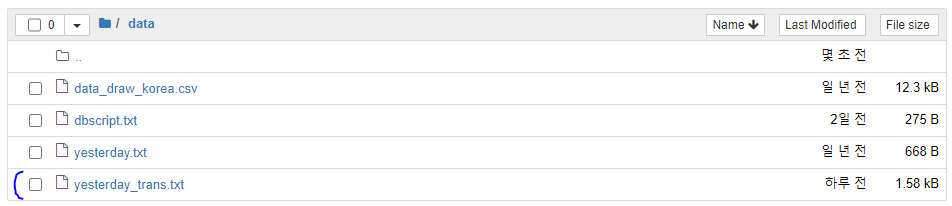

## Nhn 번역 서비스 Papago 사용하기
- urllib 사용하기
- requests 사용하기

### urllib 사용하기 _ https://developers.naver.com/docs/nmt/examples/#python


```python
# urllib 사용하기
# 네이버 Papago NMT API 예제
import os
import sys
import urllib.request
client_id = "Zo1vTslyKxKYskf_qfUk"
client_secret = "X5kGpbWEbv"
encText = urllib.parse.quote("Yesterday all my troubles seemed so far away.") # 번역하려는 문장 입력
# query string : "source=en&target=ko&text="
data = "source=en&target=ko&text=" + encText  # source : 번역전 -> target : 번역후
url = "https://openapi.naver.com/v1/papago/n2mt"

request = urllib.request.Request(url) # requests value 생성
request.add_header("X-Naver-Client-Id",client_id)
request.add_header("X-Naver-Client-Secret",client_secret) # naver 가 정해놓은 key에 값을 대입

response = urllib.request.urlopen(request, data=data.encode("utf-8"))
rescode = response.getcode()

if(rescode==200):  # 값이 올바른 경우
    response_body = response.read()
    print(response_body.decode('utf-8'))
else:
    print("Error Code:" + rescode)
```

    {"message":{"@type":"response","@service":"naverservice.nmt.proxy","@version":"1.0.0","result":{"srcLangType":"en","tarLangType":"ko","translatedText":"어제 나의 모든 고민들은 너무나 멀리 떨어져 있는 것 같았다.","engineType":"N2MT","pivot":null}}}
    

### requests 예제로 변환하기


```python
import urllib.request
import requests
from bs4 import BeautifulSoup  
# bs4 모듈 안에 Beatifulsoup 클래스를 import

from urllib.parse import urljoin
client_id = "Zo1vTslyKxKYskf_qfUk"
client_secret = "X5kGpbWEbv"

url = "https://openapi.naver.com/v1/papago/n2mt" # papago API URL
encText = "Yesterday all my troubles seemed so far away." # 번역할 문장

# dict 형식으로 header를 사용
req_headers = {
    "X-Naver-Client-Id" : client_id,
    "X-Naver-Client-Secret" : client_secret
              }
# query string을 dict형식으로 사용
prams = {
    "source" : 'en',  # 번역전 언어
    'target' : 'ko',  # 번역후 언어
    'text' : encText
}

response = requests.post(url, headers = req_headers, data = prams)
print('응답 헤더 : ' ,response.headers)
print('요청 헤더 : ', response.request.headers) # 내가 요청한 정보들이 나옴
print('ststus code : ', response.status_code)
print("")

if response.status_code == 200 :
    print(response.text)
else :
    print('Error Code :', response.status_code)
```

    응답 헤더 :  {'Server': 'nginx', 'Date': 'Tue, 21 Jul 2020 00:58:26 GMT', 'Content-Type': 'application/json; charset=UTF-8', 'Content-Length': '245', 'Connection': 'keep-alive', 'Keep-Alive': 'timeout=5', 'X-QUOTA': '45', 'Content-Encoding': 'gzip'}
    요청 헤더 :  {'User-Agent': 'python-requests/2.19.1', 'Accept-Encoding': 'gzip, deflate', 'Accept': '*/*', 'Connection': 'keep-alive', 'X-Naver-Client-Id': 'Zo1vTslyKxKYskf_qfUk', 'X-Naver-Client-Secret': 'X5kGpbWEbv', 'Content-Length': '70', 'Content-Type': 'application/x-www-form-urlencoded'}
    ststus code :  200
    
    {"message":{"@type":"response","@service":"naverservice.nmt.proxy","@version":"1.0.0","result":{"srcLangType":"en","tarLangType":"ko","translatedText":"어제 나의 모든 고민들은 너무나 멀리 떨어져 있는 것 같았다.","engineType":"N2MT","pivot":null}}}
    


```python
myjson = response.json()
print(type(myjson),myjson)
```

    <class 'dict'> {'message': {'@type': 'response', '@service': 'naverservice.nmt.proxy', '@version': '1.0.0', 'result': {'srcLangType': 'en', 'tarLangType': 'ko', 'translatedText': '어제 나의 모든 고민들은 너무나 멀리 떨어져 있는 것 같았다.', 'engineType': 'N2MT', 'pivot': None}}}
    


```python
myjson['message']['result']['translatedText']  # json data의 key값을 가져와서 뿌려본다
```


    '어제 나의 모든 고민들은 너무나 멀리 떨어져 있는 것 같았다.'


### Prepared Requests
- requests의 Requests, Session 객체를 사용하는 방식으로 변환


```python
import requests
from requests import Request, Session # 객체를 import
import sys
import urllib.request
client_id = "Zo1vTslyKxKYskf_qfUk"
client_secret = "X5kGpbWEbv"

url = "https://openapi.naver.com/v1/papago/n2mt" # papago API URL
encText = "Yesterday all my troubles seemed so far away." # 번역할 문장

# dict 형식으로 header를 사용
req_headers = {
    "X-Naver-Client-Id" : client_id,
    "X-Naver-Client-Secret" : client_secret
              }
# query string을 dict형식으로 사용
prams = {
    "source" : 'en',  # 번역전 언어
    'target' : 'ko',  # 번역후 언어
    'text' : encText
}

# Session 객체 생성
session = Session()
# Request 객체 생성
request = Request('POST', url, headers = req_headers, data = prams) # 파파고 api 정보를 확인하여 작성
# request의 prepare() 함수 호출
prepped = request.prepare()

# session 의 send()함수를 호출해서 서버에 요청을 전달
response = session.send(prepped)


print('응답 헤더 : ' ,response.headers)
print('요청 헤더 : ', response.request.headers) # 내가 요청한 정보들이 나옴
print('ststus code : ', response.status_code)
print("")

if response.status_code == 200 :
    # 값을 JSON으로 받아서 원하는 값을 추출
    print(response.json()['message']['result']['translatedText']) 
else :
    print('Error Code :', response.status_code)
```

    응답 헤더 :  {'Server': 'nginx', 'Date': 'Tue, 21 Jul 2020 01:01:32 GMT', 'Content-Type': 'application/json; charset=UTF-8', 'Content-Length': '271', 'Connection': 'keep-alive', 'Keep-Alive': 'timeout=5', 'Vary': 'Accept-Encoding', 'X-QUOTA': '45'}
    요청 헤더 :  {'X-Naver-Client-Id': 'Zo1vTslyKxKYskf_qfUk', 'X-Naver-Client-Secret': 'X5kGpbWEbv', 'Content-Length': '70', 'Content-Type': 'application/x-www-form-urlencoded'}
    ststus code :  200
    
    어제 나의 모든 고민들은 너무나 멀리 떨어져 있는 것 같았다.
    

## data/yesterday.txt 번역
1. yesterday.txt file read
2. requests로 http 통신
3. 번역된 결과를 파일로 쓰기


```python
from requests import Request, Session

# 파일 읽어서 리스트로 만들기
def get_text_list():
        result_list = []
        with open('data/yesterday.txt', 'r', encoding= 'utf8') as file:
            # 현재 위치 기준으로의 경로
            contents = file.read()
            result_list = contents.split('\n')  # 가사를 한줄씩 잘라서 저장
        return result_list

    
    
# 파일 저장하기(쓰기)
def save_file(mylist):
    with open('data/yesterday_trans.txt', 'w', encoding= 'utf8' ) as file:
        file.writelines(mylist) # list를 바로 파일에 써줌


# requests로 http 통신
def main():
    # 세션 객체 생성
    session = Session()
    
    # 내 아이디(likeyu96)로 받은 api 요청
    client_id = "u4MkSqynJH3Yjy7OLFKd"
    client_secret = "DcttMGYWS6"

    url = "https://openapi.naver.com/v1/papago/n2mt" # papago API URL
    encText = "Yesterday all my troubles seemed so far away." # 번역할 문장

    # dict 형식으로 header를 사용
    req_headers = {
        "X-Naver-Client-Id" : client_id,
        "X-Naver-Client-Secret" : client_secret
                  }
    
    # file 을 line 단위를 읽을 것이다
    lyric_list = get_text_list() # 파일을 읽어러 리스트로 저장
    print(lyric_list, len(lyric_list), '\n')
    
    # list comprehension   : 길이가 0이 아닌 것만 세기
    lyric_list = [lyric for lyric in lyric_list if len(lyric) != 0 ]
    print(lyric_list, len(lyric_list), '\n')
    
    
    # 결과를 담을 리스트
    trans_list = []
    
    
    # 리스트의 문장을 한줄씩 번역
    for en_text in lyric_list:
        
        # query string을 dict형식으로 사용
        prams = {
            "source" : 'en',  # 번역전 언어
            'target' : 'ko',  # 번역후 언어
            'text' : en_text
        }
        
        print(en_text)
        
        req = Request('POST', url, data = prams, headers = req_headers)
        prepared = req.prepare() # 준비
        res = session.send(prepared) # 보내기
        
#         print(res.status_code)
        
        try:
            ko_text = res.json()['message']['result']['translatedText']
        except Exception as err:
            print(err)
        else:
            print(ko_text)
            
        trans_list.append(en_text+'\n')
        trans_list.append(ko_text+'\n')
        
    save_file(trans_list) # 번역한 파일 저장
    print('번역 종료')

    
    
main() # main 호출
```

    ['Yesterday all my troubles seemed so far away.', "Now it looks as though they're here to stay.", 'Oh, I believe in yesterday.', '', "Suddenly I'm not half the man I used to be.", "There's a shadow hanging over me.", 'Oh, yesterday came suddenly.', '', "Why she had to go, I don't know, she wouldn't say.", 'I said something wrong, now I long for yesterday.', '', 'Yesterday love was such an easy game to play.', 'Now I need a place to hide away.', 'Oh, I believe in yesterday.', '', "Why she had to go, I don't know, she wouldn't say.", 'I said something wrong, now I long for yesterday.', '', 'Yesterday love was such an easy game to play.', 'Now I need a place to hide away.', 'Oh, I believe in yesterday.', '', 'Mm mm mm mm mm mm mm'] 23 
    
    ['Yesterday all my troubles seemed so far away.', "Now it looks as though they're here to stay.", 'Oh, I believe in yesterday.', "Suddenly I'm not half the man I used to be.", "There's a shadow hanging over me.", 'Oh, yesterday came suddenly.', "Why she had to go, I don't know, she wouldn't say.", 'I said something wrong, now I long for yesterday.', 'Yesterday love was such an easy game to play.', 'Now I need a place to hide away.', 'Oh, I believe in yesterday.', "Why she had to go, I don't know, she wouldn't say.", 'I said something wrong, now I long for yesterday.', 'Yesterday love was such an easy game to play.', 'Now I need a place to hide away.', 'Oh, I believe in yesterday.', 'Mm mm mm mm mm mm mm'] 17 
    
    Yesterday all my troubles seemed so far away.
    어제 나의 모든 고민들은 너무나 멀리 떨어져 있는 것 같았다.
    Now it looks as though they're here to stay.
    이제 그들은 여기 머물기 위해 온 것처럼 보인다.
    Oh, I believe in yesterday.
    오, 나는 어제를 다시 그리게 돼.
    Suddenly I'm not half the man I used to be.
    갑자기 나는 예전과 같은 사람이 아니다.
    There's a shadow hanging over me.
    내 위에 그림자가 드리워져 있다.
    Oh, yesterday came suddenly.
    아, 어제 갑자기 왔구나.
    Why she had to go, I don't know, she wouldn't say.
    왜 그녀가 가야만 했는지 모르겠다, 그녀는 말하지 않을 것이다.
    I said something wrong, now I long for yesterday.
    내가 말을 잘못해서 어제가 그립다.
    Yesterday love was such an easy game to play.
    어제는 사랑이 정말 쉬운 게임이었다.
    Now I need a place to hide away.
    이제 나는 숨을 곳이 필요해.
    Oh, I believe in yesterday.
    오, 나는 어제를 다시 그리게 돼.
    Why she had to go, I don't know, she wouldn't say.
    왜 그녀가 가야만 했는지 모르겠다, 그녀는 말하지 않을 것이다.
    I said something wrong, now I long for yesterday.
    내가 말을 잘못해서 어제가 그립다.
    Yesterday love was such an easy game to play.
    어제는 사랑이 정말 쉬운 게임이었다.
    Now I need a place to hide away.
    이제 나는 숨을 곳이 필요해.
    Oh, I believe in yesterday.
    오, 나는 어제를 다시 그리게 돼.
    Mm mm mm mm mm mm mm
    mm mm mm mm mm mm mm mm
    번역 종료
    


```python

```


#### yesterday 번역 결과

