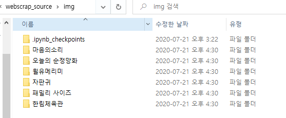

## 특정 웹툰 페이지의 모든 image를 다운로드 하기
* soup.select('img[src $=.jpg]')
* img 폴더를 생성하고 img 폴더 아래에 저장


```python
import requests
from bs4 import BeautifulSoup
import os

main_url = 'https://comic.naver.com/webtoon/detail.nhn?titleId=748105&no=11&weekday=thu' # 웹툰 url
req_header = {
    'referer' : main_url
}
res = requests.get(main_url)
html = res.text # 그 페이지의 정보를 전부 가져옴
soup = BeautifulSoup(html, 'html.parser') # text를 보기좋게 잘라서 저장해줌

img_urls = list()
# soup.select("img[src$='.jpg']")   # $ 끝의 글자 매칭 (전부 붙여서 써야함)

for img_url in soup.select("img[src$='.jpg']"):
#     print(img_url)
    img_urls.append(img_url['src']) # src 속성을 빼내는 것! 주소 부분만 빼내야 한다

# print(len(img_urls), img_urls)

```


```python
# 디렉토리 생성
if not os.path.isdir('img'):
    os.mkdir('img')

# 저장
for img_url in img_urls:
    res = requests.get(img_url, headers=req_header) # 이미지를 get방식으로 얻음
        # header는 dict 방식의 referer를 가져와야함
    img_data = res.content # 이미지 형식으로 저장
    file_name = os.path.basename(img_url) # 파일 이름 추출
    
    with open('img/'+ file_name, 'wb') as file: # img 밑에 파일에 저장
        file.write(img_data)
```


## 특정 웹툰 image 다운로드를 함수로 선언하기


```python
import os
import requests
from bs4 import BeautifulSoup
from urllib.parse import urljoin

# title, link를 입력받아 이미지를 저장하는 함수
def write_image(title, main_url):
    print(title, main_url)

    #위에 것을 복사해서 수정
    req_header = {
        'referer' : main_url
    }
    res = requests.get(main_url)
    html = res.text # 그 페이지의 정보를 전부 가져옴
    soup = BeautifulSoup(html, 'html.parser') # text를 보기좋게 잘라서 저장해줌

    img_urls = list()
    # soup.select("img[src$='.jpg']")   # $ 끝의 글자 매칭 (전부 붙여서 써야함)

    for img_url in soup.select("img[src$='.jpg']"):
    #     print(img_url)
        img_urls.append(img_url['src']) # src 속성을 빼내는 것! 주소 부분만 빼내야 한다

#     print(len(img_urls), img_urls)

    # 디렉토리 생성
    dir_name = 'img/' + title # img 하위에 원하는 웹툰의 폴더를 만들어 이미지 저장
    if not os.path.isdir(dir_name):
        os.mkdir(dir_name)

    # 저장
    for img_url in img_urls:
        res = requests.get(img_url, headers=req_header) # 이미지를 get방식으로 얻음
            # header는 dict 방식의 referer를 가져와야함
        img_data = res.content # 이미지 형식으로 저장
        file_name = os.path.basename(img_url) # 파일 이름 추출

        with open(dir_name + '/'+ file_name, 'wb') as file: # img 밑에 파일에 저장
            file.write(img_data)
    print(title , '저장 완료')

```


```python
write_image('마음의소리', 'https://comic.naver.com/webtoon/detail.nhn?titleId=20853&no=1236')
```

    마음의소리 https://comic.naver.com/webtoon/detail.nhn?titleId=20853&no=1236
    마음의소리 저장 완료
    


## 웹툰 메인 페이지 스크래핑
* 추천 웹툰의 title, link를 가져오기
* 가져와서 dict 타입으로 담기 (하나의 만화에 대한 dict)
    * { 'title' : '한림체육관', link : 'https://comic.naver.com/webtoon/list.nhn?titleId=20853'}
* dict를 list에 저장하기
    * [ {}, {}, {}, {}] 형식으로 저장


```python
# #genreRecommand > li:nth-child(2) > div.genreRecomImg2 > a
# 은 아이디


import os
import requests
from bs4 import BeautifulSoup
from urllib.parse import urljoin

main_url = 'https://comic.naver.com/index.nhn'
home_url = 'https://comic.naver.com/'
req_header = {
    'referer':url
}

res = requests.get(main_url) # get
html = res.text # html text 전부 가져오기 (bs를 사용하기 위해 text 가져옴)
soup = BeautifulSoup(html, 'html.parser')

# 원하는 특정 ul태그를 가져오기 위해 id로 값을 가져오기(list type)
# > 는 바로 밑에있는 태그를 의미한다
#genreRecommand > li:nth-child(2) > div.genreRecomInfo2 > h6 > a > span
select_a= soup.select('#genreRecommand li h6 a') 
# select_b= soup.select('#genreRecommand li h6 a') 

# select_a= soup.select('#genreRecommand li .genreRecommand2 a') 
# print(len(select_rec))

comic = list()
d = dict()


for u in select_a:
    link = urljoin(home_url, u['href'])
    title = u.text.strip() # 공백을 없앤다
    d['title'] = title
    d['link'] = link
    comic.append(d) # dict 형태를 list에다가 넣자
    print(title, link)

    #mainGenreBlind
    #genreRecommand > li:nth-child(2) > div.genreRecomInfo2 > h6 > a > span
    #genreRecommand > li:nth-child(2) > div.genreRecomInfo2 > h6 > a > span
print('\n' , comic)

```

    패밀리 사이즈 https://comic.naver.com/webtoon/list.nhn?titleId=626906
    마음의소리 https://comic.naver.com/webtoon/list.nhn?titleId=20853
    윌유메리미 https://comic.naver.com/webtoon/list.nhn?titleId=616239
    오늘의 순정망화 https://comic.naver.com/webtoon/list.nhn?titleId=716857
    자판귀 https://comic.naver.com/webtoon/list.nhn?titleId=703850
    한림체육관 https://comic.naver.com/webtoon/list.nhn?titleId=743139
    
     [{'title': '한림체육관', 'link': 'https://comic.naver.com/webtoon/list.nhn?titleId=743139'}, {'title': '한림체육관', 'link': 'https://comic.naver.com/webtoon/list.nhn?titleId=743139'}, {'title': '한림체육관', 'link': 'https://comic.naver.com/webtoon/list.nhn?titleId=743139'}, {'title': '한림체육관', 'link': 'https://comic.naver.com/webtoon/list.nhn?titleId=743139'}, {'title': '한림체육관', 'link': 'https://comic.naver.com/webtoon/list.nhn?titleId=743139'}, {'title': '한림체육관', 'link': 'https://comic.naver.com/webtoon/list.nhn?titleId=743139'}]
    


## 웹툰 메인 페이지 스크래핑_ 함수사용
* 추천 웹툰의 title과 최신 업로드된 화의 link를 추출해서 함수를 사용하여 저장한다


```python
webtoon_list = list()
webtoon_info = dict()
select_div = soup.select('.genreRecomInfo2')
for div_tag in select_div: # div tag 가져오기
    print(" ")
    print(div_tag.select('h6 a span'))
    
    # div_tag.select('h6 a span') 의 길이는 1 이지만 list이기 때문에 for loop이 필요하다
    # div_tag.select('h6 a span')[0] 으로 사용하여 for loop을 돌리지 않아도 된다
    for h in div_tag.select('h6 a span'): # h6아래에 있는 제목 가져오기
        title = h.text.strip()
        webtoon_info['title'] = title
        print(title)
    for p in div_tag.select('p a'): # p 아래에 있는 link 가져오기
        link = urljoin(home_url,p['href'])
        webtoon_info['link'] = link
        print(link)
    webtoon_list.append(webtoon_info)
    webtoon_info = {}
#     write_image(title, link) # image 저장
webtoon_list
```

     
    [<span>패밀리 사이즈</span>]
    패밀리 사이즈
    https://comic.naver.com/webtoon/detail.nhn?titleId=626906&no=602
     
    [<span>마음의소리</span>]
    마음의소리
    https://comic.naver.com/webtoon/detail.nhn?titleId=20853&no=1236
     
    [<span>윌유메리미</span>]
    윌유메리미
    https://comic.naver.com/webtoon/detail.nhn?titleId=616239&no=642
     
    [<span>오늘의 순정망화</span>]
    오늘의 순정망화
    https://comic.naver.com/webtoon/detail.nhn?titleId=716857&no=205
     
    [<span>자판귀</span>]
    자판귀
    https://comic.naver.com/webtoon/detail.nhn?titleId=703850&no=124
     
    [<span>한림체육관</span>]
    한림체육관
    https://comic.naver.com/webtoon/detail.nhn?titleId=743139&no=9
    


    [{'title': '패밀리 사이즈',
      'link': 'https://comic.naver.com/webtoon/detail.nhn?titleId=626906&no=602'},
     {'title': '마음의소리',
      'link': 'https://comic.naver.com/webtoon/detail.nhn?titleId=20853&no=1236'},
     {'title': '윌유메리미',
      'link': 'https://comic.naver.com/webtoon/detail.nhn?titleId=616239&no=642'},
     {'title': '오늘의 순정망화',
      'link': 'https://comic.naver.com/webtoon/detail.nhn?titleId=716857&no=205'},
     {'title': '자판귀',
      'link': 'https://comic.naver.com/webtoon/detail.nhn?titleId=703850&no=124'},
     {'title': '한림체육관',
      'link': 'https://comic.naver.com/webtoon/detail.nhn?titleId=743139&no=9'}]


* 만들었던 write_image 함수를 사용해서 웹툰을 다운로드!


```python
for webtoon in webtoon_list:
    print(webtoon['title'], webtoon['link'])
    write_image(webtoon['title'], webtoon['link'])
```

    패밀리 사이즈 https://comic.naver.com/webtoon/detail.nhn?titleId=626906&no=602
    패밀리 사이즈 https://comic.naver.com/webtoon/detail.nhn?titleId=626906&no=602
    패밀리 사이즈 저장 완료
    마음의소리 https://comic.naver.com/webtoon/detail.nhn?titleId=20853&no=1236
    마음의소리 https://comic.naver.com/webtoon/detail.nhn?titleId=20853&no=1236
    마음의소리 저장 완료
    윌유메리미 https://comic.naver.com/webtoon/detail.nhn?titleId=616239&no=642
    윌유메리미 https://comic.naver.com/webtoon/detail.nhn?titleId=616239&no=642
    윌유메리미 저장 완료
    오늘의 순정망화 https://comic.naver.com/webtoon/detail.nhn?titleId=716857&no=205
    오늘의 순정망화 https://comic.naver.com/webtoon/detail.nhn?titleId=716857&no=205
    오늘의 순정망화 저장 완료
    자판귀 https://comic.naver.com/webtoon/detail.nhn?titleId=703850&no=124
    자판귀 https://comic.naver.com/webtoon/detail.nhn?titleId=703850&no=124
    자판귀 저장 완료
    한림체육관 https://comic.naver.com/webtoon/detail.nhn?titleId=743139&no=9
    한림체육관 https://comic.naver.com/webtoon/detail.nhn?titleId=743139&no=9
    한림체육관 저장 완료
    


#### 웹툰 이미지 다운로드 결과 
* 저장한 디렉터리에서 확인할 수 있다

