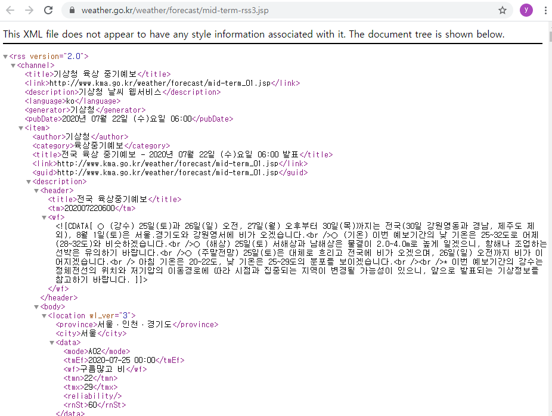

## 기상청 날씨 데이터 조회
* find(), find_all() 함수 사용
* url = "http://www.kma.go.kr/weather/forecast/mid-term-rss3.jsp" 에서 정보를 받아와 작성

### url에 들어가서 데이터 확인
* 웹에서 확인이 가능하다


### 데이터 불러오기

```python
import requests
from bs4 import BeautifulSoup

url = "http://www.kma.go.kr/weather/forecast/mid-term-rss3.jsp"

res = requests.get(url)

html = res.text
soup = BeautifulSoup(html, 'html.parser')

```


```python
# 각 title 가져오기
ch_title = soup.find('title').text
it_title = soup.find('channel').find('item').find('title').text
head_title = soup.find('header').find('title').text
print(ch_title, it_title, head_title)

# 모든 타이틀 찾기
# all_title = soup.find_all('title')
# for i in all_title:
#     print(i.text)

# 처음 wf 가져오기
wf1 = soup.find('header').find('wf')

```

    기상청 육상 중기예보 전국 육상 중기예보 - 2020년 07월 22일 (수)요일 06:00 발표 전국 육상중기예보
    


    '○ (강수) 25일(토)과 26일(일) 오전, 27일(월) 오후부터 30일(목)까지는 전국(30일 강원영동과 경남, 제주도 제외), 8월 1일(토)은 서울.경기도와 강원영서에 비가 오겠습니다.<br />○ (기온) 이번 예보기간의 낮 기온은 25~32도로 어제(28~32도)와 비슷하겠습니다.<br />○ (해상) 25일(토) 서해상과 남해상은 물결이 2.0~4.0m로 높게 일겠으니, 항해나 조업하는 선박은 유의하기 바랍니다.<br />○ (주말전망) 25일(토)은 대체로 흐리고 전국에 비가 오겠으며, 26일(일) 오전까지 비가 이어지겠습니다.<br />              아침 기온은 20~22도, 낮 기온은 25~29도의 분포를 보이겠습니다.<br /><br />* 이번 예보기간의 강수는 정체전선의 위치와 저기압의 이동경로에 따라 시점과 집중되는 지역이 변경될 가능성이 있으니, 앞으로 발표되는 기상정보를 참고하기 바랍니다.'


### 하나의 location 에 대해 정보를 가져오기


```python
province1 = soup.find('location', attrs={'wl_ver':'3'})
title = province1.find('city').text # 지역 이름
print(title)
data = province1.find_all('data') # 서울 의 데이터

print('갯수 : ' , len(data), '\n')

w_dict = dict() # 날씨정보를 담을 dict
w_list = list() # dict를 담을 list

for d in data:
    w_dict['mode'] = d.find('mode').text  # mode
#     date = d.find('tmef').text 
    w_dict['wf'] = d.find('wf').text # 날씨
    w_dict['tmn'] = d.find('tmn').text #최저온도
    w_dict['tmx'] = d.find('tmx').text #최대온도
#     reliab = d.find('reliability').text
#     rnst = d.find('rnst').text
    print(w_dict)
    w_list.append(w_dict)
    w_dict = {}


# list 출력
# print('--'* 35) # 구분자
# for li in w_list:
#     print(li)
    
```

    서울
    갯수 :  13 
    
    {'mode': 'A02', 'wf': '구름많고 비', 'tmn': '22', 'tmx': '29'}
    {'mode': 'A02', 'wf': '구름많고 비', 'tmn': '22', 'tmx': '29'}
    {'mode': 'A02', 'wf': '구름많고 비', 'tmn': '21', 'tmx': '29'}
    {'mode': 'A02', 'wf': '흐림', 'tmn': '21', 'tmx': '29'}
    {'mode': 'A02', 'wf': '흐림', 'tmn': '22', 'tmx': '29'}
    {'mode': 'A02', 'wf': '흐리고 비', 'tmn': '22', 'tmx': '29'}
    {'mode': 'A02', 'wf': '흐리고 비', 'tmn': '22', 'tmx': '28'}
    {'mode': 'A02', 'wf': '흐리고 비', 'tmn': '22', 'tmx': '28'}
    {'mode': 'A02', 'wf': '흐리고 비', 'tmn': '23', 'tmx': '29'}
    {'mode': 'A02', 'wf': '흐리고 비', 'tmn': '23', 'tmx': '29'}
    {'mode': 'A01', 'wf': '흐리고 비', 'tmn': '23', 'tmx': '30'}
    {'mode': 'A01', 'wf': '흐림', 'tmn': '23', 'tmx': '29'}
    {'mode': 'A01', 'wf': '흐리고 비', 'tmn': '23', 'tmx': '28'}
    

#### 모든 지역의 날씨 정보를 가져오기
* 모든 데이터를 result_list에 담아 json파일로 저장한다


```python
import json

location = soup.find_all('location', attrs={'wl_ver':'3'})

result_list = list() #최종 list
w_dict = { 'prov': "", 'city': "", 'data' : "" }
data_list = list()
data_dict = {'mode' : "", 'wf' : "", 'tmn': "", 'tmx': ""}

for loc in location:
    w_dict['city'] = loc.find('city').text # 서울
    w_dict['prov'] = loc.find('province').text
    data = loc.find_all('data')
    for idx, d in enumerate(data):
#         print(idx,d.find('mode'))
        data_dict = {}
        data_dict['mode'] = d.find('mode').text
        data_dict['wf'] = d.find('wf').text
        data_dict['tmn'] = d.find('tmn').text
        data_dict['tmx'] = d.find('tmx').text
        data_list.append(data_dict)
    w_dict['data'] = data_list
    data_list = []
    result_list.append(w_dict)
    w_dict = {}

    
    # 출력
for idx, p in enumerate(result_list):
#     print(idx,'\n', p, '\n')
#     print(p['prov'])
#     print(p['city'])
#     print(p['data']) # list
    pass


with open('weather.json', 'w', encoding='utf8') as file:
    try :
        json.dump(result_list, file, ensure_ascii=False)
        print('저장 완료')
    except:
        print('error')

```

    저장 완료
    

* json 파일로 저장된 것을 확인 할 수 있다


* json viewer에 파일을 넣어보면 잘 저장된 것을 볼 수 있다
  
