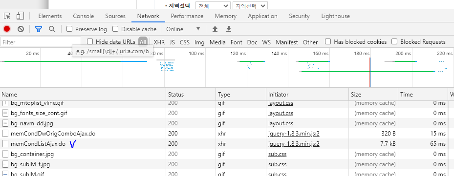
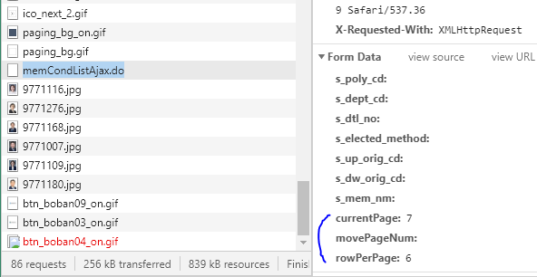
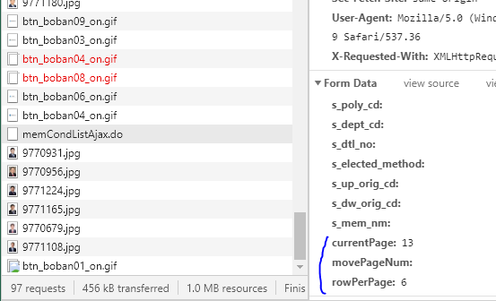
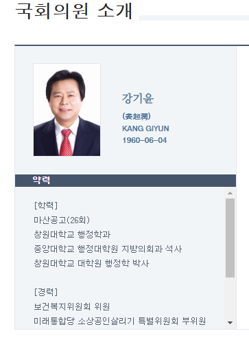
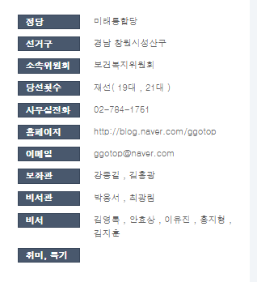

## Ajax 웹과 기존 웹의 차이점
* Ajax(Asynchrounous Javascript And Xml)  : 비동기, XML
* synchrounous : 전체가 로드 될때 까지 아무 action을 할 수 없음
---

## 국회위원 정보 보기
* 처음에 홈페이지에서 소스보기를 하면 국회위원의 정보를 가져올 수 없다
    * ajax 형식이기때문에!


* 개발자도구 - network - memCondListAjax.do - 새탭에서 열기
    * https://www.assembly.go.kr/assm/memact/congressman/memCond/memCondListAjax.do



* page2 누름
    * currentPage: 7
    * movePageNum: 
    * rowPerPage: 6



* 3 누름
    * currentPage: 13
    * movePageNum: 
    * rowPerPage: 6



* https://www.assembly.go.kr/assm/memact/congressman/memCond/memCondListAjax.do?currentPage=1&rowPerPage=300

    * 이제 이 페이지를 parsing하면 됨

---
## 국회위원 정보 스크래핑
* 국회위원이름, 국회위원 id 추출
* 국회위원 상세 페이지에 300번 요청을 보내거 상세 정보를 스크래핑
* pandas DataFrame에 저장
* 시각화(막대 그래프, 히스토그램, 파이차트)
* DB에 members 테이블에 저장
---


```python
import requests
from bs4 import BeautifulSoup
import re

url = 'https://www.assembly.go.kr/assm/memact/congressman/memCond/memCondListAjax.do?currentPage=1&rowPerPage=300'

html = requests.get(url).text # get후 text로 변환
soup = BeautifulSoup(html, 'html.parser') # 파싱

a_tag_list = soup.select('.memberna_list dl dt a')

# len(a_tag_list) = 300
id_list = list()

for idx, a_tag in enumerate(a_tag_list,1):
    name = a_tag.text
    link = a_tag['href']
    
    matched = re.search(r'(\d+)', link)
    
    member_id = matched.group(0)
    id_list.append(member_id)
#     print(idx, name, member_id)

id_list[:10] # id_list를 출력해본다
```


    ['9771230',
     '9771142',
     '9771174',
     '9771233',
     '9771283',
     '9770933',
     '9771116',
     '9771276',
     '9771168',
     '9771007']


#### 정규표현식을 이용하여 문자 없애기


```python
import re

mystr="a\n\r\t"*4

regex = re.compile(r'[\n\t\r]')
result = regex.sub("",mystr)
result.strip()
```


    'aaaa'


---
#### 국회위원의 상세 페이지 가져오기
* https://www.assembly.go.kr/assm/memPop/memPopup.do?dept_cd=9770956
    * 뒤에 dept_cd부분을 member_id로 넣어주면된다

* profile부분 : 이름, 사진, 생년월일



* pro_detail부분 : 상세 페이지의 오른쪽 부분

---


```python
import requests
from bs4 import BeautifulSoup
import re
from urllib.parse import urljoin

member_list = []
print('start')

# 국회위원 상세페이지를 가져오는 url을 구하기
for idx, i in enumerate(id_list,1):
    detail_url = 'https://www.assembly.go.kr/assm/memPop/memPopup.do?dept_cd=' + i
    print(idx, i)
    html = requests.get(detail_url).text
    soup = BeautifulSoup(html, 'html.parser')
    
    # pro_detail 부분 가져오기
    member_dict = dict() # 국회위원 한명의 상세 정보를 저장하는 dict (제목, 내용)
    dt_list = [] # 제목
    for dt_tag in soup.select('.info_mna dl.pro_detail dt'):
    #     print(dt_tag)
        dt_list.append(dt_tag.text)

    dd_list = [] # 내용
    for dd_tag in soup.select('.info_mna dl.pro_detail dd'):
    #     print(dd_tag)
        regex = re.compile(r'[\n\t\r]')
        result = regex.sub("",dd_tag.text.strip()).replace(" ","")
        dd_list.append(result)

    member_dict = dict(zip(dt_list, dd_list))
    
    # profile 부분 가져오기
    for info in soup.select('div.info_mna .profile'): 
#         print(info, '\n')
        member_dict['이름'] = info.select_one('h4').text # 의원의 이름
        photo = info.find('img').attrs['src']# 의원의 사진 
            #(find : 한개의 원소만 가져옴)
        member_dict['이미지'] = urljoin(detail_url, photo)
        member_dict['생년월일'] = info.select_one('li:nth-of-type(4)').text
#         print('이름 : ', name, '\n사진 :', photo_url, '\n생년월일 :', birth)
    
    # 최종으로 list에 넣기
    member_list.append(member_dict)

print('len : ' ,len(member_list))
print('complete')
```

    start
    1 9771230
    2 9771142
    3 9771174
    4 9771233
    5 9771283
    6 9770933
    7 9771116
    8 9771276
    9 9771168
    10 9771007
    11 9771109
    12 9771180
    13 9770931
    14 9770956
    15 9771224
    16 9771165
    17 9770679
    18 9771108
    19 9770977
    20 9771259
    21 9770998
    22 9770927
    23 9771258
    24 9770712
    25 9771152
    26 9771164
    27 9771181
    28 9770719
    29 9770997
    30 9771136
    31 9770723
    32 9771120
    33 9771173
    34 9770941
    35 9770984
    36 9771285
    37 9771268
    38 9770725
    39 9770527
    40 9771024
    41 9771195
    42 9770985
    43 9771208
    44 9771089
    45 9771210
    46 9771220
    47 9771144
    48 9771169
    49 9771111
    50 9771225
    51 9770975
    52 9770981
    53 9770934
    54 9771249
    55 9771186
    56 9771147
    57 9771127
    58 9771214
    59 9771206
    60 9771171
    61 9771023
    62 9771090
    63 9771009
    64 9771192
    65 9771281
    66 9770982
    67 9770986
    68 9770741
    69 9771237
    70 9770742
    71 9770991
    72 9771223
    73 9771270
    74 9771216
    75 9771134
    76 9771228
    77 9770752
    78 9770753
    79 9770755
    80 9771141
    81 9771274
    82 9771091
    83 9771187
    84 9771204
    85 9771175
    86 9771159
    87 9770764
    88 9770911
    89 9771248
    90 9770767
    91 9770768
    92 9770770
    93 9770090
    94 9771193
    95 9771163
    96 9771107
    97 9770944
    98 9771135
    99 9771162
    100 9771030
    101 9770774
    102 9770929
    103 9770950
    104 9770995
    105 9770932
    106 9771125
    107 9770963
    108 9771226
    109 9770779
    110 9771148
    111 9771277
    112 9771128
    113 9771137
    114 9770980
    115 9770356
    116 9771218
    117 9771166
    118 9771133
    119 9771092
    120 9770784
    121 9771176
    122 9771236
    123 9771254
    124 9770786
    125 9771008
    126 9771217
    127 9770999
    128 9771093
    129 9771001
    130 9770996
    131 9771094
    132 9770967
    133 9771058
    134 9771238
    135 9770968
    136 9771209
    137 9771246
    138 9771219
    139 9771257
    140 9770869
    141 9770587
    142 9770372
    143 9771132
    144 9771017
    145 9771273
    146 9771143
    147 9771178
    148 9771287
    149 9771271
    150 9771155
    151 9771010
    152 9771202
    153 9771113
    154 9771172
    155 9771037
    156 9771261
    157 9770871
    158 9770872
    159 9771038
    160 9771126
    161 9771121
    162 9770966
    163 9771199
    164 9770912
    165 9771266
    166 9771118
    167 9770808
    168 9771227
    169 9771263
    170 9770598
    171 9771153
    172 9770811
    173 9771170
    174 9771221
    175 9770812
    176 9771239
    177 9771212
    178 9771240
    179 9771032
    180 9770876
    181 9770813
    182 9771123
    183 9770905
    184 9771198
    185 9771191
    186 9771106
    187 9771232
    188 9771260
    189 9771028
    190 9770602
    191 9771154
    192 9770414
    193 9771207
    194 9771098
    195 9771151
    196 9771185
    197 9771284
    198 9771269
    199 9771003
    200 9771251
    201 9771255
    202 9771158
    203 9771115
    204 9771184
    205 9771015
    206 9770826
    207 9771213
    208 9771278
    209 9770878
    210 9771201
    211 9771060
    212 9771205
    213 9770914
    214 9771242
    215 9771138
    216 9770835
    217 9771002
    218 9771190
    219 9771280
    220 9770836
    221 9771129
    222 9770837
    223 9771157
    224 9770839
    225 9771177
    226 9771041
    227 9771000
    228 9771203
    229 9771110
    230 9770954
    231 9771160
    232 9771275
    233 9771139
    234 9771272
    235 9770951
    236 9771253
    237 9770846
    238 9770926
    239 9771245
    240 9771140
    241 9770881
    242 9771012
    243 9771150
    244 9771103
    245 9771200
    246 9771006
    247 9771189
    248 9771114
    249 9771068
    250 9771122
    251 9771264
    252 9771229
    253 9770450
    254 9771247
    255 9771243
    256 9770973
    257 9771156
    258 9770990
    259 9770456
    260 9771262
    261 9771244
    262 9771235
    263 9771215
    264 9770883
    265 9771250
    266 9770852
    267 9771117
    268 9771112
    269 9771282
    270 9771119
    271 9771252
    272 9771279
    273 9770952
    274 9771188
    275 9771194
    276 9771231
    277 9771267
    278 9770962
    279 9771286
    280 9771234
    281 9770858
    282 9771197
    283 9771241
    284 9771211
    285 9770859
    286 9771182
    287 9771196
    288 9771256
    289 9771149
    290 9771179
    291 9770886
    292 9771146
    293 9771167
    294 9770676
    295 9770864
    296 9771183
    297 9771145
    298 9771130
    299 9771161
    300 9770936
    len :  300
    complete
    

* [{},{},{}]
* {} -> series 로 mapping
* [] -> dataFrame


```python
# 결과 보기
member_list[298:]
```


    [{'정당': '더불어민주당',
      '선거구': '대전중구',
      '소속위원회': '산업통상자원중소벤처기업위원회,예산결산특별위원회',
      '당선횟수': '초선(21대)',
      '사무실전화': '02-784-1935',
      '홈페이지': '',
      '이메일': 'unhah0301@gmail.com',
      '보좌관': '박승규,방인호',
      '비서관': '장진섭,최형준',
      '비서': '유혜정,홍승경,이제문,정윤주,정서원',
      '취미, 특기': '',
      '이름': '황운하',
      '이미지': 'https://www.assembly.go.kr/photo/9771161.jpg',
      '생년월일': '1962-09-10'},
     {'정당': '더불어민주당',
      '선거구': '서울양천구갑',
      '소속위원회': '국방위원회',
      '당선횟수': '재선(20대,21대)',
      '사무실전화': '02-784-8551',
      '홈페이지': 'http://blog.naver.com/hwanghee67',
      '이메일': 'hwanghee6728@gmail.com',
      '보좌관': '나성채,이용협',
      '비서관': '김순구,김진하',
      '비서': '이정수,이종서,장유리,강조원,나종호',
      '취미, 특기': '',
      '이름': '황희',
      '이미지': 'https://www.assembly.go.kr/photo/9770936.jpg',
      '생년월일': '1967-07-28'}]


---
#### dataFrame 만들기


```python
import pandas as pd
data_dict = {'a':[1,2,3], 'b':[4,5,6], 'c':[7,8,9]}

df = pd.DataFrame(data_dict)
df
```


<div>
<style scoped>
    .dataframe tbody tr th:only-of-type {
        vertical-align: middle;
    }

    .dataframe tbody tr th {
        vertical-align: top;
    }

    .dataframe thead th {
        text-align: right;
    }
</style>
<table border="1" class="dataframe">
  <thead>
    <tr style="text-align: right;">
      <th></th>
      <th>a</th>
      <th>b</th>
      <th>c</th>
    </tr>
  </thead>
  <tbody>
    <tr>
      <th>0</th>
      <td>1</td>
      <td>4</td>
      <td>7</td>
    </tr>
    <tr>
      <th>1</th>
      <td>2</td>
      <td>5</td>
      <td>8</td>
    </tr>
    <tr>
      <th>2</th>
      <td>3</td>
      <td>6</td>
      <td>9</td>
    </tr>
  </tbody>
</table>
</div>


---

## member_list를 dataframe으로 만들기


```python
import pandas as pd


data_df = pd.DataFrame(columns=['이름', '이미지', '생년월일', '정당', '선거구', '소속위원회', '당선횟수', '사무실전화', '홈페이지', '이메일', '보좌관', '비서관', '비서', '취미, 특기'])
# data_df = data_df[]

for member in member_list:
    series_obj = pd.Series(member)
    data_df = data_df.append(series_obj, ignore_index=True)

data_df.head(2)
```


<div>
<style scoped>
    .dataframe tbody tr th:only-of-type {
        vertical-align: middle;
    }

    .dataframe tbody tr th {
        vertical-align: top;
    }

    .dataframe thead th {
        text-align: right;
    }
</style>
<table border="1" class="dataframe">
  <thead>
    <tr style="text-align: right;">
      <th></th>
      <th>이름</th>
      <th>이미지</th>
      <th>생년월일</th>
      <th>정당</th>
      <th>선거구</th>
      <th>소속위원회</th>
      <th>당선횟수</th>
      <th>사무실전화</th>
      <th>홈페이지</th>
      <th>이메일</th>
      <th>보좌관</th>
      <th>비서관</th>
      <th>비서</th>
      <th>취미, 특기</th>
    </tr>
  </thead>
  <tbody>
    <tr>
      <th>0</th>
      <td>강기윤</td>
      <td>https://www.assembly.go.kr/photo/9771230.jpg</td>
      <td>1960-06-04</td>
      <td>미래통합당</td>
      <td>경남창원시성산구</td>
      <td>보건복지위원회</td>
      <td>재선(19대,21대)</td>
      <td>02-784-1751</td>
      <td>http://blog.naver.com/ggotop</td>
      <td>ggotop@naver.com</td>
      <td>강종길,김홍광</td>
      <td>박응서,최광림</td>
      <td>김영록,안효상,이유진,홍지형,김지훈</td>
      <td></td>
    </tr>
    <tr>
      <th>1</th>
      <td>강대식</td>
      <td>https://www.assembly.go.kr/photo/9771142.jpg</td>
      <td>1959-11-02</td>
      <td>미래통합당</td>
      <td>대구동구을</td>
      <td>국방위원회</td>
      <td>초선(21대)</td>
      <td></td>
      <td></td>
      <td></td>
      <td>박홍규,정운태</td>
      <td>유진영</td>
      <td>박종원,박순권,김광연,김현정,송민욱</td>
      <td></td>
    </tr>
  </tbody>
</table>
</div>


## 만들어진 DataFreme 확인하기


```python
print(data_df.columns)
print(data_df.index)
print(data_df.shape)
```

    Index(['이름', '이미지', '생년월일', '정당', '선거구', '소속위원회', '당선횟수', '사무실전화', '홈페이지',
           '이메일', '보좌관', '비서관', '비서', '취미, 특기'],
          dtype='object')
    RangeIndex(start=0, stop=300, step=1)
    (300, 14)
    


```python
data_df.info()
```

    <class 'pandas.core.frame.DataFrame'>
    RangeIndex: 300 entries, 0 to 299
    Data columns (total 14 columns):
     #   Column  Non-Null Count  Dtype 
    ---  ------  --------------  ----- 
     0   이름      300 non-null    object
     1   이미지     300 non-null    object
     2   생년월일    300 non-null    object
     3   정당      300 non-null    object
     4   선거구     300 non-null    object
     5   소속위원회   300 non-null    object
     6   당선횟수    300 non-null    object
     7   사무실전화   300 non-null    object
     8   홈페이지    300 non-null    object
     9   이메일     300 non-null    object
     10  보좌관     300 non-null    object
     11  비서관     300 non-null    object
     12  비서      300 non-null    object
     13  취미, 특기  300 non-null    object
    dtypes: object(14)
    memory usage: 32.9+ KB
    


```python
data_df['정당'].unique()
```


    array(['미래통합당', '더불어민주당', '열린민주당', '정의당', '무소속', '국민의당', '기본소득당', '시대전환'],
          dtype=object)


```python
data_df['정당'].value_counts()
```


    더불어민주당    176
    미래통합당     103
    무소속         7
    정의당         6
    열린민주당       3
    국민의당        3
    시대전환        1
    기본소득당       1
    Name: 정당, dtype: int64


```python
data_df['선거구'].unique()[:4]
# 앞에 글자를 통해 선거 지역을 grouping가능
```


    array(['경남창원시성산구', '대구동구을', '경기안양시만안구', '경남진주시을'], dtype=object)


```python
data_df['당선횟수'].unique()
# 앞 두 글자를 통해 grouping가능
```


    array(['재선(19대,21대)', '초선(21대)', '재선(20대,21대)', '4선(18대,19대,20대,21대)',
           '4선(16대,17대,18대,21대)', '3선(19대,20대,21대)', '재선(17대,21대)',
           '4선(17대,18대,19대,21대)', '3선(15대,16대,21대)', '4선(17대,19대,20대,21대)',
           '재선(18대,21대)', '5선(17대,18대,19대,20대,21대)', '3선(18대,19대,21대)',
           '6선(16대,17대,18대,19대,20대,21대)', '5선(16대,17대,18대,19대,21대)',
           '5선(15대,16대,19대,20대,21대)', '5선(16대,17대,18대,20대,21대)',
           '3선(17대,19대,21대)', '3선(17대,18대,21대)', '3선(18대,20대,21대)',
           '5선(15대,16대,17대,18대,21대)'], dtype=object)


## data_df 가공하기

#### 당선 횟수 기준


```python
# type(data_df['당선횟수'])  : serise type
temp_str = data_df['당선횟수'].str # 일시적으로 string으로 바꾸어줌
numberof_election = temp_str[:2] # 앞의 두글자만 가지고 옴
numberof_election
```


    0      재선
    1      초선
    2      초선
    3      초선
    4      초선
           ..
    295    초선
    296    5선
    297    초선
    298    초선
    299    재선
    Name: 당선횟수, Length: 300, dtype: object


```python
# 당선횟수 2 컬럼 만들기
data_df['당선횟수2'] = numberof_election # 컬럼 추가
data_df.loc[:,['당선횟수', '당선횟수2']].head(4) # 출력해보기!
```


<div>
<style scoped>
    .dataframe tbody tr th:only-of-type {
        vertical-align: middle;
    }

    .dataframe tbody tr th {
        vertical-align: top;
    }

    .dataframe thead th {
        text-align: right;
    }
</style>
<table border="1" class="dataframe">
  <thead>
    <tr style="text-align: right;">
      <th></th>
      <th>당선횟수</th>
      <th>당선횟수2</th>
    </tr>
  </thead>
  <tbody>
    <tr>
      <th>0</th>
      <td>재선(19대,21대)</td>
      <td>재선</td>
    </tr>
    <tr>
      <th>1</th>
      <td>초선(21대)</td>
      <td>초선</td>
    </tr>
    <tr>
      <th>2</th>
      <td>초선(21대)</td>
      <td>초선</td>
    </tr>
    <tr>
      <th>3</th>
      <td>초선(21대)</td>
      <td>초선</td>
    </tr>
  </tbody>
</table>
</div>


```python
data_df['당선횟수2'].value_counts()
```


    초선    151
    재선     74
    3선     42
    4선     19
    5선     13
    6선      1
    Name: 당선횟수2, dtype: int64


```python
# 6선이 누군지 궁금하다면?
data_df.loc[data_df['당선횟수2']=='6선',['이름', '당선횟수']]
```


<div>
<style scoped>
    .dataframe tbody tr th:only-of-type {
        vertical-align: middle;
    }

    .dataframe tbody tr th {
        vertical-align: top;
    }

    .dataframe thead th {
        text-align: right;
    }
</style>
<table border="1" class="dataframe">
  <thead>
    <tr style="text-align: right;">
      <th></th>
      <th>이름</th>
      <th>당선횟수</th>
    </tr>
  </thead>
  <tbody>
    <tr>
      <th>92</th>
      <td>박병석</td>
      <td>6선(16대,17대,18대,19대,20대,21대)</td>
    </tr>
  </tbody>
</table>
</div>


#### 나이가 가장 어린사람을 찾아보기


```python
# DatatimeIndex 클래스를 이용해서 생년월일 컬럼에서 년/월/일 값을 추출
# year. month, day 컬럼을 추가
data_df['year'] = pd.DatetimeIndex(data_df['생년월일']).year
data_df['month'] = pd.DatetimeIndex(data_df['생년월일']).month
data_df['day'] = pd.DatetimeIndex(data_df['생년월일']).day

# 잘 추가되었는지 조회해보기
data_df.loc[:,['생년월일', 'year', 'month', 'day']].head()

```


<div>
<style scoped>
    .dataframe tbody tr th:only-of-type {
        vertical-align: middle;
    }

    .dataframe tbody tr th {
        vertical-align: top;
    }

    .dataframe thead th {
        text-align: right;
    }
</style>
<table border="1" class="dataframe">
  <thead>
    <tr style="text-align: right;">
      <th></th>
      <th>생년월일</th>
      <th>year</th>
      <th>month</th>
      <th>day</th>
    </tr>
  </thead>
  <tbody>
    <tr>
      <th>0</th>
      <td>1960-06-04</td>
      <td>1960</td>
      <td>6</td>
      <td>4</td>
    </tr>
    <tr>
      <th>1</th>
      <td>1959-11-02</td>
      <td>1959</td>
      <td>11</td>
      <td>2</td>
    </tr>
    <tr>
      <th>2</th>
      <td>1963-05-27</td>
      <td>1963</td>
      <td>5</td>
      <td>27</td>
    </tr>
    <tr>
      <th>3</th>
      <td>1971-03-03</td>
      <td>1971</td>
      <td>3</td>
      <td>3</td>
    </tr>
    <tr>
      <th>4</th>
      <td>1961-04-26</td>
      <td>1961</td>
      <td>4</td>
      <td>26</td>
    </tr>
  </tbody>
</table>
</div>


```python
# 나이가 가장 많은 사람
max_age = data_df['year'].min()
high = data_df.loc[data_df['year'] == max_age, ['이름', '생년월일','정당']]
high
```


<div>
<style scoped>
    .dataframe tbody tr th:only-of-type {
        vertical-align: middle;
    }

    .dataframe tbody tr th {
        vertical-align: top;
    }

    .dataframe thead th {
        text-align: right;
    }
</style>
<table border="1" class="dataframe">
  <thead>
    <tr style="text-align: right;">
      <th></th>
      <th>이름</th>
      <th>생년월일</th>
      <th>정당</th>
    </tr>
  </thead>
  <tbody>
    <tr>
      <th>65</th>
      <td>김진표</td>
      <td>1947-05-04</td>
      <td>더불어민주당</td>
    </tr>
    <tr>
      <th>290</th>
      <td>홍문표</td>
      <td>1947-10-05</td>
      <td>미래통합당</td>
    </tr>
  </tbody>
</table>
</div>


```python
# 나이가 가장 어린사람
min_age = data_df['year'].max()
low = data_df.loc[data_df['year'] == min_age, ['이름', '생년월일','정당']]
low
```


<div>
<style scoped>
    .dataframe tbody tr th:only-of-type {
        vertical-align: middle;
    }

    .dataframe tbody tr th {
        vertical-align: top;
    }

    .dataframe thead th {
        text-align: right;
    }
</style>
<table border="1" class="dataframe">
  <thead>
    <tr style="text-align: right;">
      <th></th>
      <th>이름</th>
      <th>생년월일</th>
      <th>정당</th>
    </tr>
  </thead>
  <tbody>
    <tr>
      <th>80</th>
      <td>류호정</td>
      <td>1992-08-09</td>
      <td>정의당</td>
    </tr>
  </tbody>
</table>
</div>


#### 나이 컬럼을 추가하자


```python
# 나이를 계산하는 함수
from datetime import date
def calc_age(dtob):
    my_today = date.today() # 오늘 날짜를 가져오기
    return my_today.year - dtob.year - \
        ((my_today.month, my_today.day) < (dtob.month, dtob.day)) # 동시비교
```


```python
# 나이를 구하기!
age_list = []
for idx, row in data_df.iterrows(): # 반복자 함수 사용
    # data객체로 바꾸어서 함수에 전달하기
    age = calc_age(date(row['year'], row['month'], row['day'])) 
    age_list.append(age)
#     print(idx,age)


print(len(age_list), age_list[0:4])
data_df['나이'] = age_list # 컬럼에 값을 넣기 위해 list형식으로 값을 모은다
```

    300 [60, 60, 57, 49]
    

#### 선거구2컬럼을 추가하자
* 선거구2 컬럼은 기존의 선거구 컬럼의 앞 2글자이다.


```python
# 선거구2 컬럼 추가
temp_str = data_df['선거구'].str
data_df['선거구2'] = temp_str[0:2]

data_df.loc[:, ['선거구', '선거구2']].head()
```


<div>
<style scoped>
    .dataframe tbody tr th:only-of-type {
        vertical-align: middle;
    }

    .dataframe tbody tr th {
        vertical-align: top;
    }

    .dataframe thead th {
        text-align: right;
    }
</style>
<table border="1" class="dataframe">
  <thead>
    <tr style="text-align: right;">
      <th></th>
      <th>선거구</th>
      <th>선거구2</th>
    </tr>
  </thead>
  <tbody>
    <tr>
      <th>0</th>
      <td>경남창원시성산구</td>
      <td>경남</td>
    </tr>
    <tr>
      <th>1</th>
      <td>대구동구을</td>
      <td>대구</td>
    </tr>
    <tr>
      <th>2</th>
      <td>경기안양시만안구</td>
      <td>경기</td>
    </tr>
    <tr>
      <th>3</th>
      <td>경남진주시을</td>
      <td>경남</td>
    </tr>
    <tr>
      <th>4</th>
      <td>비례대표</td>
      <td>비례</td>
    </tr>
  </tbody>
</table>
</div>


```python
data_df['선거구2'].value_counts()
```


    경기    59
    서울    49
    비례    47
    부산    18
    경남    16
    경북    13
    인천    13
    대구    12
    충남    11
    전남    10
    전북    10
    충북     8
    강원     8
    광주     8
    대전     7
    울산     6
    제주     3
    세종     2
    Name: 선거구2, dtype: int64


```python
# 비율 값을 알 수 있다
data_df['선거구2'].value_counts(normalize=True)
```


    경기    0.196667
    서울    0.163333
    비례    0.156667
    부산    0.060000
    경남    0.053333
    경북    0.043333
    인천    0.043333
    대구    0.040000
    충남    0.036667
    전남    0.033333
    전북    0.033333
    충북    0.026667
    강원    0.026667
    광주    0.026667
    대전    0.023333
    울산    0.020000
    제주    0.010000
    세종    0.006667
    Name: 선거구2, dtype: float64


```python
# 20개의 컬럼이 있는 것을 확인할 수 있다
data_df.info()
```

    <class 'pandas.core.frame.DataFrame'>
    RangeIndex: 300 entries, 0 to 299
    Data columns (total 20 columns):
     #   Column  Non-Null Count  Dtype 
    ---  ------  --------------  ----- 
     0   이름      300 non-null    object
     1   이미지     300 non-null    object
     2   생년월일    300 non-null    object
     3   정당      300 non-null    object
     4   선거구     300 non-null    object
     5   소속위원회   300 non-null    object
     6   당선횟수    300 non-null    object
     7   사무실전화   300 non-null    object
     8   홈페이지    300 non-null    object
     9   이메일     300 non-null    object
     10  보좌관     300 non-null    object
     11  비서관     300 non-null    object
     12  비서      300 non-null    object
     13  취미, 특기  300 non-null    object
     14  당선횟수2   300 non-null    object
     15  year    300 non-null    int64 
     16  month   300 non-null    int64 
     17  day     300 non-null    int64 
     18  나이      300 non-null    int64 
     19  선거구2    300 non-null    object
    dtypes: int64(4), object(16)
    memory usage: 47.0+ KB
    
