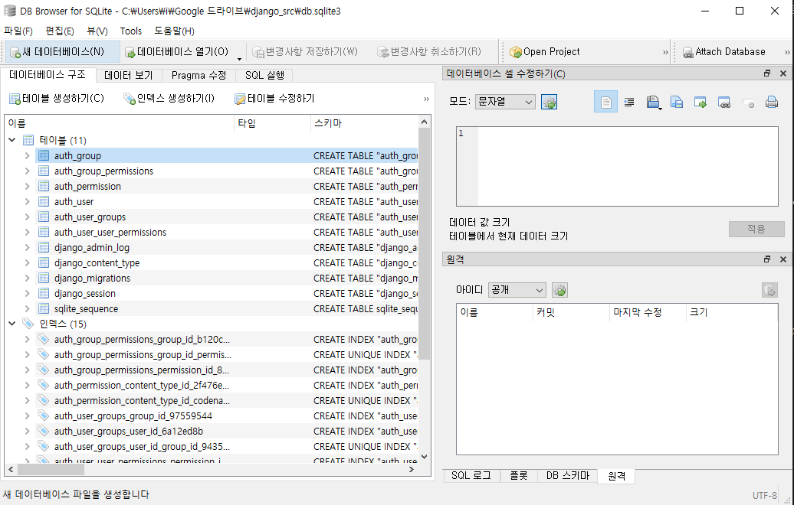

# Django basic

### 역할의 분리
* "Separation Of Concerns (Responsibility)
* https://github.com/django/django
---


## MVC pattern

##### M(Model)
* DB와 연동
##### V(View)
* 화면
##### C(Controller)
* View 와 Model을 연결


## MVT pattern

##### M(Model)

##### V(View)
* template와 Model을 연결
* 기존 MVC 패턴의 controller와 비슷한 역할
##### T(Template)
* 화면


---
---


### ORM 매핑 Rule

* Class <=> Table
* Object <=> Row(Record)
* Variable(Attribute) <=> Column

---
---

## 시작하기

---

### django 프로젝트 생성
* django-admin startproject mydjango django_src
    * django_src 파일에 mydjango 프로젝트를 생성

---
### setting.py 변경

* 언어와 시간을 변경해준다
```python
LANGUAGE_CODE = 'ko'
TIME_ZONE = 'Asia/Seoul'
```

* 정적 파일 경로 추가
```python
STATIC_URL = '/static/'
STATIC_ROOT = os.path.join(BASE_DIR, STATIC_URL)
```

---
### DB 생성과 Server 시작

##### db 생성
* >>> python manage.py migrate
    * => db.splite3 파일이 생성된다.
* django 는 sql lite를 사용한다.
    * sqllite viewer를 사용하여 db.splite3 파일을 볼 수 있다.
      


##### server 시작
* >>> python manage.py runserver
* http://127.0.0.1:8000/
    * 이곳으로 접속해서 생성된 서버를 확인할 수 있다.


---
### Superuser 생성 및 관리자 화면

##### superuser 계정 생성
* >>> python manage.py createsuperuser

