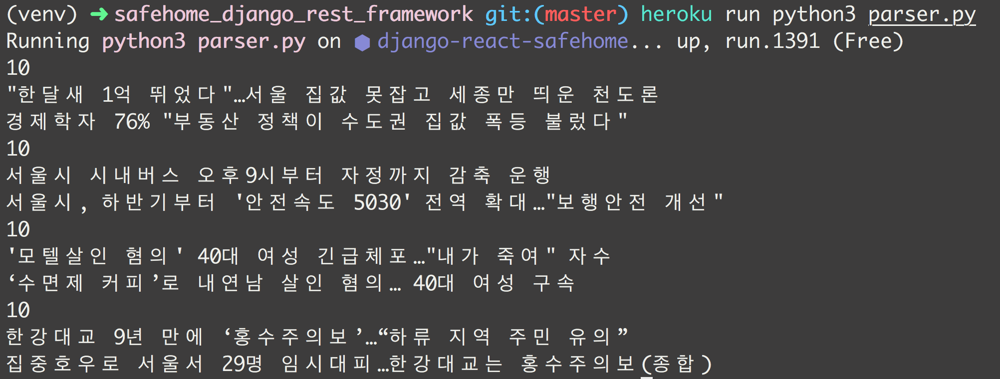
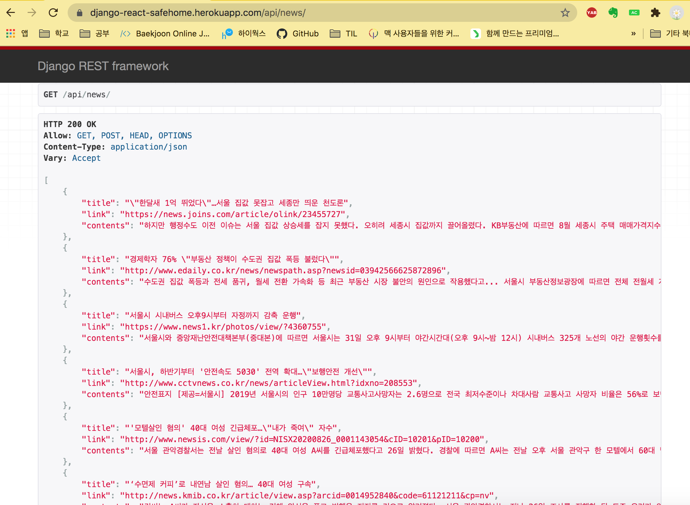

# heroku 에 clock 기능 사용

# 방법 1 : [parser.py](http://parser.py) 파일을 일정시간이 되면 실행하도록

## parser_scheduler.py 파일 작성

- python의 `apscheduler` 모듈을 사용한다.
    - `pip3 install apscheduler`
    - `pip3 freeze > requirements.txt`
- 기존의 작성해 둔 [`parser.py](http://parser.py)` 를 import 한다.
    - `import parser as pr`
- timeZone을 `Asiz/Seoul`로 맞춥니다.
    - `local_tz = pytz.timezone('Asia/Seoul')`
- 정해진 시간(6시간) 마다 뉴스 데이터를 크롤링하여 업데이트 합니다.

- `parser_scheduler.py`

```python
from apscheduler.schedulers.blocking import BlockingScheduler
import datetime
import pytz

import parser as pr

sched = BlockingScheduler()
local_tz = pytz.timezone('Asia/Seoul')

@sched.scheduled_job('interval', minutes=60*6) # 6시간마다
def timed_job():
    print('This job is run every 60*6 minutes.')
    pr.del_save_data() # news update

sched.start()
```

## heroku의 timezone 맞추기

- CLI에서 작성

```python
$ heroku config:add TZ="Asia/Seoul"
```

## Procfile 변경해주기

```python
release: python3 manage.py migrate  # 배포와 동시에 migrate하는 라인
clock: python3 parser_scheduler.py  # 추가 해줍니다.
web: gunicorn mytest.wsgi
```

## Deployment (clock 켜기)

- heroku에서 clock을 켜주어야 합니다.

```python
$ heroku ps:scale clock=1
```

- 두 개 이상 하면 작업이 중복되어 일어나게 됩니다.

- 그다음 배포하면 잘 됩니다.

    

    

### 참고 링크

1. 클럭 전개 (doc)

[Scheduled Jobs with Custom Clock Processes in Python with APScheduler](https://devcenter.heroku.com/articles/clock-processes-python#deployment)

2. 전체적인 작업 ( main link)

[Python 코드를 Heroku에 올리고 특정 시간에 실행하도록 하기](https://cjh5414.github.io/heroku-python/)

3. timezone 작성 (github repo)

[커밋벨을 Heroku에 올리기](https://hyesun03.github.io/2016/10/10/heroku/)