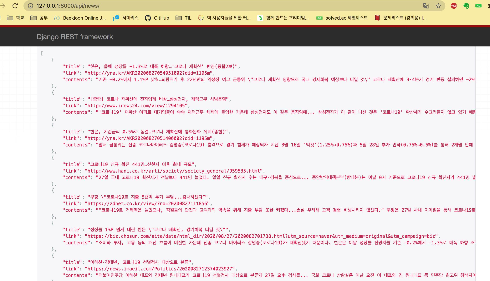

# 뉴스 크롤링 → 본문의 두 문장도 함께 저장

생성일: 2020년 8월 27일 오후 6:19

## [models.py](http://models.py) 변경

- 본문의 내용을 넣을 contents 변수 추가

```python
from django.db import models

# Create your models here.

# 뉴스 데이터
class NewsData(models.Model):
    title = models.CharField(max_length=500)
    link = models.URLField()
    contents = models.TextField(max_length=500, default='')

    def __str__(self):
        return self.title
```


## [parser.py](http://parser.py) 변경

- 네이버에서  키워드 검색하여 나온 10개의 뉴스를 가져온다.
    - 제목, 링크, 내용 을 가져온다.

```python
import requests
from bs4 import BeautifulSoup
import json
import os
from urllib.parse import urljoin
import django

# 실행될 때 DJANGO_SETTINGS_MODULE이라는 환경 변수에 현재 프로젝트의 settings.py파일 경로를 등록
os.environ.setdefault("DJANGO_SETTINGS_MODULE", "mytest.settings")

# 장고를 가져와 장고 프로젝트를 사용할 수 있는 환경을 만들기
django.setup()

from newscrawl.models import NewsData

def parse_news():

# BASE_DIR = os.path.dirname(os.path.abspath(__file__))
    search_keyword = '코로나'
    base = f'https://search.naver.com/search.naver?where=news&sm=tab_jum&query={search_keyword}'

    req= requests.get(base)
    html = req.text
    soup = BeautifulSoup(html, 'html.parser')
    my_title = soup.select('a._sp_each_title') # 제목, 링크
    my_contents = soup.select('ul.type01 dl > dd:nth-child(3)') # 내용

    data = {}

    for idx, i in enumerate(my_title):
        title = i['title']
        link = urljoin(base, i['href'])
        contents = my_contents[idx].text
        
        data[title] = (link, contents)
        
    return data

if __name__ == '__main__':
    news_data_dict = parse_news()
    # print(news_data_dict)
    print(len(news_data_dict))
    for t, l in news_data_dict.items():
        NewsData(title=t, link=l[0], contents=l[1]).save()
```


## 결과 화면


