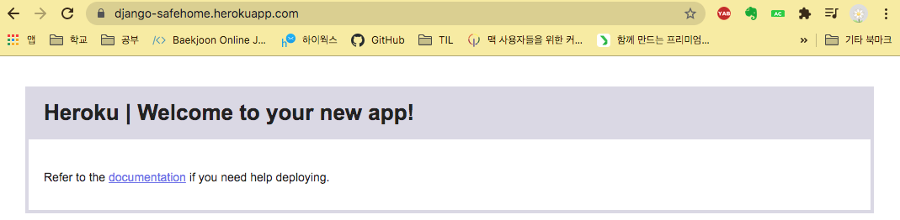
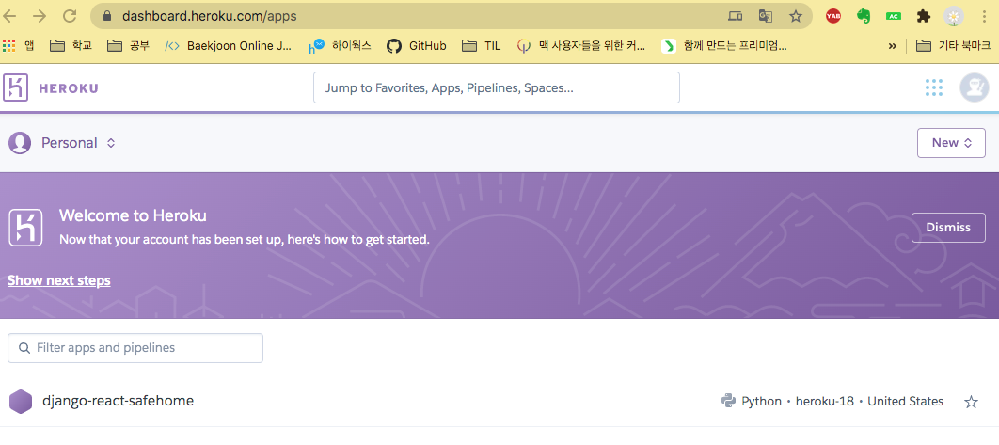

# Heroku 배포하기

# 헤로쿠 배포하기

## 1. requirements .txt 파일 필요

- virtualenv 를 활성화 시키고, 몇 가지 패키지를 설치하기

    `pip3 install gunicorn django-heroku`

- requirements.txt

    `pip freeze > requirements.txt`

## 2. Procfile

- 이것은 헤로쿠에세 우리의 웹사이트를 시작시키시 위해 실행되어야 할 명령어의 순서를 알려준다.
- repo의 root에서 `procfile` 파일을 만들어서 다음 줄을 추가하기

```python
web: gunicorn mytest.wsgi
```

- 이 줄은 `web` 애플리케이션을 배포할 때 `guncorn mytest.wsgi` 명령을 실행하는 것을 의미한다.
    - gunicorn 은 더 강력한 버전의 runserver 명령어

## 3. settings.py

`import django_heroku`  추가해주기

하단에 `django_heroku.settings(locals())`  을 추가해준다.

- # Activate Django-Heroku.

이제 배포하면 잘 될 것 입니다.

- 우리의 프로젝트는 `SQLLite`로 되어있지만 헤로쿠는 `Postgres`를 사용한다.

## 헤로쿠 계정

- 설치하기
    - mac :  `brew tap heroku/brew && brew install heroku`
- 계정 인증
    - `heroku login`  명령을 통해 계정을 인증 받을 수 있다.

    ```python
    (venv) ➜ safehome_django_rest_framework git:(issue1) ✗ heroku login
    heroku: Press any key to open up the browser to login or q to exit:
    Opening browser to https://cli-auth.heroku.com/auth/cli/browser/f64a72e1-3ac6-471e-8df4-3325678985c1?requestor=SFMyNTY.g3QAAAACZAAEZGF0YW0AAAAOMjE5LjI0MC4xMjMuNDNkAAZzaWduZWRuBgDQme80dAE.okclduQCT3QVQxbBmh157Pxr7bnEZuJgwRdrWGLiGLI
    Logging in... done
    Logged in as likeyu96@gmail.com
    ```

## Git 커밋

- 헤로쿠는 배포를 위해 git을 사용
1. 그리고 변경 사항을 커밋

    ```python
    git status
    git add -A .
    git commit -m "additional files and changes for Heroku"
    ```

## 애플리케이션 이름 정하기

```python
>>> heroku create django-safehome
Creating ⬢ django-safehome... done
https://django-safehome.herokuapp.com/ | https://git.heroku.com/django-safehome.git
```

- https://... 주소로 방문해보기!



## 헤로쿠에 배포하기!

```c
git push heroku master

# git 에도 최종적으로 커밋을 해주어야합니다.
git push origin master
```

- 오류 1

    ```c
    remote: -----> Python app detected
    remote:  !     Requested runtime (python-3.5.2) is not available for this stack (heroku-18).
    remote:  !     Aborting.  More info: https://devcenter.heroku.com/articles/python-support
    remote:  !     Push rejected, failed to compile Python app.
    ```

- 해결 1 : runtime.txt

    ```c
    python==3.7.7   -> 나의 python 버전 
    ```

- 오류 2
    - `Error: could not determine PostgreSQL version from '12.4'`
- requirements.txt 수정

    ```c
    psycopg2==2.7.7
    ```

- 오류 3

    ```c
    OSError: [Errno 30] Read-only file system: '/static'
    remote:
    remote:  !     Error while running '$ python manage.py collectstatic --noinput'.
    remote:        See traceback above for details.
    remote:
    remote:        You may need to update application code to resolve this error.
    remote:        Or, you can disable collectstatic for this application:
    remote:
    remote:           $ heroku config:set DISABLE_COLLECTSTATIC=1
    ```

- 해결 3 : terminal 에서 실행
    - `heroku config:set DISABLE_COLLECTSTATIC=1`

## 애플리케이션에 접속하기

- 헤로쿠에 코드를 배포하고 `Procfile` 로 프로세스 유형을 지정했다.(`web` 프로세스로).
- 이제 헤로쿠에 web process 시작하라고 하기
- 명령어 실행
    - 헤로쿠가 `web` 프로세스의 인스턴스 하나만 실행하게 한다.

```c
$ heroku ps:scale web=1
```

- `heroku open` 으로 브라우저에 접속 가능

## 오류가 날 것이다!

- 헤로쿠에 배포 할 때 비어있는 새로운 데이터베이스를 만들어주었기 때문에 `migrate`와 `createsuperuser` 명령어를 실행해 주어야 한다.
- 헤로쿠의 명령어 `heroku run` 을 실행하자

```c
$ heroku run python3 manage.py migrate

Running python3 manage.py migrate on ⬢ django-safehome... up, run.5496 (Free)
Operations to perform:
  Apply all migrations: admin, auth, contenttypes, knox, newscrawl, 
																							safehome, sessions
Running migrations:
....

$ heroku run python3 manage.py createsuperuser

Running python3 manage.py createsuperuser on ⬢ django-safehome... up, run.8854 (Free)
...
Superuser created successfully.
```

---

## 로그보기

- 헤로쿠가 실행될 때, log를 볼 수 있다.

`heroku logs --tail`

---

## 실행시 오류

- 오류 1

    ```c
    2020-08-28T13:51:37.547536+00:00 heroku[router]: at=error code=H14 desc="No web processes running" method=GET path="/" host=django-safehome.herokuapp.com request_id=af41d44a-afc6-478e-b8aa-0373d3cc30d0 fwd="219.240.123.43" dyno= connect= service= status=503 bytes= protocol=https
    2020-08-28T13:51:38.116369+00:00 heroku[router]: at=error code=H14 desc="No web processes running" method=GET path="/favicon.ico" host=django-safehome.herokuapp.com request_id=54d689cc-88c7-4511-bcae-ca0939cdc4a2 fwd="219.240.123.43" dyno= connect= service= status=503 bytes= protocol=https
    ```

    - 해결 1

        ```c
        $ heroku ps:scale web=1

        Scaling dynos... !
         ▸    Couldn't find that process type (web).   -> 또 오류남
        ```

- 오류 2
    - 위의 에러 : process 가 실행되지 않음
    - 해결 2

        이는 "procfile"또는 "ProcFile"등과 같이 procfile이 틀린 경우 발생할 수 있습니다. 파일 이름은 "Procfile"(대문자 P 포함)이어야합니다.

        때때로 파일 이름을 변경하는 것은 git이 변경 사항을 발견하지 못하기 때문에 충분하지 않습니다. Procfile을 완전히 삭제 한 다음 올바른 이름으로 다시 추가하는 것보다 변경 사항을 커밋 한 다음 다시 커밋해야했습니다.

        1. procfile 제거
        2. 자식 커밋
        3. 정확한 이름이 "Procfile"인 새 procfile을 추가하십시오.
        4. 다시 커밋
        5. git push heroku master
- 오류 3
    - 

        ImportError:
        2020-08-28T15:44:35.448743+00:00 app[web.1]:
        2020-08-28T15:44:35.448744+00:00 app[web.1]: Your WhiteNoise configuration is incompatible with WhiteNoise v4.0

    - 해결3
        - `from whitenoise import WhiteNoise`
        - [wsgi.py](http://wsgi.py) 파일 수정

---

## 실행

→ `$ heroku ps:scale web=1`  프로세스 실행

→ `$ heroku open`  브라우저 실행

---

# 참고 링크

1. 헤로쿠 배포

[Configuring Django Apps for Heroku](https://devcenter.heroku.com/articles/django-app-configuration)

2. 정적 파일 설정

[Django and Static Assets](https://devcenter.heroku.com/articles/django-assets)

3. 해로쿠 디비 연결

[Deploying Django to Heroku: Connecting Heroku Postgres](https://blog.usejournal.com/deploying-django-to-heroku-connecting-heroku-postgres-fcc960d290d1)

4. datadump

[[Database] SQLite에서 Postgres로 데이터베이스 마이그레이션](https://gustjd887.tistory.com/26)

---

### 내가 배포한 앱 확인하는 곳

[Heroku](https://dashboard.heroku.com/apps)



---

## 기존의 sqllite에 있던 db를 postres로 옮기는 방법

- 일단 그 전에 sqllite의 데이터를 dump.json해서 heroku server에 올려야 한다.
    - 덤프 후 `git push heroku master`
        - 그제서야 heroku bash에서 json 파일이 보임

- 일단 데이터 넣는거

    `heroku run bash`  하면 bash로 들어감

    - 거기서 4번 링크의 것들 전부 실행하면 데이터가 들어감

---

### 다음에 할 일 → 일정시간마다 뉴스 데이터 가져오기

[Deploy Your Django + React.js app to Heroku](https://dev.to/shakib609/deploy-your-django-react-js-app-to-heroku-2bck)

[Python 코드를 Heroku에 올리고 특정 시간에 실행하도록 하기](https://cjh5414.github.io/heroku-python/)